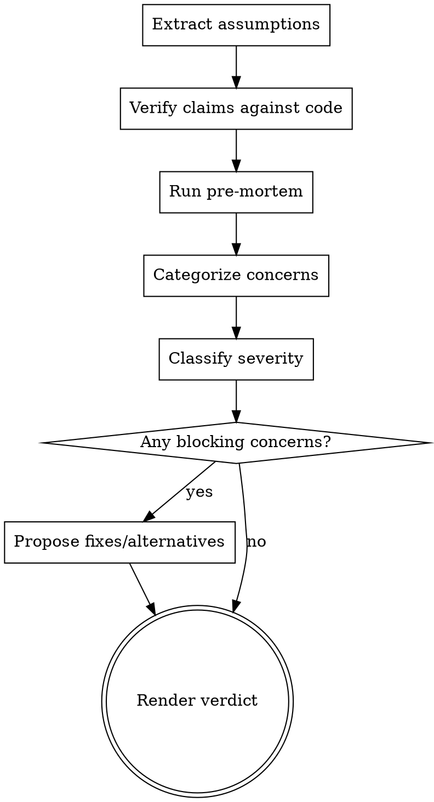

# /challenge-plan - Challenge Plan

## Overview

Stress-test a proposed plan before implementation begins. Extract assumptions, verify claims against actual code, classify concerns by severity, and run a pre-mortem. The goal is to find plan-blocking issues before they become implementation-blocking issues.

**This skill answers: "Will this plan actually work, and what could go wrong?"**

## Usage

```
/challenge-plan [proposed plan, implementation outline, or design decision]
```

- `deep-planning` formulates the best approach
- **`challenge-plan`** stress-tests the chosen approach
- `analyze` evaluates code paths and edge cases during/after implementation

## Checklist

You MUST create a task for each of these items and complete them in order:

1. **Extract assumptions** — List every assumption the plan makes (explicit and implicit). These are your attack surface.
2. **Verify claims** — For each factual claim in the plan (file paths, API behavior, architectural constraints), verify against actual code. Do NOT take claims at face value.
3. **Run pre-mortem** — "It's 2 weeks from now and this plan failed. Why?" Generate 3-5 realistic failure scenarios.
4. **Categorize concerns** — Group into: Correctness, Completeness, Performance, Maintainability, and Compatibility.
5. **Classify severity** — For each concern: Blocking (must fix before implementing), Significant (should fix, risky to ignore), or Minor (nice-to-have, won't derail).
6. **Propose alternatives** — For each blocking concern, propose a fix or alternative approach. Don't just identify problems — offer solutions.
7. **Render verdict** — Is this plan ready to implement, needs revision, or should be reconsidered?

## Process Flow



## Critical Rules

### Extract Assumptions First (Baseline agents skip this)

Before attacking the plan, explicitly list what it assumes. Every plan has hidden assumptions — about the codebase, the runtime, the users, the constraints. These are your primary attack surface.

Examples of hidden assumptions:

- "This API returns headers we can read" — does it?
- "This operation is fast enough to do synchronously" — is it?
- "This cache key is unique" — is it always?
- "Only this code path calls this function" — are there others?

### Verify Claims Against Code (Baseline agents partially do this)

For EVERY factual claim in the plan, read the actual code. Plans frequently contain:

- Wrong file paths or line numbers
- Misunderstanding of how a function works
- Incorrect assumptions about decorator behavior
- Missing call sites or consumers

Do NOT take claims at face value. If the plan says "X works this way," verify it.

Record the evidence you used for each verified or disputed claim. Prefer concrete file paths, code paths, or command output over generic statements like "checked the code."

### Run a Pre-Mortem (Baseline agents never do this)

Imagine the plan was implemented and deployed, and it failed. Generate 3-5 specific failure scenarios:

- What breaks under load?
- What breaks with edge-case inputs?
- What breaks when another part of the system changes?
- What breaks in a different environment (browser vs Node.js)?
- What breaks when the user does something unexpected?

This is different from listing concerns — it's narrative scenario thinking that surfaces risks pure analysis misses.

### Classify Severity (Baseline agents treat everything equally)

Not all concerns are equal. For each concern:

- **Blocking**: This will cause bugs, data loss, or incorrect behavior. Must fix before implementing.
- **Significant**: This could cause issues under specific conditions or has notable maintainability cost. Should fix.
- **Minor**: Nice-to-have improvement. Won't derail the implementation.

This classification is critical — a plan with 10 "minor" concerns is fine. A plan with 1 "blocking" concern is not.

## Output Format

```markdown
## Plan Challenge: [Plan Name]

### Assumptions (attack surface)

1. [Assumption] — Verified: [yes/no/partially]. Evidence: [file:line, code path, or command output]
2. ...

### Pre-Mortem Scenarios

1. **[Scenario name]**: [What happens, why, impact]
2. ...

### Concerns

| #   | Category     | Severity    | Concern | Evidence                             | Fix            |
| --- | ------------ | ----------- | ------- | ------------------------------------ | -------------- |
| 1   | Correctness  | Blocking    | [issue] | [file:line or code path]             | [proposed fix] |
| 2   | Completeness | Significant | [issue] | [file:line or code path]             | [proposed fix] |
| 3   | Performance  | Minor       | [issue] | [benchmark, call path, or rationale] | —              |

### Verdict

[Ready / Needs Revision / Reconsider]

[2-3 sentence summary: what's the biggest risk, what must change, is the direction right?]

If you found no blocking or significant concerns, say so explicitly and summarize what you verified plus the residual risks.
```

## Red Flags — You're Not Being Adversarial Enough

| Thought                                      | Reality                                                          |
| -------------------------------------------- | ---------------------------------------------------------------- |
| "The plan looks reasonable"                  | You haven't extracted assumptions yet. Do that first.            |
| "I found 10 concerns, that's thorough"       | Did you classify severity? 10 minors ≠ 1 blocker.                |
| "The plan says X, so X is true"              | Did you verify against actual code? Plans lie.                   |
| "I listed the problems"                      | Did you propose fixes? Problems without solutions aren't useful. |
| "This is a long review, it must be thorough" | Length ≠ thoroughness. Use the table. Prioritize blockers.       |

## Anti-Patterns

- **Equal-weight concerns**: Listing 15 concerns with no severity classification — the reader can't tell what matters
- **Claim-trusting**: Accepting the plan's description of how code works without reading the code
- **Problem-only review**: Finding issues without proposing fixes or alternatives
- **Missing pre-mortem**: Only doing static analysis without imagining dynamic failure scenarios
- **Rubber-stamping**: Declaring "no significant concerns" without showing what you verified, what assumptions you tested, and what residual risks remain
