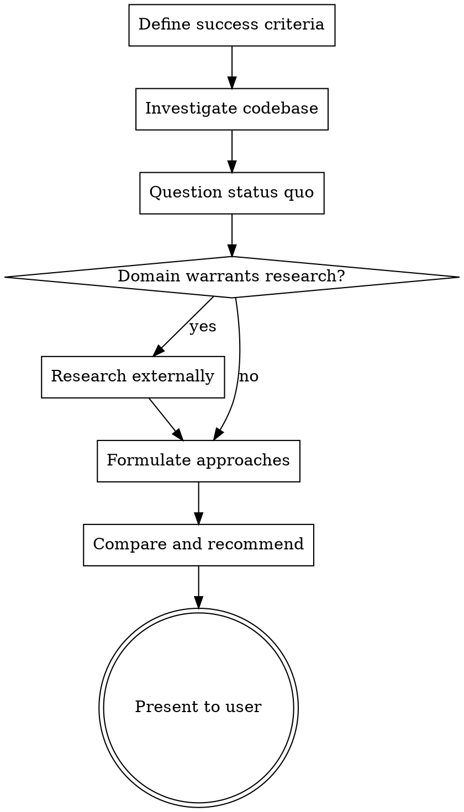

# /deep-planning - Deep Planning

## Overview

Find the **best** approach to a task — not just a good one. Investigate the codebase deeply, question whether existing patterns are optimal, research how the industry solves this, and present approaches grounded in reality with honest trade-offs.

**This skill answers: "What is the BEST approach?"**

## Usage

```
/deep-planning [task, feature, refactor, or design decision]
```

- If adjacent skills like `brainstorming` or `writing-plans` are available, use them as complements.
- If they are not available in the current environment, continue with this skill. It is self-contained.

## Related Skills

- `brainstorming` answers "What are we building?"
- `writing-plans` answers "What are the exact steps?"
- `analyze` answers "Are there problems with this design?"
- **`deep-planning`** answers "What is the optimal technical approach, and why?"

## Checklist

You MUST create a task for each of these items and complete them in order:

1. **Define success criteria** — What does "good" look like? Performance targets, maintainability bar, constraints.
2. **Investigate the codebase** — Launch Explore agents if available. Otherwise inspect the codebase directly. Map current patterns, utilities, abstractions. Find reusable code.
3. **Question the status quo** — For each existing pattern: Why was it done this way? What are its limitations? Is there a fundamentally better approach?
4. **Research externally** — When the problem domain warrants it, use web search. How do popular libraries, frameworks, or competing tools solve this? What are current best practices? (Skip for purely internal/domain-specific tasks.)
5. **Formulate approaches** — Design 1-3 approaches. Each must reference specific files and code paths. Include at least one approach that challenges existing patterns (if the status quo has limitations).
6. **Compare and recommend** — Trade-off matrix. Clear recommendation. Honest about costs.
7. **Present to user** — Use the output format below. Be concise.

## Process Flow



## Critical Rules

### Question the Status Quo (Baseline agents skip this 100% of the time)

For every existing pattern you find, ask:

- **Why** was it done this way? (commit history, PR context, or infer from constraints)
- **What are its limitations?** (performance ceiling, maintainability debt, missing capabilities)
- **Would a fundamentally different approach serve better?** Not just a variation — a different mental model.

Do NOT accept existing patterns as given. They may be historical artifacts, premature abstractions, or simply the first thing that worked. Your job is to evaluate them critically.

### Research Externally (Baseline agents never do this)

When the problem domain is not purely internal (caching strategies, rate limiting, streaming protocols, state management, etc.), you MUST research:

- How popular open-source projects solve this
- Current industry best practices
- Existing libraries that could be leveraged

Use web search. Do NOT rely solely on training knowledge — it may be outdated or incomplete.

**Skip research when:** The task is purely internal (renaming, reorganizing existing code, fixing a bug in project-specific logic).

### Include a Challenging Alternative (Baseline agents stay conservative)

If the status quo has limitations, at least one of your approaches MUST challenge existing patterns — not just extend them. Ask: "What if we did this completely differently?"

This doesn't mean the radical approach must win. Often the incremental approach is correct. But you must **consider** the alternative so the recommendation is informed, not default.

**Exception:** When there is genuinely only one good approach, say so explicitly and explain why alternatives are worse. Don't manufacture fake alternatives.

### Be Concise (Baseline agents write 2000+ words)

Your analysis should be **scannable**. The comparison table is the centerpiece — not prose.

- **Non-recommended approaches**: 2-3 sentences max. Just enough to understand what it is and why it's not recommended.
- **Recommended approach**: 4-6 sentences. Include specific files, the key design decision, and why it wins.
- **Current State**: Focus on limitations, not exhaustive description. 3-5 bullet points.
- **External Research**: Key takeaways only, not summaries of articles. 2-4 bullets with source links.

**Target:** 400-700 words for the final output. Complex tasks may need 800-1000 — but if you're over 1000, you're writing an implementation plan, not a planning analysis. Cut prose, expand the table.

## Output Format

```markdown
## Deep Planning: [Task Description]

### Success Criteria

[What "good" looks like — performance targets, constraints, maintainability bar]

### Current State

[How the codebase handles this today — specific files, patterns]
[Limitations of the current approach]

### External Research (if applicable)

[How popular solutions handle this — with sources]
[Key takeaways for our context]

### Approaches

#### Approach A: [Name] (Recommended)

[4-6 sentence description with specific files/code changes]

#### Approach B: [Name]

[2-3 sentence description]

#### Approach C: [Name] (if applicable)

[2-3 sentence description]

### Comparison

| Dimension       | A   | B   | C   |
| --------------- | --- | --- | --- |
| Performance     | ... | ... | ... |
| Maintainability | ... | ... | ... |
| Complexity      | ... | ... | ... |
| Migration cost  | ... | ... | ... |

### Recommendation

[Which approach and why — 2-3 sentences]
[Key risks to watch for]
```

## Red Flags — You're Skipping the Hard Parts

| Thought                                          | Reality                                                      |
| ------------------------------------------------ | ------------------------------------------------------------ |
| "The current pattern is fine, just extend it"    | Did you question WHY it's fine? Maybe it's not.              |
| "I don't need to web search, I know this"        | Training knowledge ages. Search anyway.                      |
| "There's obviously only one approach"            | Did you consider a fundamentally different one?              |
| "Let me just list the approaches I can think of" | Investigate the codebase first. Approaches must be grounded. |
| "This analysis needs to be thorough"             | Thorough ≠ verbose. Use the comparison table.                |
| "I'll define success criteria later"             | Success criteria FIRST. You can't evaluate without them.     |

## Anti-Patterns

- **Pattern-bound thinking**: Proposing only variations within the existing architecture without considering alternatives
- **Skipping research**: Relying on training knowledge for well-studied problem domains (caching, rate limiting, state management)
- **Accepting status quo**: Not questioning why existing patterns exist or whether they're optimal
- **Verbose analysis**: Writing 2000+ words when 800 would suffice. Use tables.
- **Missing success criteria**: Evaluating approaches without defining what "good" means first
- **Fake alternatives**: Manufacturing approaches that are obviously worse just to have multiple options
