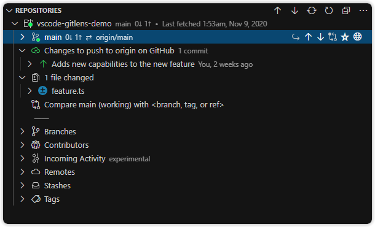

   
  

> GitLens **supercharges** the Git capabilities built into Visual Studio Code. It helps you to **visualize code authorship** at a glance via Git blame annotations and code lens, **seamlessly navigate and explore** Git repositories, **gain valuable insights** via powerful comparison commands, and so much more.

## Sponsor GitLens

Sponsored by

  

If you find GitLens useful, please consider [**sponsoring**](https://gitlens.amod.io/#sponsor) it. Also please [write a review](https://marketplace.visualstudio.com/items?itemName=eamodio.gitlens#review-details 'Write a review'), [star me on GitHub](https://github.com/eamodio/vscode-gitlens 'Star me on GitHub'), and [follow me on Twitter](https://twitter.com/eamodio 'Follow me on Twitter')

# What's new in GitLens 11

TBD

- And much more

See the [release notes](https://github.com/eamodio/vscode-gitlens/blob/master/CHANGELOG.md 'Open Release Notes') for the full set of changes

# GitLens

[GitLens](https://gitlens.amod.io 'Learn more about GitLens') is an [open-source](https://github.com/eamodio/vscode-gitlens 'Open GitLens on GitHub') extension for [Visual Studio Code](https://code.visualstudio.com) created by [Eric Amodio](https://www.amod.io 'Learn more about Eric').

GitLens simply helps you **better understand code**. Quickly glimpse into whom, why, and when a line or code block was changed. Jump back through history to **gain further insights** as to how and why the code evolved. Effortlessly explore the history and evolution of a codebase.

GitLens is **powerful**, **feature rich**, and [highly customizable](#gitlens-settings- 'Jump to the GitLens settings docs') to meet your needs. Do you find code lens intrusive or the current line blame annotation distracting &mdash; no problem, quickly turn them off or change how they behave via the interactive [_GitLens Settings_ editor](#configuration 'Jump to Configuration'). For advanced customizations, refer to the [GitLens docs](#gitlens-settings- 'Jump to the GitLens settings') and edit your [user settings](https://code.visualstudio.com/docs/getstarted/settings 'Open User settings').

Here are just some of the **features** that GitLens provides,

- an unobtrusive [**current line blame**](#current-line-blame- 'Jump to the Current Line Blame') annotation at the end of the line with detailed blame information accessible via [**hovers**](#hovers- 'Jump to Hovers')
- [**authorship code lens**](#git-code-lens- 'Jump to the Git Code Lens') showing the most recent commit and # of authors to the top of files and/or on code blocks
- a [**status bar blame**](#status-bar-blame- 'Jump to the Status Bar Blame') annotation showing author and date for the current line
- many rich Side Bar views

  - a [**_Commits_ view**](#commits-view- 'Jump to the Commits view') to visualize, explore, and manage Git commits
  - a [**_File History_ view**](#file-history-view- 'Jump to the File History view') to visualize, navigate, and explore the revision history of the current file or just the selected lines of the current file and explore the revision history of the selected lines of current file
  - a [**_Branches_ view**](#branches-view- 'Jump to the Branches view') to visualize, explore, and manage Git branches
  - a [**_Remotes_ view**](#remotes-view- 'Jump to the Remotes view') to visualize, explore, and manage Git remotes and remote branches
  - a [**_Stashes_ view**](#stashes-view- 'Jump to the Stashes view') to visualize, explore, and manage Git stashes
  - a [**_Tags_ view**](#tags-view- 'Jump to the Tags view') to visualize, explore, and manage Git tags
  - a [**_Contributors_ view**](#contributors-view- 'Jump to the Contributors view') to visualize, navigate, and explore contributors
  - a [**_Search & Compare_ view**](#search-&-compare-view- 'Jump to the Search & Compare view') to search and explore commit histories by message, author, files, id, etc, or visualize comparisons between branches, tags, commits, and more

- on-demand [**gutter blame**](#gutter-blame- 'Jump to the Gutter Blame') annotations, including a heatmap, for the whole file
- on-demand [**gutter changes**](#gutter-changes- 'Jump to the Gutter Changes') annotations to highlight any local (unpublished) changes or lines changed by the most recent commit
- on-demand [**gutter heatmap**](#gutter-heatmap- 'Jump to the Gutter Heatmap') annotations to show how recently lines were changed, relative to all the other changes in the file and to now (hot vs. cold)
- a custom, user-friendly [**interactive rebase editor**](#interactive-rebase-editor- 'Jump to the Interactive Rebase Editor') to more easily configure an interactive rebase session
- a [**Git Command Palette**](#git-command-palette- 'Jump to the Git Command Palette') to provide guided (step-by-step) access to many common Git commands and their flags
- many [**powerful commands**](#navigate-and-explore- 'Jump to the Navigate and Explorer') for exploring commits and histories, comparing and navigating revisions, stash access, repository status, etc
- user-defined [**modes**](#modes- 'Jump to the Modes') for quickly toggling between sets of settings
- and so much [**more**](#and-more- 'Jump to More')

   
  
   

# Features

## Current Line Blame [#](#current-line-blame- 'Current Line Blame')

  

- Adds an unobtrusive, [customizable](#current-line-blame-settings- 'Jump to the Current Line Blame settings'), and [themable](#themable-colors- 'Jump to the Themable Colors'), **blame annotation** at the end of the current line
  - Contains the author, date, and message of the current line's most recent commit (by [default](#current-line-blame-settings- 'Jump to the Current Line Blame settings'))
  - Adds a _Toggle Line Blame Annotations_ command (`gitlens.toggleLineBlame`) to toggle the blame annotation on and off

## Git Code Lens [#](#git-code-lens- 'Git Code Lens')

  

- Adds Git authorship **code lens** to the top of the file and on code blocks ([optional](#git-code-lens-settings- 'Jump to the Git Code Lens settings'), on by default)

  - **Recent Change** &mdash; author and date of the most recent commit for the file or code block
    - Click the code lens to show a **commit file details quick pick menu** with commands for comparing, navigating and exploring commits, and more (by [default](#git-code-lens-settings- 'Jump to the Code Lens settings'))
  - **Authors** &mdash; number of authors of the file or code block and the most prominent author (if there is more than one)

    - Click the code lens to toggle the file Git blame annotations on and off of the whole file (by [default](#git-code-lens-settings- 'Jump to the Git Code Lens settings'))
    - Will be hidden if the author of the most recent commit is also the only author of the file or block, to avoid duplicate information and reduce visual noise

  - Provides [customizable](#git-code-lens-settings- 'Jump to the Git Code Lens settings') click behavior for each code lens &mdash; choose between one of the following
    - Toggle file blame annotations on and off
    - Compare the commit with the previous commit
    - Show a quick pick menu with details and commands for the commit
    - Show a quick pick menu with file details and commands for the commit
    - Show a quick pick menu with the commit history of the file
    - Show a quick pick menu with the commit history of the current branch

- Adds a _Toggle Git Code Lens_ command (`gitlens.toggleCodeLens`) with a shortcut of `shift+alt+b` to toggle the code lens on and off

## Status Bar Blame [#](#status-bar-blame- 'Status Bar Blame')

  

- Adds a [customizable](#status-bar-settings- 'Jump to the Status Bar Blame settings') **Git blame annotation** about the current line to the **status bar** ([optional](#status-bar-settings- 'Jump to the Status Bar Blame settings'), on by default)

  - Contains the commit author and date (by [default](#status-bar-settings- 'Jump to the Status Bar Blame settings'))
  - Click the status bar item to show a **commit details quick pick menu** with commands for comparing, navigating and exploring commits, and more (by [default](#status-bar-settings- 'Jump to the Status Bar Blame settings'))

  - Provides [customizable](#status-bar-settings- 'Jump to the Status Bar Blame settings') click behavior &mdash; choose between one of the following
    - Toggle file blame annotations on and off
    - Toggle code lens on and off
    - Compare the line commit with the previous commit
    - Compare the line commit with the working tree
    - Show a quick pick menu with details and commands for the commit (default)
    - Show a quick pick menu with file details and commands for the commit
    - Show a quick pick menu with the commit history of the file
    - Show a quick pick menu with the commit history of the current branch

## Hovers [#](#hovers- 'Hovers')

### Current Line Hovers

  

- Adds [customizable](#hover-settings- 'Jump to the Hover settings') Git blame hovers accessible over the current line

#### Details Hover

  

    
  

- Adds a **details hover** annotation to the current line to show more commit details ([optional](#hover-settings- 'Jump to the Hover settings'), on by default)
  - Provides **automatic issue linking** to Bitbucket, GitHub, GitLab, and Azure DevOps in commit messages
  - Provides a **quick-access command bar** with _Open Changes_, _Blame Previous Revision_, _Open on Remote_, _Invite to Live Share_ (if available), and _Show More Actions_ command buttons
  - Click the commit id to execute the _Show Commit_ command

#### Changes (diff) Hover

  

- Adds a **changes (diff) hover** annotation to the current line to show the line's previous version ([optional](#hover-settings- 'Jump to the Hover settings'), on by default)
  - Click the **Changes** to execute the _Open Changes_ command
  - Click the current and previous commit ids to execute the _Show Commit_ command

### Annotation Hovers

  

- Adds [customizable](#hover-settings- 'Jump to the Hover settings') Git blame hovers accessible when annotating

### Details Hover

  

    
  

- Adds a **details hover** annotation to each line while annotating to show more commit details ([optional](#hover-settings- 'Jump to the Hover settings'), on by default)
  - Provides **automatic issue linking** to Bitbucket, GitHub, GitLab, and Azure DevOps in commit messages
  - Provides a **quick-access command bar** with _Open Changes_, _Blame Previous Revision_, _Open on Remote_, _Invite to Live Share_ (if available), and _Show More Actions_ command buttons
  - Click the commit id to execute the _Show Commit_ command

### Changes (diff) Hover

  

- Adds a **changes (diff) hover** annotation to each line while annotating to show the line's previous version ([optional](#hover-settings- 'Jump to the Hover settings'), on by default)
  - Click the **Changes** to execute the _Open Changes_ command
  - Click the current and previous commit ids to execute the _Show Commit_ command

## Side Bar Views [#](#side-bar-views- 'Side Bar Views')

### Commits view [#](#commits-view- 'Commits view')

  

A [customizable](#commits-view-settings- 'Jump to the Commits view settings') view to visualize, explore, and manage Git commits

The _Commits_ view lists all of the commits on the current branch, and additionally provides,

- a toggle to switch between showing all commits or just your own commits
- a toggle to change the file layout: list, tree, auto
- a branch comparison tool (**Compare &lt;current branch&gt; with &lt;branch, tag, or ref&gt;**) &mdash; [optionally](#commits-view-settings- 'Jump to the Commits view settings') shows a comparison of the current branch (or working tree) to a user-selected reference
  - **Behind** &mdash; lists the commits that are missing from the current branch (i.e. behind) but exist in the selected reference
    - **# files changed** &mdash; lists all of the files changed between the compared references
  - **Ahead** &mdash; lists the commits that the current branch has (i.e. ahead) but are missing in the selected reference
    - **# files changed** &mdash; lists all of the files changed between the compared references
- the current branch status &mdash; shows the upstream status of the current branch
  - **Publish &lt;current branch&gt; to remote** &mdash; shown when the current branch has not been published to a remote
  - **Up to date with &lt;remote&gt;** &mdash; shown when the current branch is up to date with the upstream remote
  - **Changes to push to &lt;remote&gt;** &mdash; lists of all the files changed in the unpublished commits when the current branch has (unpublished) commits that waiting to be pushed to the upstream remote
  - **Changes to pull from &lt;remote&gt;** &mdash; lists all of the commits waiting to be pulled when the current branch has commits that are waiting to be pulled from the upstream remote
- any associated pull request &mdash; shows any opened pull request associated with the current branch

---

### File History view [#](#file-history-view- 'File History view')

  

A [customizable](#file-history-view-settings- 'Jump to the File History view settings') view to visualize, navigate, and explore the revision history of the current file or just the selected lines of the current file

The file history view lists all of the commits that changed the current file on the current branch, and additionally provides,

- a toggle to pin (pause) the automatic tracking of the current editor
- a toggle to switch between file and line history, i.e. show all commits of the current file, or just the selected lines of the current file
- the ability to change the current base branch (reference) for the file or line history
- a toggle to follow renames across the current file
- a toggle to show commits from all branches rather than just from the current base branch (reference)

---

### Branches view [#](#branches-view- 'Branches view')

  

A [customizable](#branches-view-settings- 'Jump to the Branches view settings') view to visualize, explore, and manage Git branches

The _Branches_ view lists all of the branches, and additionally provides,

- a toggle to change the branch layout: list or tree
- a toggle to change the file layout: list, tree, auto
- an indicator (check-mark) if the branch is the current branch
- an icon indicator to show the branch's upstream status (if available)
  - _No dot_ &mdash; unpushlished or up to date with the upstream remote
  - _Green dot_ &mdash; has changes unpublished (ahead)
  - _Red dot_ &mdash; has changes un-pulled (behind)
  - _Yellow dot_ &mdash; both unpublished and un-pulled changes
- a branch comparison tool (**Compare &lt;branch&gt; with &lt;branch, tag, or ref&gt;**) &mdash; [optionally](#branches-view-settings- 'Jump to the Branches view settings') shows a comparison of the branch to a user-selected reference
  - **Behind** &mdash; lists the commits that are missing from the branch (i.e. behind) but exist in the selected reference
    - **# files changed** &mdash; lists all of the files changed between the compared references
  - **Ahead** &mdash; lists the commits that the branch has (i.e. ahead) but are missing in the selected reference
    - **# files changed** &mdash; lists all of the files changed between the compared references
- the branch status &mdash; shows the upstream status of the branch
  - **Changes to push to &lt;remote&gt;** &mdash; lists of all the files changed in the unpublished commits when the branch has (unpublished) commits that waiting to be pushed to the upstream remote
  - **Changes to pull from &lt;remote&gt;** &mdash; lists all of the commits waiting to be pulled when the branch has commits that are waiting to be pulled from the upstream remote
- any associated pull request &mdash; shows any pull request associated with the branch

---

### Remotes view [#](#remotes-view- 'Remotes view')

  

A [customizable](#remotes-view-settings- 'Jump to the Remotes view settings') view to visualize, explore, and manage Git remotes and remote branches

The _Remotes_ view lists all of the remotes and its remote branches, and additionally provides,

- a toggle to change the branch layout: list or tree
- a toggle to change the file layout: list, tree, auto
- a toggle to connect to a supported remote providers to enable a rich integration with pull requests, issues, avatars, and more

---

### Stashes view [#](#stashes-view- 'Stashes view')

  

A [customizable](#stashes-view-settings- 'Jump to the Stashes view settings') view to visualize, explore, and manage Git stashes

The _Stashes_ view lists all of the stashes, and additionally provides,

- a toggle to change the file layout: list, tree, auto

---

### Tags view [#](#tags-view- 'Tags view')

  

A [customizable](#tags-view-settings- 'Jump to the Tags view settings') view to visualize, explore, and manage Git tags

The _Tags_ view lists all of the tags, and additionally provides,

- a toggle to change the tag layout: list or tree
- a toggle to change the file layout: list, tree, auto

---

### Contributors view [#](#contributors-view- 'Contributors view')

  

A [customizable](#contributors-view-settings- 'Jump to the Contributors view settings'), but hidden by default, view to visualize, navigate, and explore contributors

The _Contributors_ view lists all of the contributors, and additionally provides,

- a toggle to change the file layout: list, tree, auto

---

### Search & Compare view [#](#search-&-compare-view- 'Search & Compare view')

  

A [customizable](#search-&-compare-view-settings- 'Jump to the Search & Compare view settings'), but hidden by default, view to search and explore commit histories by message, author, files, id, etc, or visualize comparisons between
branches, tags, commits, and more

The _Search & Compare_ view lists pinnable (saved) results for searching commit histories or for comparison operations, and additionally provides,

- a toggle to keep previous results when new results are added
- a toggle to change the file layout: list, tree, auto
- pinnable search &mdash; lists all of the commits that match the search query
  - Search results can be provided by the following commands
    - _Search Commits_ command (`gitlens.showCommitSearch`) can search
      - by message &mdash; use `<message>` to search for commits with messages that match `<message>` &mdash; See [Git docs](https://git-scm.com/docs/git-log#Documentation/git-log.txt---grepltpatterngt 'Open Git docs')
      - or, by author &mdash; use `@<pattern>` to search for commits with authors that match `<pattern>` &mdash; See [Git docs](https://git-scm.com/docs/git-log#Documentation/git-log.txt---authorltpatterngt 'Open Git docs')
      - or, by commit id &mdash; use `#<sha>` to search for a commit with id of `<sha>` &mdash; See [Git docs](https://git-scm.com/docs/git-log#Documentation/git-log.txt-ltrevisionrangegt 'Open Git docs')
      - or, by files &mdash; use `:<path/glob>` to search for commits with file names that match `<path/glob>` &mdash; See [Git docs](https://git-scm.com/docs/git-log#Documentation/git-log.txt---ltpathgt82308203 'Open Git docs')
      - or, by changes &mdash; use `~<pattern>` to search for commits with differences whose patch text contains added/removed lines that match `<pattern>` &mdash; See [Git docs](https://git-scm.com/docs/git-log#Documentation/git-log.txt--Gltregexgt 'Open Git docs')
    - _Show File History_ command (`gitlens.showQuickFileHistory`)
    - _Show Commit_ command (`gitlens.showQuickCommitDetails`)
- pinnable comparison &mdash; shows a comparison of the two user-selected references
  - **Behind** &mdash; lists the commits that are missing from the branch (i.e. behind) but exist in the selected reference
    - **# files changed** &mdash; lists all of the files changed between the compared references
  - **Ahead** &mdash; lists the commits that the branch has (i.e. ahead) but are missing in the selected reference
    - **# files changed** &mdash; lists all of the files changed between the compared references
  - Comparision results can be provided by the following commands
    - _Compare with Upstream_ command (`gitlens.views.compareWithUpstream`)
    - _Compare with Working Tree_ command (`gitlens.views.compareWithWorking`)
    - _Compare with HEAD_ command (`gitlens.views.compareWithHead`)
    - _Compare with Selected_ command (`gitlens.views.compareWithSelected`)
    - _Compare Ancestry with Working Tree_ command (`gitlens.views.compareAncestryWithWorking`)

---

### Repositories view [#](#repositories-view- 'Repositories view')

  

A [customizable](#repositories-view-settings- 'Jump to the Repositories view settings'), hidden by default (as it has been superseded by the new views), view to visualize, navigate, and explore Git repositories

The Repositories view lists opened Git repositories, and additionally provides,

- a toggle to automatically refresh the repository on changes
- a toggle to change the file layout: list, tree, auto
- an icon indicator to show the current branch's upstream status (if available)
  - _No dot_ &mdash; unpushlished or up to date with the upstream remote
  - _Green dot_ &mdash; has changes unpublished (ahead)
  - _Red dot_ &mdash; has changes un-pulled (behind)
  - _Yellow dot_ &mdash; both unpublished and un-pulled changes
- a branch comparison tool (**Compare &lt;current branch&gt; with &lt;branch, tag, or ref&gt;**) &mdash; [optionally](#repositories-view-settings- 'Jump to the Repositories view settings') shows a comparison of the current branch (or working tree) to a user-selected reference
- the current branch status &mdash; shows the upstream status of the current branch (if not up to date)
  - **Publish &lt;current branch&gt; to remote** &mdash; shown when the current branch has not been published to a remote
  - **Changes to push to &lt;remote&gt;** &mdash; lists of all the files changed in the unpublished commits when the current branch has (unpublished) commits that waiting to be pushed to the upstream remote
  - **Changes to pull from &lt;remote&gt;** &mdash; lists all of the commits waiting to be pulled when the current branch has commits that are waiting to be pulled from the upstream remote
- any associated pull request &mdash; shows any opened pull request associated with the current branch
  - **Behind** &mdash; lists the commits that are missing from the current branch (i.e. behind) but exist in the selected reference
    - **# files changed** &mdash; lists all of the files changed between the compared references
  - **Ahead** &mdash; lists the commits that the current branch has (i.e. ahead) but are missing in the selected reference
    - **# files changed** &mdash; lists all of the files changed between the compared references
- the changed files &mdash; lists all of the files changed by the unpublished (unpushed) commits and [optionally](#repositories-view-settings- 'Jump to the Repositories view settings') any working tree changes
- the current branch commits &mdash; similar to the [Commits view](#commits-view- 'Commits view')
- the local branches &mdash; similar to the [Branches view](#branches-view- 'Branches view')
- the contributors &mdash; similar to the [Contributors view](#contributors-view- 'Contributors view')
- any incoming activity (experimental) &mdash; lists the command, branch (if available), and date of recent incoming activity (merges and pulls) to your local repository
- the remotes and remote branches &mdash; similar to the [Remotes view](#remotes-view- 'Remotes view')
- the stashes &mdash; similar to the [Stashes view](#stashes-view- 'Stashes view')
- the tags &mdash; similar to the [Tags view](#tags-view- 'Tags view')

## Gutter Blame [#](#gutter-blame- 'Gutter Blame')

  

- Adds on-demand, [customizable](#gutter-blame-settings- 'Jump to the Gutter Blame settings'), and [themable](#themable-colors- 'Jump to the Themable Colors'), **gutter blame annotations** for the whole file
  - Contains the commit message and date, by [default](#gutter-blame-settings- 'Jump to the Gutter Blame settings')
  - Adds a **heatmap** (age) indicator on right edge (by [default](#gutter-blame-settings- 'Jump to the Gutter Blame settings')) of the gutter to provide an easy, at-a-glance way to tell how recently lines were changed ([optional](#gutter-blame-settings- 'Jump to the Gutter Blame settings'), on by default)
    - See the [gutter heatmap](#gutter-Heatmap- 'Jump to the Gutter Heatmap') section below for more details
  - Adds a _Toggle File Blame Annotations_ command (`gitlens.toggleFileBlame`) with a shortcut of `alt+b` to toggle the blame annotations on and off
  - Press `Escape` to turn off the annotations

## Gutter Changes [#](#changes- 'Gutter Changes')

  

- Adds an on-demand, [customizable](#gutter-changes-settings- 'Jump to the Gutter Changes settings') and [themable](#themable-colors- 'Jump to the Themable Colors'), **gutter changes annotation** to highlight any local (unpublished) changes or lines changed by the most recent commit
  - Adds _Toggle File Changes Annotations_ command (`gitlens.toggleFileChanges`) to toggle the changes annotations on and off
  - Press `Escape` to turn off the annotations

## Gutter Heatmap [#](#gutter-heatmap- 'Gutter Heatmap')

  

- Adds an on-demand **heatmap** to the edge of the gutter to show how recently lines were changed
  - The indicator's [customizable](#gutter-heatmap-settings- 'Jump to the Gutter Heatmap settings') color will either be hot or cold based on the age of the most recent change (cold after 90 days by [default](#gutter-heatmap-settings- 'Jump to the Gutter Heatmap settings'))
  - The indicator's brightness ranges from bright (newer) to dim (older) based on the relative age, which is calculated from the median age of all the changes in the file
  - Adds _Toggle File Heatmap Annotations_ command (`gitlens.toggleFileHeatmap`) to toggle the heatmap on and off
  - Press `Escape` to turn off the annotations

## Git Command Palette [#](#git-command-palette- 'Git Command Palette')

  

- Adds a [customizable](#git-command-palette-settings- 'Jump to the Git Command Palette settings') _Git Command Palette_ command (`gitlens.gitCommands`) to provide guided (step-by-step) access to many common Git commands and their flags
  - Quickly navigate and execute Git commands through easy-to-use menus where each command can require an explicit confirmation step before executing

## Interactive Rebase Editor [#](#interactive-rebase-editor- 'Interactive Rebase Editor')

  

- Adds a custom, user-friendly interactive rebase editor to more easily configure an interactive rebase session
  - Quickly re-order, edit, squash, and drop commits

#### TODO@eamodio Needs updating

## Modes [#](#modes- 'Modes')

- GitLens supports [user-defined](#modes-settings- 'Jump to the Modes settings') modes for quickly toggling between sets of settings
  - Adds _Switch Mode_ command (`gitlens.switchMode`) to quickly switch the active mode
  - Adds a built-in _Zen_ mode which for a zen-like experience, disables many visual features
    - Adds _Toggle Zen Mode_ command (`gitlens.toggleZenMode`) to toggle Zen mode
  - Adds a built-in _Review_ mode which for reviewing code, enables many visual features
    - Adds _Toggle Review Mode_ command (`gitlens.toggleReviewMode`) to toggle Review mode
  - Adds the active mode to the **status bar** ([optional](#modes-settings- 'Jump to the Modes settings'), on by default)

## Navigate and Explore [#](#navigate-and-explore- 'Navigate and Explore')

### TODO@eamodio Needs updating

### TODO@eamodio Add section about integration with remote providers (GitHub)

- Adds a _Show Last Opened Quick Pick_ command (`gitlens.showLastQuickPick`) with a shortcut of `alt+-` to quickly get back to where you were when the last GitLens quick pick menu closed

- Adds commands to Open files, commits, branches, and the repository on the supported remote services, **Bitbucket, GitHub, GitLab, and Azure DevOps** or a [**user-defined** remote services](#custom-remotes-settings 'Jump to Custom Remotes settings') &mdash; only available if a Git upstream service is configured in the repository
  - Also supports [remote services with custom domains](#custom-remotes-settings 'Jump to Custom Remotes settings'), such as **Bitbucket, Bitbucket Server (previously called Stash), GitHub, GitHub Enterprise, GitLab**
  - _Open Branches on Remote_ command (`gitlens.openBranchesOnRemote`) &mdash; opens the branches on the supported remote service
  - _Open Branch on Remote_ command (`gitlens.openBranchOnRemote`) &mdash; opens the current branch commits on the supported remote service
  - _Open Commit on Remote_ command (`gitlens.openCommitOnRemote`) &mdash; opens the commit revision of the current line on the supported remote service
  - _Open File on Remote_ command (`gitlens.openFileOnRemote`) &mdash; opens the current file/revision on the supported remote service
  - _Open Repository on Remote_ command (`gitlens.openRepoOnRemote`) &mdash; opens the repository on the supported remote service

### Branch History

  

- Adds a _Show Current Branch History_ command (`gitlens.showQuickRepoHistory`) with a shortcut of `shift+alt+h` to show a paged **branch history quick pick menu** of the current branch for exploring its commit history
  - Provides entries to _Show Commit Search_ and _Open Branch on \<remote-service\>_ (if available)
  - Navigate back to the previous quick pick menu via `alt+left arrow`, if available
  - Navigate pages via `alt+,` and `alt+.` to go backward and forward respectively
- Adds a _Show Branch History_ command (`gitlens.showQuickBranchHistory`) to show a paged **branch history quick pick menu** of the selected branch for exploring its commit history
  - Provides the same features as _Show Current Branch History_ above

### File History

  

- Adds a _Show File History_ command (`gitlens.showQuickFileHistory`) to show a paged **file history quick pick menu** of the current file for exploring its commit history
  - Provides additional entries to _Show in View_, _Show Branch History_, and _Open File on \<remote-service\>_ (if available)
  - Navigate back to the previous quick pick menu via `alt+left arrow`, if available
  - Navigate pages via `alt+,` and `alt+.` to go backward and forward respectively

### Commit Details

  

- Adds a _Show Commit_ command (`gitlens.showQuickCommitDetails`) to show a **commit details quick pick menu** of the most recent commit of the current file
  - Quickly see the set of files changed in the commit, complete with status indicators for adds, changes, renames, and deletes
  - Provides additional entries to _Show in View_, _Open Commit on \<remote-service\>_ (if available), _Open Files_, _Open Revisions_, _Open Directory Compare with Previous Revision_, _Open Directory Compare with Working Tree_, _Copy Commit ID to Clipboard_, _Copy Commit Message to Clipboard_
  - Navigate back to the previous quick pick menu via `alt+left arrow`, if available
  - Use the `alt+right arrow` shortcut on an entry to execute it without closing the quick pick menu, if possible &mdash; commands that open windows outside of VS Code will still close the quick pick menu unless [`"gitlens.advanced.quickPick.closeOnFocusOut": false`](#misc-settings- 'Jump to Misc settings') is set
  - Use the `alt+right arrow` shortcut on a file entry in the `Changed Files` section to preview the comparison of the current revision with the previous one

  

- Adds a _Show Commit File Details_ command (`gitlens.showQuickCommitFileDetails`) with a shortcut of `alt+c` to show a **file commit details quick pick menu** of the most recent commit of the current file
  - Provides entries to _Open Changes_, _Open Changes with Working File_, _Open File_, _Open Revision_, _Open File on \<remote-service\>_ (if available), _Open Revision on \<remote-service\>_ (if available), _Copy Commit ID to Clipboard_, _Copy Commit Message to Clipboard_, _Show Commit_, _Show File History_, and _Show Previous File History_
  - Navigate back to the previous quick pick menu via `alt+left arrow`, if available
  - Use the `alt+right arrow` shortcut on an entry to execute it without closing the quick pick menu, if possible &mdash; commands that open windows outside of VS Code will still close the quick pick menu unless [`"gitlens.advanced.quickPick.closeOnFocusOut": false`](#misc-settings- 'Jump to Misc settings') is set

### Repository Status

  

- Adds a _Show Repository Status_ command (`gitlens.showQuickRepoStatus`) with a shortcut of `alt+s` to show a **repository status quick pick menu** for visualizing the current repository status
  - Quickly see upstream status (if an Git upstream is configured) &mdash; complete with ahead and behind information
    - If you are ahead of the upstream, an entry will be shown with the number of commits ahead. Choosing it will show a limited **branch history quick pick menu** containing just the commits ahead of the upstream
    - If you are behind the upstream, an entry will be shown with the number of commits behind. Choosing it will show a limited **branch history quick pick menu** containing just the commits behind the upstream
  - Quickly see all working changes, both staged and unstaged, complete with status indicators for adds, changes, renames, and deletes
  - Provides entries to _Show Stashes_, _Open Changed Files_, and _Close Unchanged Files_
  - Use the `alt+right arrow` shortcut on an entry to execute it without closing the quick pick menu, if possible &mdash; commands that open windows outside of VS Code will still close the quick pick menu unless [`"gitlens.advanced.quickPick.closeOnFocusOut": false`](#misc-settings- 'Jump to Misc settings') is set
  - Use the `alt+right arrow` shortcut on a file entry in the `Staged Files` or `Unstaged Files` sections to preview the comparison of the working file with the previous revision

### Stashes

  

- Adds a _Show Stashes_ command (`gitlens.showQuickStashList`) to show a **stashes quick pick menu** for exploring your repository stash history
  - Provides additional entries to _Stash All Changes_
  - Navigate back to the previous quick pick menu via `alt+left arrow`, if available
- Adds a _Stash All Changes_ command (`gitlens.stashSave`) to save any working tree changes to the stash &mdash; can optionally provide a stash message
  - Also adds the command to the Source Control items context menu to stash an individual or group of files, works with multi-select too!

#### Stash Details

  

- Stashes show a **stash details quick pick menu** which is very similar to the **commit details quick pick menu** above
  - Quickly see the set of files changed in the stash, complete with status indicators for adds, changes, renames, and deletes
  - Provides additional entries to _Apply Stash_ (requires confirmation), _Delete Stash_ (requires confirmation), _Open Files_, _Open Revisions_, _Open Directory Compare with Previous Revision_, _Open Directory Compare with Working Tree_, _Copy Commit Message to Clipboard_
  - Navigate back to the previous quick pick menu via `alt+left arrow`, if available
  - Use the `alt+right arrow` shortcut on an entry to execute it without closing the quick pick menu, if possible &mdash; commands that open windows outside of VS Code will still close the quick pick menu unless [`"gitlens.advanced.quickPick.closeOnFocusOut": false`](#misc-settings- 'Jump to Misc settings') is set
  - Use the `alt+right arrow` shortcut on a file entry in the `Changed Files` section to preview the comparison of the current revision with the previous one
- Adds an _Apply Stash_ command (`gitlens.stashApply`) to chose a stash entry to apply to the working tree from a quick pick menu

## And More [#](#and-more- 'More features')

### Powerful Comparison Tools

- Effortlessly navigate between comparisons via the `alt+,` and `alt+.` shortcut keys to go back and forth through a file's revisions
- Provides easy access to the following comparison commands via the `Command Palette` as well as in context via the many provided quick pick menus
- Adds a _Directory Compare Working Tree with..._ command (`gitlens.diffDirectory`) to open the configured Git difftool to compare the working tree with the selected reference
- Adds a _Compare HEAD with..._ command (`gitlens.diffHeadWith`) to compare the index (HEAD) with the selected reference
- Adds a _Compare Working Tree with..._ command (`gitlens.diffWorkingWith`) to compare the working tree with the selected reference
- Adds an _Open Changes with..._ command (`gitlens.diffWithRef`) to compare the current file with the same file on the selected reference
- Adds an _Open Changes with Next Revision_ command (`gitlens.diffWithNext`) with a shortcut of `alt+.` to compare the current file/diff with the next commit revision
- Adds an _Open Changes with Previous Revision_ command (`gitlens.diffWithPrevious`) with a shortcut of `alt+,` to compare the current file/diff with the previous commit revision
- Adds an _Open Line Changes with Previous Revision_ command (`gitlens.diffLineWithPrevious`) with a shortcut of `shift+alt+,` to compare the current file/diff with the previous line commit revision
- Adds an _Open Changes with Revision..._ command (`gitlens.diffWithRevision`) to compare the current file with the selected revision of the same file
- Adds an _Open Changes with Working File_ command (`gitlens.diffWithWorking`) with a shortcut of `shift+alt+w` to compare the most recent commit revision of the current file/diff with the working tree
- Adds an _Open Line Changes with Working File_ command (`gitlens.diffLineWithWorking`) with a shortcut of `alt+w` to compare the commit revision of the current line with the working tree

### Other Commands (not a complete list)

- Adds a _Copy SHA_ command (`gitlens.copyShaToClipboard`) to copy the commit id (sha) of the current line to the clipboard or from the most recent commit to the current branch, if there is no current editor
- Adds a _Copy Message_ command (`gitlens.copyMessageToClipboard`) to copy the commit message of the current line to the clipboard or from the most recent commit to the current branch, if there is no current editor
- Adds a _Copy Remote Commit Url_ command (`gitlens.copyRemoteCommitUrl`) to copy the remote url of the commit of the current line to the clipboard
- Adds a _Copy Remote File Url_ command (`gitlens.copyRemoteFileUrlToClipboard`) to copy the remote url of the current file and line to the clipboard
- Adds an _Open Working File"_ command (`gitlens.openWorkingFile`) to open the working file for the current file revision
- Adds an _Open Revision..._ command (`gitlens.openFileRevision`) to open the selected revision for the current file
- Adds an _Open Revision from..._ command (`gitlens.openFileRevisionFrom`) to open the revision of the current file from the selected reference
- Adds an _Open Changes (with difftool)_ command (`gitlens.externalDiff`) to the source control group and source control resource context menus to open the changes of a file or set of files with the configured git difftool
- Adds an _Open All Changes (with difftool)_ command (`gitlens.externalDiffAll`) to open all working changes with the configured git difftool
  - Also adds the command to the Source Control group context menu
- Adds an _Directory Compare All Changes_ command (`gitlens.diffDirectoryWithHead`) to the source control groups to open the configured Git difftool to compare the working tree with HEAD
- Adds a _Open Changed Files_ command (`gitlens.openChangedFiles`) to open any files with working tree changes
- Adds a _Close Unchanged Files_ command (`gitlens.closeUnchangedFiles`) to close any files without working tree changes

# Configuration

  

GitLens has a built-in **interactive settings editor** which provides an easy-to-use interface to configure many of GitLens' powerful features. It can be accessed via the _GitLens: Open Settings_ (`gitlens.showSettingsPage`) command from the [_Command Palette_](https://code.visualstudio.com/docs/getstarted/userinterface#_command-palette).

For more advanced customizations, refer to the [settings documentation](#gitlens-settings- 'Jump to the GitLens settings docs') below.

# GitLens Settings [#](#gitlens-settings- 'GitLens Settings')

GitLens is highly customizable and provides many configuration settings to allow the personalization of almost all features.

## Current Line Blame Settings [#](#current-line-blame-settings- 'Current Line Blame Settings')

| Name                                       | Description                                                                                                                                                                                                                                                         |
| ------------------------------------------ | ------------------------------------------------------------------------------------------------------------------------------------------------------------------------------------------------------------------------------------------------------------------- |
| `gitlens.currentLine.dateFormat`           | Specifies how to format absolute dates (e.g. using the `${date}` token) for the current line blame annotations. See the [Moment.js docs](https://momentjs.com/docs/#/displaying/format/) for valid formats                                                          |
| `gitlens.currentLine.enabled`              | Specifies whether to provide a blame annotation for the current line, by default. Use the _Toggle Line Blame Annotations_ command (`gitlens.toggleLineBlame`) to toggle the annotations on and off for the current window                                           |
| `gitlens.currentLine.format`               | Specifies the format of the current line blame annotation. See [_Commit Tokens_](https://github.com/eamodio/vscode-gitlens/wiki/Custom-Formatting#commit-tokens) in the GitLens docs. Date formatting is controlled by the `gitlens.currentLine.dateFormat` setting |
| `gitlens.currentLine.pullRequests.enabled` | Specifies whether to provide information about the Pull Request (if any) that introduced the commit in the current line blame annotation. Requires a connection to a supported remote service (e.g. GitHub)                                                         |
| `gitlens.currentLine.scrollable`           | Specifies whether the current line blame annotation can be scrolled into view when it is outside the viewport                                                                                                                                                       |

## Git Code Lens Settings [#](#git-code-lens-settings- 'Git Code Lens Settings')

| Name                                        | Description                                                                                                                                                                                                                                                                                                                                                                                                                                                                                                                                                                                                                                                                                                                                                                                 |
| ------------------------------------------- | ------------------------------------------------------------------------------------------------------------------------------------------------------------------------------------------------------------------------------------------------------------------------------------------------------------------------------------------------------------------------------------------------------------------------------------------------------------------------------------------------------------------------------------------------------------------------------------------------------------------------------------------------------------------------------------------------------------------------------------------------------------------------------------------- |
| `gitlens.codeLens.authors.command`          | Specifies the command to be executed when an _authors_ code lens is clicked, set to (`gitlens.toggleFileBlame`) by default. Can be set to `false` to disable click actions on the code lens.  `gitlens.toggleFileBlame` - toggles file blame annotations `gitlens.diffWithPrevious` - opens changes with the previous revision `gitlens.revealCommitInView` - reveals the commit in the Side Bar `gitlens.showCommitsInView` - searches for commits within the range `gitlens.showQuickCommitDetails` - shows details of the commit `gitlens.showQuickCommitFileDetails` - show file details of the commit `gitlens.showQuickFileHistory` - shows the current file history `gitlens.showQuickRepoHistory` - shows the current branch history   |
| `gitlens.codeLens.authors.enabled`          | Specifies whether to provide an _authors_ code lens, showing number of authors of the file or code block and the most prominent author (if there is more than one)                                                                                                                                                                                                                                                                                                                                                                                                                                                                                                                                                                                                                          |
| `gitlens.codeLens.enabled`                  | Specifies whether to provide any Git code lens, by default. Use the _Toggle Git Code Lens_ command (`gitlens.toggleCodeLens`) to toggle the Git code lens on and off for the current window                                                                                                                                                                                                                                                                                                                                                                                                                                                                                                                                                                                                 |
| `gitlens.codeLens.includeSingleLineSymbols` | Specifies whether to provide any Git code lens on symbols that span only a single line                                                                                                                                                                                                                                                                                                                                                                                                                                                                                                                                                                                                                                                                                                      |
| `gitlens.codeLens.recentChange.command`     | Specifies the command to be executed when a _recent change_ code lens is clicked, set to (`gitlens.showQuickCommitFileDetails`) by default. Can be set to `false` to disable click actions on the code lens.  `gitlens.toggleFileBlame` - toggles file blame annotations `gitlens.diffWithPrevious` - opens changes with the previous revision `gitlens.revealCommitInView` - reveals the commit in the Side Bar `gitlens.showCommitsInView` - searches for the commit `gitlens.showQuickCommitDetails` - shows details of the commit `gitlens.showQuickCommitFileDetails` - show file details of the commit `gitlens.showQuickFileHistory` - shows the current file history `gitlens.showQuickRepoHistory` - shows the current branch history |
| `gitlens.codeLens.recentChange.enabled`     | Specifies whether to provide a _recent change_ code lens, showing the author and date of the most recent commit for the file or code block                                                                                                                                                                                                                                                                                                                                                                                                                                                                                                                                                                                                                                                  |
| `gitlens.codeLens.scopes`                   | Specifies where Git code lens will be shown in the document  `document` - adds code lens at the top of the document `containers` - adds code lens at the start of container-like symbols (modules, classes, interfaces, etc) `blocks` - adds code lens at the start of block-like symbols (functions, methods, etc) lines                                                                                                                                                                                                                                                                                                                                                                                                                                               |
| `gitlens.codeLens.scopesByLanguage`         | Deprecated. Use per-language `gitlens.codeLens.scopes` and `gitlens.codeLens.symbolScopes` settings instead                                                                                                                                                                                                                                                                                                                                                                                                                                                                                                                                                                                                                                                                                 |
| `gitlens.codeLens.symbolScopes`             | Specifies a set of document symbols where Git code lens will or will not be shown in the document. Prefix with `!` to avoid providing a Git code lens for the symbol. Must be a member of [`SymbolKind`](https://code.visualstudio.com/docs/extensionAPI/vscode-api#_a-namesymbolkindaspan-classcodeitem-id660symbolkindspan)                                                                                                                                                                                                                                                                                                                                                                                                                                                               |

## Status Bar Settings [#](#status-bar-settings- 'Status Bar Settings')

| Name                                     | Description                                                                                                                                                                                                                                                                                                                                                                                                                                                                                                                                                                                                                                                                                                                                                                                            |
| ---------------------------------------- | ------------------------------------------------------------------------------------------------------------------------------------------------------------------------------------------------------------------------------------------------------------------------------------------------------------------------------------------------------------------------------------------------------------------------------------------------------------------------------------------------------------------------------------------------------------------------------------------------------------------------------------------------------------------------------------------------------------------------------------------------------------------------------------------------------ |
| `gitlens.statusBar.alignment`            | Specifies the blame alignment in the status bar  `left` - aligns to the left `right` - aligns to the right                                                                                                                                                                                                                                                                                                                                                                                                                                                                                                                                                                                                                                                                              |
| `gitlens.statusBar.command`              | Specifies the command to be executed when the blame status bar item is clicked  `gitlens.toggleFileBlame` - toggles file blame annotations `gitlens.diffWithPrevious` - opens line changes with the previous revision `gitlens.diffWithWorking` - opens line changes with the working file `gitlens.revealCommitInView` - reveals the commit in the Side Bar `gitlens.showCommitsInView` - searches for the commit `gitlens.toggleCodeLens` - toggles the Git code lens `gitlens.showQuickCommitDetails` - shows details of the commit `gitlens.showQuickCommitFileDetails` - show file details of the commit `gitlens.showQuickFileHistory` - shows the current file history `gitlens.showQuickRepoHistory` - shows the current branch history |
| `gitlens.statusBar.dateFormat`           | Specifies how to format absolute dates (e.g. using the `${date}` token) in the blame information in the status bar. See the [Moment.js docs](https://momentjs.com/docs/#/displaying/format/) for valid formats                                                                                                                                                                                                                                                                                                                                                                                                                                                                                                                                                                                         |
| `gitlens.statusBar.enabled`              | Specifies whether to provide blame information in the status bar                                                                                                                                                                                                                                                                                                                                                                                                                                                                                                                                                                                                                                                                                                                                       |
| `gitlens.statusBar.format`               | Specifies the format of the blame information in the status bar. See [_Commit Tokens_](https://github.com/eamodio/vscode-gitlens/wiki/Custom-Formatting#commit-tokens) in the GitLens docs. Date formatting is controlled by the `gitlens.statusBar.dateFormat` setting                                                                                                                                                                                                                                                                                                                                                                                                                                                                                                                                |
| `gitlens.statusBar.pullRequests.enabled` | Specifies whether to provide information about the Pull Request (if any) that introduced the commit in the status bar. Requires a connection to a supported remote service (e.g. GitHub)                                                                                                                                                                                                                                                                                                                                                                                                                                                                                                                                                                                                               |
| `gitlens.statusBar.reduceFlicker`        | Specifies whether to avoid clearing the previous blame information when changing lines to reduce status bar "flashing"                                                                                                                                                                                                                                                                                                                                                                                                                                                                                                                                                                                                                                                                                 |

## Hover Settings [#](#hover-settings- 'Hover Settings')

| Name                                   | Description                                                                                                                                                                                                              |
| -------------------------------------- | ------------------------------------------------------------------------------------------------------------------------------------------------------------------------------------------------------------------------ |
| `gitlens.hovers.annotations.changes`   | Specifies whether to provide a _changes (diff)_ hover for all lines when showing blame annotations                                                                                                                       |
| `gitlens.hovers.annotations.details`   | Specifies whether to provide a _commit details_ hover for all lines when showing blame annotations                                                                                                                       |
| `gitlens.hovers.annotations.enabled`   | Specifies whether to provide any hovers when showing blame annotations                                                                                                                                                   |
| `gitlens.hovers.annotations.over`      | Specifies when to trigger hovers when showing blame annotations  `annotation` - only shown when hovering over the line annotation `line` - shown when hovering anywhere over the line                     |
| `gitlens.hovers.avatars`               | Specifies whether to show avatar images in hovers                                                                                                                                                                        |
| `gitlens.hovers.avatarSize`            | Specifies the size of the avatar images in hovers                                                                                                                                                                        |
| `gitlens.hovers.changesDiff`           | Specifies whether to show just the changes to the line or the set of related changes in the _changes (diff)_ hover  `line` - Shows only the changes to the line `hunk` - Shows the set of related changes |
| `gitlens.hovers.currentLine.changes`   | Specifies whether to provide a _changes (diff)_ hover for the current line                                                                                                                                               |
| `gitlens.hovers.currentLine.details`   | Specifies whether to provide a _commit details_ hover for the current line                                                                                                                                               |
| `gitlens.hovers.currentLine.enabled`   | Specifies whether to provide any hovers for the current line                                                                                                                                                             |
| `gitlens.hovers.currentLine.over`      | Specifies when to trigger hovers for the current line  `annotation` - only shown when hovering over the line annotation `line` - shown when hovering anywhere over the line                               |
| `gitlens.hovers.detailsMarkdownFormat` | Specifies the format (in markdown) of the _commit details_ hover. See [_Commit Tokens_](https://github.com/eamodio/vscode-gitlens/wiki/Custom-Formatting#commit-tokens) in the GitLens docs                              |
| `gitlens.hovers.enabled`               | Specifies whether to provide any hovers                                                                                                                                                                                  |
| `gitlens.hovers.autolinks.enabled`     | Specifies whether to automatically link external resources in commit messages                                                                                                                                            |
| `gitlens.hovers.autolinks.enhanced`    | Specifies whether to lookup additional details about automatically link external resources in commit messages. Requires a connection to a supported remote service (e.g. GitHub)                                         |
| `gitlens.hovers.pullRequests.enabled`  | Specifies whether to provide information about the Pull Request (if any) that introduced the commit in the hovers. Requires a connection to a supported remote service (e.g. GitHub)                                     |

## View Settings [#](#view-settings- 'View Settings')

| Name                                        | Description                                                                                                                                                                         |
| ------------------------------------------- | ----------------------------------------------------------------------------------------------------------------------------------------------------------------------------------- |
| `gitlens.views.defaultItemLimit`            | Specifies the default number of items to show in a view list. Use 0 to specify no limit                                                                                             |
| `gitlens.views.formats.commits.label`       | Specifies the format of commits in the views. See [_Commit Tokens_](https://github.com/eamodio/vscode-gitlens/wiki/Custom-Formatting#commit-tokens) in the GitLens docs             |
| `gitlens.views.formats.commits.description` | Specifies the description format of commits in the views. See [_Commit Tokens_](https://github.com/eamodio/vscode-gitlens/wiki/Custom-Formatting#commit-tokens) in the GitLens docs |
| `gitlens.views.formats.files.label`         | Specifies the format of a file in the views. See [_File Tokens_](https://github.com/eamodio/vscode-gitlens/wiki/Custom-Formatting#file-tokens) in the GitLens docs                  |
| `gitlens.views.formats.files.description`   | Specifies the description format of a file in the views. See [_File Tokens_](https://github.com/eamodio/vscode-gitlens/wiki/Custom-Formatting#file-tokens) in the GitLens docs      |
| `gitlens.views.formats.stashes.label`       | Specifies the format of stashes in the views. See [_Commit Tokens_](https://github.com/eamodio/vscode-gitlens/wiki/Custom-Formatting#commit-tokens) in the GitLens docs             |
| `gitlens.views.formats.stashes.description` | Specifies the description format of stashes in the views. See [_Commit Tokens_](https://github.com/eamodio/vscode-gitlens/wiki/Custom-Formatting#commit-tokens) in the GitLens docs |
| `gitlens.views.pageItemLimit`               | Specifies the number of items to show in a each page when paginating a view list. Use 0 to specify no limit                                                                         |
| `gitlens.views.showRelativeDateMarkers`     | Specifies whether to show relative date markers (_Less than a week ago_, _Over a week ago_, _Over a month ago_, etc) on revision (commit) histories in the views                    |

## Commits View Settings [#](#commits-view-settings- 'Commits View Settings')

See also [View Settings](#view-settings- 'Jump to the View settings')

| Name                                                 | Description                                                                                                                                                                                                                                                                                                                                                    |
| ---------------------------------------------------- | -------------------------------------------------------------------------------------------------------------------------------------------------------------------------------------------------------------------------------------------------------------------------------------------------------------------------------------------------------------- |
| `gitlens.views.commits.avatars`                      | Specifies whether to show avatar images instead of commit (or status) icons in the _Commits_ view                                                                                                                                                                                                                                                              |
| `gitlens.views.commits.files.compact`                | Specifies whether to compact (flatten) unnecessary file nesting in the _Commits_ view. Only applies when `gitlens.views.commits.files.layout` is set to `tree` or `auto`                                                                                                                                                                                  |
| `gitlens.views.commits.files.layout`                 | Specifies how the _Commits_ view will display files  `auto` - automatically switches between displaying files as a `tree` or `list` based on the `gitlens.views.commits.files.threshold` value and the number of files at each nesting level `list` - displays files as a list `tree` - displays files as a tree                           |
| `gitlens.views.commits.files.threshold`              | Specifies when to switch between displaying files as a `tree` or `list` based on the number of files in a nesting level in the _Commits_ view Only applies when `gitlens.views.commits.files.layout` is set to `auto`                                                                                                                                     |
| `gitlens.views.commits.pullRequests.enabled`         | Specifies whether to query for pull requests associated with the current branch and commits in the _Commits_ view. Requires a connection to a supported remote service (e.g. GitHub)                                                                                                                                                                           |
| `gitlens.views.commits.pullRequests.showForBranches` | Specifies whether to query for pull requests associated with the current branch and commits in the _Commits_ view. Requires a connection to a supported remote service (e.g. GitHub)                                                                                                                                                                           |
| `gitlens.views.commits.pullRequests.showForCommits`  | Specifies whether to show pull requests (if any) associated with the current branch in the _Commits_ view. Requires a connection to a supported remote service (e.g. GitHub)                                                                                                                                                                                   |
| `gitlens.views.commits.showBranchComparison`         | Specifies whether to show a comparison of the current branch or the working tree with a user-selected reference (branch, tag. etc) in the _Commits_ view  `false` - hides the branch comparison `branch` - compares the current branch with a user-selected reference `working` - compares the working tree with a user-selected reference |

## File History View Settings [#](#file-history-view-settings- 'File History View Settings')

See also [View Settings](#view-settings- 'Jump to the View settings')

| Name                                | Description                                                                                |
| ----------------------------------- | ------------------------------------------------------------------------------------------ |
| `gitlens.views.fileHistory.avatars` | Specifies whether to show avatar images instead of status icons in the _File History_ view |

## Branches View Settings [#](#branches-view-settings- 'Branches View Settings')

See also [View Settings](#view-settings- 'Jump to the View settings')

| Name                                                  | Description                                                                                                                                                                                                                                                                                                                           |
| ----------------------------------------------------- | ------------------------------------------------------------------------------------------------------------------------------------------------------------------------------------------------------------------------------------------------------------------------------------------------------------------------------------- |
| `gitlens.views.branches.avatars`                      | Specifies whether to show avatar images instead of commit (or status) icons in the _Branches_ view                                                                                                                                                                                                                                    |
| `gitlens.views.branches.branches.layout`              | Specifies how the _Branches_ view will display branches  `list` - displays branches as a list `tree` - displays branches as a tree                                                                                                                                                                                     |
| `gitlens.views.branches.files.compact`                | Specifies whether to compact (flatten) unnecessary file nesting in the _Branches_ view. Only applies when `gitlens.views.commits.files.layout` is set to `tree` or `auto`                                                                                                                                                        |
| `gitlens.views.branches.files.layout`                 | Specifies how the _Branches_ view will display files  `auto` - automatically switches between displaying files as a `tree` or `list` based on the `gitlens.views.commits.files.threshold` value and the number of files at each nesting level `list` - displays files as a list `tree` - displays files as a tree |
| `gitlens.views.branches.files.threshold`              | Specifies when to switch between displaying files as a `tree` or `list` based on the number of files in a nesting level in the _Branches_ view Only applies when `gitlens.views.commits.files.layout` is set to `auto`                                                                                                           |
| `gitlens.views.branches.pullRequests.enabled`         | Specifies whether to query for pull requests associated with the current branch and commits in the _Branches_ view. Requires a connection to a supported remote service (e.g. GitHub)                                                                                                                                                 |
| `gitlens.views.branches.pullRequests.showForBranches` | Specifies whether to query for pull requests associated with the current branch and commits in the _Branches_ view. Requires a connection to a supported remote service (e.g. GitHub)                                                                                                                                                 |
| `gitlens.views.branches.pullRequests.showForCommits`  | Specifies whether to show pull requests (if any) associated with the current branch in the _Branches_ view. Requires a connection to a supported remote service (e.g. GitHub)                                                                                                                                                         |
| `gitlens.views.branches.showBranchComparison`         | Specifies whether to show a comparison of the branch with a user-selected reference (branch, tag. etc) in the _Branches_ view  `false` - hides the branch comparison `branch` - compares the current branch with a user-selected reference                                                                             |

## Remotes View Settings [#](#remotes-view-settings- 'Remotes View Settings')

See also [View Settings](#view-settings- 'Jump to the View settings')

| Name                                                 | Description                                                                                                                                                                                                                                                                                                                          |
| ---------------------------------------------------- | ------------------------------------------------------------------------------------------------------------------------------------------------------------------------------------------------------------------------------------------------------------------------------------------------------------------------------------ |
| `gitlens.views.remotes.avatars`                      | Specifies whether to show avatar images instead of commit (or status) icons in the _Remotes_ view                                                                                                                                                                                                                                    |
| `gitlens.views.remotes.branches.layout`              | Specifies how the _Remotes_ view will display branches  `list` - displays branches as a list `tree` - displays branches as a tree                                                                                                                                                                                     |
| `gitlens.views.remotes.files.compact`                | Specifies whether to compact (flatten) unnecessary file nesting in the _Remotes_ view. Only applies when `gitlens.views.commits.files.layout` is set to `tree` or `auto`                                                                                                                                                        |
| `gitlens.views.remotes.files.layout`                 | Specifies how the _Remotes_ view will display files  `auto` - automatically switches between displaying files as a `tree` or `list` based on the `gitlens.views.commits.files.threshold` value and the number of files at each nesting level `list` - displays files as a list `tree` - displays files as a tree |
| `gitlens.views.remotes.files.threshold`              | Specifies when to switch between displaying files as a `tree` or `list` based on the number of files in a nesting level in the _Remotes_ view Only applies when `gitlens.views.commits.files.layout` is set to `auto`                                                                                                           |
| `gitlens.views.remotes.pullRequests.enabled`         | Specifies whether to query for pull requests associated with the current branch and commits in the _Remotes_ view. Requires a connection to a supported remote service (e.g. GitHub)                                                                                                                                                 |
| `gitlens.views.remotes.pullRequests.showForBranches` | Specifies whether to query for pull requests associated with the current branch and commits in the _Remotes_ view. Requires a connection to a supported remote service (e.g. GitHub)                                                                                                                                                 |
| `gitlens.views.remotes.pullRequests.showForCommits`  | Specifies whether to show pull requests (if any) associated with the current branch in the _Remotes_ view. Requires a connection to a supported remote service (e.g. GitHub)                                                                                                                                                         |
| `gitlens.views.remotes.showBranchComparison`         | Specifies whether to show a comparison of the branch with a user-selected reference (branch, tag. etc) in the _Remotes_ view  `false` - hides the branch comparison `branch` - compares the current branch with a user-selected reference                                                                             |

## Stashes View Settings [#](#stashes-view-settings- 'Stashes View Settings')

See also [View Settings](#view-settings- 'Jump to the View settings')

| Name                                    | Description                                                                                                                                                                                                                                                                                                                          |
| --------------------------------------- | ------------------------------------------------------------------------------------------------------------------------------------------------------------------------------------------------------------------------------------------------------------------------------------------------------------------------------------ |
| `gitlens.views.stashes.files.compact`   | Specifies whether to compact (flatten) unnecessary file nesting in the _Stashes_ view. Only applies when `gitlens.views.commits.files.layout` is set to `tree` or `auto`                                                                                                                                                        |
| `gitlens.views.stashes.files.layout`    | Specifies how the _Stashes_ view will display files  `auto` - automatically switches between displaying files as a `tree` or `list` based on the `gitlens.views.commits.files.threshold` value and the number of files at each nesting level `list` - displays files as a list `tree` - displays files as a tree |
| `gitlens.views.stashes.files.threshold` | Specifies when to switch between displaying files as a `tree` or `list` based on the number of files in a nesting level in the _Stashes_ view Only applies when `gitlens.views.commits.files.layout` is set to `auto`                                                                                                           |

## Tags View Settings [#](#tags-view-settings- 'Tags View Settings')

See also [View Settings](#view-settings- 'Jump to the View settings')

| Name                                 | Description                                                                                                                                                                                                                                                                                                                       |
| ------------------------------------ | --------------------------------------------------------------------------------------------------------------------------------------------------------------------------------------------------------------------------------------------------------------------------------------------------------------------------------- |
| `gitlens.views.tags.avatars`         | Specifies whether to show avatar images instead of commit (or status) icons in the _Tags_ view                                                                                                                                                                                                                                    |
| `gitlens.views.tags.branches.layout` | Specifies how the _Tags_ view will display tags  `list` - displays tags as a list `tree` - displays tags as a tree                                                                                                                                                                                                 |
| `gitlens.views.tags.files.compact`   | Specifies whether to compact (flatten) unnecessary file nesting in the _Tags_ view. Only applies when `gitlens.views.commits.files.layout` is set to `tree` or `auto`                                                                                                                                                        |
| `gitlens.views.tags.files.layout`    | Specifies how the _Tags_ view will display files  `auto` - automatically switches between displaying files as a `tree` or `list` based on the `gitlens.views.commits.files.threshold` value and the number of files at each nesting level `list` - displays files as a list `tree` - displays files as a tree |
| `gitlens.views.tags.files.threshold` | Specifies when to switch between displaying files as a `tree` or `list` based on the number of files in a nesting level in the _Tags_ view Only applies when `gitlens.views.commits.files.layout` is set to `auto`                                                                                                           |

## Contributors View Settings [#](#contributors-view-settings- 'Contributors View Settings')

See also [View Settings](#view-settings- 'Jump to the View settings')

| Name                                                     | Description                                                                                                                                                                                                                                                                                                                               |
| -------------------------------------------------------- | ----------------------------------------------------------------------------------------------------------------------------------------------------------------------------------------------------------------------------------------------------------------------------------------------------------------------------------------- |
| `gitlens.views.contributors.avatars`                     | Specifies whether to show avatar images instead of commit (or status) icons in the _Contributors_ view                                                                                                                                                                                                                                    |
| `gitlens.views.contributors.files.compact`               | Specifies whether to compact (flatten) unnecessary file nesting in the _Contributors_ view. Only applies when `gitlens.views.commits.files.layout` is set to `tree` or `auto`                                                                                                                                                        |
| `gitlens.views.contributors.files.layout`                | Specifies how the _Contributors_ view will display files  `auto` - automatically switches between displaying files as a `tree` or `list` based on the `gitlens.views.commits.files.threshold` value and the number of files at each nesting level `list` - displays files as a list `tree` - displays files as a tree |
| `gitlens.views.contributors.files.threshold`             | Specifies when to switch between displaying files as a `tree` or `list` based on the number of files in a nesting level in the _Contributors_ view Only applies when `gitlens.views.commits.files.layout` is set to `auto`                                                                                                           |
| `gitlens.views.contributors.pullRequests.enabled`        | Specifies whether to query for pull requests associated with the current branch and commits in the _Contributors_ view. Requires a connection to a supported remote service (e.g. GitHub)                                                                                                                                                 |
| `gitlens.views.contributors.pullRequests.showForCommits` | Specifies whether to show pull requests (if any) associated with the current branch in the _Contributors_ view. Requires a connection to a supported remote service (e.g. GitHub)                                                                                                                                                         |

## Search & Compare View Settings [#](#search-&-compareview-settings- 'Search & Compare View Settings')

See also [View Settings](#view-settings- 'Jump to the View settings')

| Name                                    | Description                                                                                                                                                                                                                                                                                                                           |
| --------------------------------------- | ------------------------------------------------------------------------------------------------------------------------------------------------------------------------------------------------------------------------------------------------------------------------------------------------------------------------------------- |
| `gitlens.views.search.avatars`          | Specifies whether to show avatar images instead of commit (or status) icons in the _Search Commits_ view                                                                                                                                                                                                                              |
| `gitlens.views.search.files.compact`    | Specifies whether to compact (flatten) unnecessary file nesting in the _Search Commits_ view Only applies when `gitlens.views.compare.files.layout` is set to `tree` or `auto`                                                                                                                                                   |
| `gitlens.views.search.files.layout`     | Specifies how the _Search Commits_ view will display files `auto` - automatically switches between displaying files as a `tree` or `list` based on the `gitlens.views.compare.files.threshold` value and the number of files at each nesting level `list` - displays files as a list `tree` - displays files as a tree |
| `gitlens.views.compare.files.threshold` | Specifies when to switch between displaying files as a `tree` or `list` based on the number of files in a nesting level in the _Search Commits_ view Only applies when `gitlens.views.compare.files.layout` is set to `auto`                                                                                                     |

See also [View Settings](#view-settings- 'Jump to the View settings')

| Name                                    | Description                                                                                                                                                                                                                                                                                                                          |
| --------------------------------------- | ------------------------------------------------------------------------------------------------------------------------------------------------------------------------------------------------------------------------------------------------------------------------------------------------------------------------------------ |
| `gitlens.views.compare.avatars`         | Specifies whether to show avatar images instead of commit (or status) icons in the _Compare_ view                                                                                                                                                                                                                                    |
| `gitlens.views.compare.files.compact`   | Specifies whether to compact (flatten) unnecessary file nesting in the _Compare_ view. Only applies when `gitlens.views.compare.files.layout` is set to `tree` or `auto`                                                                                                                                                             |
| `gitlens.views.compare.files.layout`    | Specifies how the _Compare_ view will display files  `auto` - automatically switches between displaying files as a `tree` or `list` based on the `gitlens.views.compare.files.threshold` value and the number of files at each nesting level `list` - displays files as a list `tree` - displays files as a tree |
| `gitlens.views.compare.files.threshold` | Specifies when to switch between displaying files as a `tree` or `list` based on the number of files in a nesting level in the _Compare_ view. Only applies when `gitlens.views.compare.files.layout` is set to `auto`                                                                                                               |

## Repositories View Settings [#](#repositories-view-settings- 'Repositories View Settings')

See also [View Settings](#view-settings- 'Jump to the View settings')

| Name                                              | Description                                                                                                                                                                                                                                                                                                                                    |
| ------------------------------------------------- | ---------------------------------------------------------------------------------------------------------------------------------------------------------------------------------------------------------------------------------------------------------------------------------------------------------------------------------------------- |
| `gitlens.views.repositories.avatars`              | Specifies whether to show avatar images instead of commit (or status) icons in the _Repositories_ view                                                                                                                                                                                                                                         |
| `gitlens.views.repositories.autoRefresh`          | Specifies whether to automatically refresh the _Repositories_ view when the repository or the file system changes                                                                                                                                                                                                                              |
| `gitlens.views.repositories.autoReveal`           | Specifies whether to automatically reveal repositories in the _Repositories_ view when opening files                                                                                                                                                                                                                                           |
| `gitlens.views.repositories.branches.layout`      | Specifies how the _Repositories_ view will display branches  `list` - displays branches as a list `tree` - displays branches as a tree when branch names contain slashes `/`                                                                                                                                                    |
| `gitlens.views.repositories.compact`              | Specifies whether to show the _Repositories_ view in a compact display density                                                                                                                                                                                                                                                                 |
| `gitlens.views.repositories.enabled`              | Specifies whether to show the _Repositories_ view                                                                                                                                                                                                                                                                                              |
| `gitlens.views.repositories.files.compact`        | Specifies whether to compact (flatten) unnecessary file nesting in the _Repositories_ view. Only applies when `gitlens.views.repositories.files.layout` is set to `tree` or `auto`                                                                                                                                                             |
| `gitlens.views.repositories.files.layout`         | Specifies how the _Repositories_ view will display files  `auto` - automatically switches between displaying files as a `tree` or `list` based on the `gitlens.views.repositories.files.threshold` value and the number of files at each nesting level `list` - displays files as a list `tree` - displays files as a tree |
| `gitlens.views.repositories.files.threshold`      | Specifies when to switch between displaying files as a `tree` or `list` based on the number of files in a nesting level in the _Repositories_ view. Only applies when `gitlens.views.repositories.files.layout` is set to `auto`                                                                                                               |
| `gitlens.views.repositories.includeWorkingTree`   | Specifies whether to include working tree file status for each repository in the _Repositories_ view                                                                                                                                                                                                                                           |
| `gitlens.views.repositories.showBranchComparison` | Specifies whether to show a comparison of a user-selected reference (branch, tag. etc) to the current branch or the working tree in the _Repositories_ view                                                                                                                                                                                    |

## Gutter Blame Settings [#](#gutter-blame-settings- 'Gutter Blame Settings')

| Name                                | Description                                                                                                                                                                                                                                                                  |
| ----------------------------------- | ---------------------------------------------------------------------------------------------------------------------------------------------------------------------------------------------------------------------------------------------------------------------------- |
| `gitlens.blame.avatars`             | Specifies whether to show avatar images in the gutter blame annotations                                                                                                                                                                                                      |
| `gitlens.blame.compact`             | Specifies whether to compact (deduplicate) matching adjacent gutter blame annotations                                                                                                                                                                                        |
| `gitlens.blame.dateFormat`          | Specifies how to format absolute dates (e.g. using the `${date}` token) in gutter blame annotations. See the [Moment.js docs](https://momentjs.com/docs/#/displaying/format/) for valid formats                                                                              |
| `gitlens.blame.format`              | Specifies the format of the gutter blame annotations. See [_Commit Tokens_](https://github.com/eamodio/vscode-gitlens/wiki/Custom-Formatting#commit-tokens) in the GitLens docs. Date formatting is controlled by the `gitlens.blame.dateFormat` setting                     |
| `gitlens.blame.heatmap.enabled`     | Specifies whether to provide a heatmap indicator in the gutter blame annotations                                                                                                                                                                                             |
| `gitlens.blame.heatmap.location`    | Specifies where the heatmap indicators will be shown in the gutter blame annotations  `left` - adds a heatmap indicator on the left edge of the gutter blame annotations `right` - adds a heatmap indicator on the right edge of the gutter blame annotations |
| `gitlens.blame.highlight.enabled`   | Specifies whether to highlight lines associated with the current line                                                                                                                                                                                                        |
| `gitlens.blame.highlight.locations` | Specifies where the associated line highlights will be shown  `gutter` - adds a gutter indicator `line` - adds a full-line highlight background color `overview` - adds a decoration to the overview ruler (scroll bar)                                  |
| `gitlens.blame.ignoreWhitespace`    | Specifies whether to ignore whitespace when comparing revisions during blame operations                                                                                                                                                                                      |
| `gitlens.blame.separateLines`       | Specifies whether gutter blame annotations will have line separators                                                                                                                                                                                                         |
| `gitlens.blame.toggleMode`          | Specifies how the gutter blame annotations will be toggled  `file` - toggles each file individually `window` - toggles the window, i.e. all files at once                                                                                                     |

## Gutter Changes Settings [#](#gutter-changes-settings- 'Gutter Changes Settings')

| Name                         | Description                                                                                                                                                                                         |
| ---------------------------- | --------------------------------------------------------------------------------------------------------------------------------------------------------------------------------------------------- |
| `gitlens.changes.locations`  | Specifies where the indicators of the gutter changes annotations will be shown  `gutter` - adds a gutter indicator `overview` - adds a decoration to the overview ruler (scroll bar) |
| `gitlens.changes.toggleMode` | Specifies how the gutter changes annotations will be toggled  `file` - toggles each file individually `window` - toggles the window, i.e. all files at once                          |

## Gutter Heatmap Settings [#](#gutter-heatmap-settings- 'Gutter Heatmap Settings')

| Name                           | Description                                                                                                                                                                                                     |
| ------------------------------ | --------------------------------------------------------------------------------------------------------------------------------------------------------------------------------------------------------------- |
| `gitlens.heatmap.ageThreshold` | Specifies the age of the most recent change (in days) after which the gutter heatmap annotations will be cold rather than hot (i.e. will use `gitlens.heatmap.coldColor` instead of `gitlens.heatmap.hotColor`) |
| `gitlens.heatmap.coldColor`    | Specifies the base color of the gutter heatmap annotations when the most recent change is older (cold) than the `gitlens.heatmap.ageThreshold` value                                                            |
| `gitlens.heatmap.hotColor`     | Specifies the base color of the gutter heatmap annotations when the most recent change is newer (hot) than the `gitlens.heatmap.ageThreshold` value                                                             |
| `gitlens.heatmap.toggleMode`   | Specifies how the gutter heatmap annotations will be toggled  `file` - toggles each file individually `window` - toggles the window, i.e. all files at once                                      |

## Git Command Palette Settings [#](#git-command-palette-settings- 'Git Command Palette Settings')

| Name                                              | Description                                                                                                                           |
| ------------------------------------------------- | ------------------------------------------------------------------------------------------------------------------------------------- |
| `gitlens.gitCommands.closeOnFocusOut`             | Specifies whether to dismiss the _Git Commands Palette_ when focus is lost (if not, press `ESC` to dismiss)                           |
| `gitlens.gitCommands.search.matchAll`             | Specifies whether to match all or any commit message search patterns                                                                  |
| `gitlens.gitCommands.search.matchCase`            | Specifies whether to match commit search patterns with or without regard to casing                                                    |
| `gitlens.gitCommands.search.matchRegex`           | Specifies whether to match commit search patterns using regular expressions                                                           |
| `gitlens.gitCommands.search.showResultsInSideBar` | Specifies whether to show the commit search results directly in the quick pick menu, in the Side Bar, or will be based on the context |
| `gitlens.gitCommands.skipConfirmations`           | Specifies which (and when) Git commands will skip the confirmation step, using the format: `git-command-name:(menu                    | command)` |

## Date & Time Settings [#](#date--time-settings- 'Date & Time Settings')

| Name                             | Description                                                                                                                                                 |
| -------------------------------- | ----------------------------------------------------------------------------------------------------------------------------------------------------------- |
| `gitlens.defaultDateFormat`      | Specifies how absolute dates will be formatted by default. See the [Moment.js docs](https://momentjs.com/docs/#/displaying/format/) for valid formats       |
| `gitlens.defaultDateShortFormat` | Specifies how short absolute dates will be formatted by default. See the [Moment.js docs](https://momentjs.com/docs/#/displaying/format/) for valid formats |
| `gitlens.defaultDateStyle`       | Specifies how dates will be displayed by default                                                                                                            |
| `gitlens.defaultDateSource`      | Specifies whether commit dates should use the authored or committed date                                                                                    |

## Menu & Toolbar Settings [#](#menu--toolbar-settings- 'Menu & Toolbar Settings')

| Name            | Description                                           |
| --------------- | ----------------------------------------------------- |
| `gitlens.menus` | Specifies which commands will be added to which menus |

## Keyboard Shortcut Settings [#](#keyboard-shortcut-settings- 'Keyboard Shortcut Settings')

| Name             | Description                                                                                                                                                                                                                                                                                                                                |
| ---------------- | ------------------------------------------------------------------------------------------------------------------------------------------------------------------------------------------------------------------------------------------------------------------------------------------------------------------------------------------ |
| `gitlens.keymap` | Specifies the keymap to use for GitLens shortcut keys  `alternate` - adds an alternate set of shortcut keys that start with `Alt` (&#x2325; on macOS) `chorded` - adds a chorded set of shortcut keys that start with `Ctrl+Shift+G` (<code>&#x2325;&#x2318;G</code> on macOS) `none` - no shortcut keys will be added |

## Modes Settings [#](#modes-settings- 'Modes Settings')

| Name                               | Description                                                                                                                                                                                                                                                                                                                                                                                                                                                                                                                                                                                                                                                                                                                                                                                                                                                                                                                                                                          |
| ---------------------------------- | ------------------------------------------------------------------------------------------------------------------------------------------------------------------------------------------------------------------------------------------------------------------------------------------------------------------------------------------------------------------------------------------------------------------------------------------------------------------------------------------------------------------------------------------------------------------------------------------------------------------------------------------------------------------------------------------------------------------------------------------------------------------------------------------------------------------------------------------------------------------------------------------------------------------------------------------------------------------------------------ |
| `gitlens.mode.active`              | Specifies the active GitLens mode, if any                                                                                                                                                                                                                                                                                                                                                                                                                                                                                                                                                                                                                                                                                                                                                                                                                                                                                                                                            |
| `gitlens.mode.statusBar.enabled`   | Specifies whether to provide the active GitLens mode in the status bar                                                                                                                                                                                                                                                                                                                                                                                                                                                                                                                                                                                                                                                                                                                                                                                                                                                                                                               |
| `gitlens.mode.statusBar.alignment` | Specifies the active GitLens mode alignment in the status bar  `left` - aligns to the left `right` - aligns to the right                                                                                                                                                                                                                                                                                                                                                                                                                                                                                                                                                                                                                                                                                                                                                                                                                                              |
| `gitlens.modes`                    | Specifies the user-defined GitLens modes  Example &mdash; adds heatmap annotations to the built-in _Reviewing_ mode `"gitlens.modes": { "review": { "annotations": "heatmap" } }`  Example &mdash; adds a new _Annotating_ mode with blame annotations `"gitlens.modes": {` &nbsp;&nbsp;&nbsp;&nbsp;`"annotate": {` &nbsp;&nbsp;&nbsp;&nbsp;&nbsp;&nbsp;&nbsp;&nbsp;`"name": "Annotating",` &nbsp;&nbsp;&nbsp;&nbsp;&nbsp;&nbsp;&nbsp;&nbsp;`"statusBarItemName": "Annotating",` &nbsp;&nbsp;&nbsp;&nbsp;&nbsp;&nbsp;&nbsp;&nbsp;`"description": "for root cause analysis",` &nbsp;&nbsp;&nbsp;&nbsp;&nbsp;&nbsp;&nbsp;&nbsp;`"annotations": "blame",` &nbsp;&nbsp;&nbsp;&nbsp;&nbsp;&nbsp;&nbsp;&nbsp;`"codeLens": false,` &nbsp;&nbsp;&nbsp;&nbsp;&nbsp;&nbsp;&nbsp;&nbsp;`"currentLine": false,` &nbsp;&nbsp;&nbsp;&nbsp;&nbsp;&nbsp;&nbsp;&nbsp;`"hovers": true` &nbsp;&nbsp;&nbsp;&nbsp;`}` `}` |

## Autolink Settings

| Name                | Description                                                                                                                                                                                                                                                                                                                          |
| ------------------- | ------------------------------------------------------------------------------------------------------------------------------------------------------------------------------------------------------------------------------------------------------------------------------------------------------------------------------------ |
| `gitlens.autolinks` | Specifies autolinks to external resources in commit messages. Use `<num>` as the variable for the reference number  Example to autolink Jira issues: (e.g. `JIRA-123 ⟶ https://jira.company.com/issue?query=123`) `"gitlens.autolinks": [{ "prefix": "JIRA-", "url": "https://jira.company.com/issue?query=<num>" }]` |

## Custom Remotes Settings

| Name              | Description                                                                                                                                                                                                                                                                                                                                                                                                                                                                                                                                                                                                                                                                                                                                                                                                                                                                                                                                                                                                                                                                                                                                                                                                                                                                                                                                                                                                                                                                                                                                                                                                                                                                                                                                                                                                                                                                                                                                                                                                                                                                                                                                                                                                                                                                                                                                                                                                                                                                                                                                                                                                                                                                                                                                                                                                                                                                                                                                                                                                                                                                                                                                                                                                                                                                                                                                                                                                                                   |
| ----------------- | --------------------------------------------------------------------------------------------------------------------------------------------------------------------------------------------------------------------------------------------------------------------------------------------------------------------------------------------------------------------------------------------------------------------------------------------------------------------------------------------------------------------------------------------------------------------------------------------------------------------------------------------------------------------------------------------------------------------------------------------------------------------------------------------------------------------------------------------------------------------------------------------------------------------------------------------------------------------------------------------------------------------------------------------------------------------------------------------------------------------------------------------------------------------------------------------------------------------------------------------------------------------------------------------------------------------------------------------------------------------------------------------------------------------------------------------------------------------------------------------------------------------------------------------------------------------------------------------------------------------------------------------------------------------------------------------------------------------------------------------------------------------------------------------------------------------------------------------------------------------------------------------------------------------------------------------------------------------------------------------------------------------------------------------------------------------------------------------------------------------------------------------------------------------------------------------------------------------------------------------------------------------------------------------------------------------------------------------------------------------------------------------------------------------------------------------------------------------------------------------------------------------------------------------------------------------------------------------------------------------------------------------------------------------------------------------------------------------------------------------------------------------------------------------------------------------------------------------------------------------------------------------------------------------------------------------------------------------------------------------------------------------------------------------------------------------------------------------------------------------------------------------------------------------------------------------------------------------------------------------------------------------------------------------------------------------------------------------------------------------------------------------------------------------------------------------- |
| `gitlens.remotes` | Specifies user-defined remote (code-hosting) services or custom domains for built-in remote services  Example: `"gitlens.remotes": [{ "domain": "git.corporate-url.com", "type": "GitHub" }]`  Example: `"gitlens.remotes": [{` &nbsp;&nbsp;&nbsp;&nbsp;`"domain": "git.corporate-url.com",` &nbsp;&nbsp;&nbsp;&nbsp;`"type": "Custom",` &nbsp;&nbsp;&nbsp;&nbsp;`"name": "My Company",` &nbsp;&nbsp;&nbsp;&nbsp;`"protocol": "https",` &nbsp;&nbsp;&nbsp;&nbsp;`"urls": {` &nbsp;&nbsp;&nbsp;&nbsp;&nbsp;&nbsp;&nbsp;&nbsp;`"repository": "https://git.corporate-url.com/${repo}",` &nbsp;&nbsp;&nbsp;&nbsp;&nbsp;&nbsp;&nbsp;&nbsp;`"branches": "https://git.corporate-url.com/${repo}/branches",` &nbsp;&nbsp;&nbsp;&nbsp;&nbsp;&nbsp;&nbsp;&nbsp;`"branch": "https://git.corporate-url.com/${repo}/commits/${branch}",` &nbsp;&nbsp;&nbsp;&nbsp;&nbsp;&nbsp;&nbsp;&nbsp;`"commit": "https://git.corporate-url.com/${repo}/commit/${id}",` &nbsp;&nbsp;&nbsp;&nbsp;&nbsp;&nbsp;&nbsp;&nbsp;`"file": "https://git.corporate-url.com/${repo}?path=${file}${line}",` &nbsp;&nbsp;&nbsp;&nbsp;&nbsp;&nbsp;&nbsp;&nbsp;`"fileInBranch": "https://git.corporate-url.com/${repo}/blob/${branch}/${file}${line}",` &nbsp;&nbsp;&nbsp;&nbsp;&nbsp;&nbsp;&nbsp;&nbsp;`"fileInCommit": "https://git.corporate-url.com/${repo}/blob/${id}/${file}${line}",` &nbsp;&nbsp;&nbsp;&nbsp;&nbsp;&nbsp;&nbsp;&nbsp;`"fileLine": "#L${line}",` &nbsp;&nbsp;&nbsp;&nbsp;&nbsp;&nbsp;&nbsp;&nbsp;`"fileRange": "#L${start}-L${end}"` &nbsp;&nbsp;&nbsp;&nbsp;&nbsp;&nbsp;&nbsp;&nbsp;`}` &nbsp;&nbsp;&nbsp;&nbsp;`}]`  Example: `"gitlens.remotes": [{` &nbsp;&nbsp;&nbsp;&nbsp;`"domain": "git.corporate-url.com",` &nbsp;&nbsp;&nbsp;&nbsp;`"type": "Custom",` &nbsp;&nbsp;&nbsp;&nbsp;`"name": "My Company",` &nbsp;&nbsp;&nbsp;&nbsp;`"protocol": "https",` &nbsp;&nbsp;&nbsp;&nbsp;`"urls": {` &nbsp;&nbsp;&nbsp;&nbsp;&nbsp;&nbsp;&nbsp;&nbsp;`"repository": "https://git.corporate-url.com/projects/${repoBase}/repos/${repoPath}",` &nbsp;&nbsp;&nbsp;&nbsp;&nbsp;&nbsp;&nbsp;&nbsp;`"branches": "https://git.corporate-url.com/projects/${repoBase}/repos/${repoPath}/branches",` &nbsp;&nbsp;&nbsp;&nbsp;&nbsp;&nbsp;&nbsp;&nbsp;`"branch": "https://git.corporate-url.com/projects/${repoBase}/repos/${repoPath}/commits/${branch}",` &nbsp;&nbsp;&nbsp;&nbsp;&nbsp;&nbsp;&nbsp;&nbsp;`"commit": "https://git.corporate-url.com/projects/${repoBase}/repos/${repoPath}/commit/${id}",` &nbsp;&nbsp;&nbsp;&nbsp;&nbsp;&nbsp;&nbsp;&nbsp;`"file": "https://git.corporate-url.com/projects/${repoBase}/repos/${repoPath}?path=${file}${line}",` &nbsp;&nbsp;&nbsp;&nbsp;&nbsp;&nbsp;&nbsp;&nbsp;`"fileInBranch": "https://git.corporate-url.com/projects/${repoBase}/repos/${repoPath}/blob/${branch}/${file}${line}",` &nbsp;&nbsp;&nbsp;&nbsp;&nbsp;&nbsp;&nbsp;&nbsp;`"fileInCommit": "https://git.corporate-url.com/projects/${repoBase}/repos/${repoPath}/blob/${id}/${file}${line}",` &nbsp;&nbsp;&nbsp;&nbsp;&nbsp;&nbsp;&nbsp;&nbsp;`"fileLine": "#L${line}",` &nbsp;&nbsp;&nbsp;&nbsp;&nbsp;&nbsp;&nbsp;&nbsp;`"fileRange": "#L${start}-L${end}"` &nbsp;&nbsp;&nbsp;&nbsp;&nbsp;&nbsp;&nbsp;&nbsp;`}` &nbsp;&nbsp;&nbsp;&nbsp;`}]` |

## Misc Settings [#](#misc-settings- 'Misc Settings')

| Name                                                             | Description                                                                                                                                                                                                                                                                                                                                                                                                                                               |
| ---------------------------------------------------------------- | --------------------------------------------------------------------------------------------------------------------------------------------------------------------------------------------------------------------------------------------------------------------------------------------------------------------------------------------------------------------------------------------------------------------------------------------------------- |
| `gitlens.defaultGravatarsStyle`                                  | Specifies the style of the gravatar default (fallback) images  `identicon` - a geometric pattern `mm` - a simple, cartoon-style silhouetted outline of a person (does not vary by email hash) `monsterid` - a monster with different colors, faces, etc `retro` - 8-bit arcade-style pixelated faces `robohash` - a robot with different colors, faces, etc `wavatar` - a face with differing features and backgrounds |
| `gitlens.insiders`                                               | Specifies whether to enable experimental features                                                                                                                                                                                                                                                                                                                                                                                                         |
| `gitlens.liveshare.allowGuestAccess`                             | Specifies whether to allow guest access to GitLens features when using Visual Studio Live Share                                                                                                                                                                                                                                                                                                                                                           |
| `gitlens.outputLevel`                                            | Specifies how much (if any) output will be sent to the GitLens output channel                                                                                                                                                                                                                                                                                                                                                                             |
| `gitlens.showWhatsNewAfterUpgrades`                              | Specifies whether to show What's New after upgrading to new feature releases                                                                                                                                                                                                                                                                                                                                                                              |
| `gitlens.advanced.abbreviatedShaLength`                          | Specifies the length of abbreviated commit ids (shas)                                                                                                                                                                                                                                                                                                                                                                                                     |
| `gitlens.advanced.blame.customArguments`                         | Specifies additional arguments to pass to the `git blame` command                                                                                                                                                                                                                                                                                                                                                                                         |
| `gitlens.advanced.blame.delayAfterEdit`                          | Specifies the time (in milliseconds) to wait before re-blaming an unsaved document after an edit. Use 0 to specify an infinite wait                                                                                                                                                                                                                                                                                                                       |
| `gitlens.advanced.blame.sizeThresholdAfterEdit`                  | Specifies the maximum document size (in lines) allowed to be re-blamed after an edit while still unsaved. Use 0 to specify no maximum                                                                                                                                                                                                                                                                                                                     |
| `gitlens.advanced.caching.enabled`                               | Specifies whether git output will be cached &mdash; changing the default is not recommended                                                                                                                                                                                                                                                                                                                                                               |
| `gitlens.advanced.fileHistoryFollowsRenames`                     | Specifies whether file histories will follow renames -- will affect how merge commits are shown in histories                                                                                                                                                                                                                                                                                                                                              |
| `gitlens.advanced.fileHistoryShowAllBranches`                    | Specifies whether file histories will show commits from all branches                                                                                                                                                                                                                                                                                                                                                                                      |
| `gitlens.advanced.maxListItems`                                  | Specifies the maximum number of items to show in a list. Use 0 to specify no maximum                                                                                                                                                                                                                                                                                                                                                                      |
| `gitlens.advanced.maxSearchItems`                                | Specifies the maximum number of items to show in a search. Use 0 to specify no maximum                                                                                                                                                                                                                                                                                                                                                                    |
| `gitlens.advanced.messages`                                      | Specifies which messages should be suppressed                                                                                                                                                                                                                                                                                                                                                                                                             |
| `gitlens.advanced.quickPick.closeOnFocusOut`                     | Specifies whether to dismiss quick pick menus when focus is lost (if not, press `ESC` to dismiss)                                                                                                                                                                                                                                                                                                                                                         |
| `gitlens.advanced.repositorySearchDepth`                         | Specifies how many folders deep to search for repositories                                                                                                                                                                                                                                                                                                                                                                                                |
| `gitlens.advanced.similarityThreshold`                           | Specifies the amount (percent) of similarity a deleted and added file pair must have to be considered a rename                                                                                                                                                                                                                                                                                                                                            |
| `gitlens.advanced.useSymmetricDifferenceNotation`                | Specifies whether to use the symmetric difference (three-dot) notation or the range (two-dot) notation for comparisons. See the [Git docs](https://git-scm.com/docs/gitrevisions#_dotted_range_notations)                                                                                                                                                                                                                                                 |
| `gitlens.strings.codeLens.unsavedChanges.recentChangeAndAuthors` | Specifies the string to be shown in place of both the _recent change_ and _authors_ code lens when there are unsaved changes                                                                                                                                                                                                                                                                                                                              |
| `gitlens.strings.codeLens.unsavedChanges.recentChangeOnly`       | Specifies the string to be shown in place of the _recent change_ code lens when there are unsaved changes                                                                                                                                                                                                                                                                                                                                                 |
| `gitlens.strings.codeLens.unsavedChanges.authorsOnly`            | Specifies the string to be shown in place of the _authors_ code lens when there are unsaved changes                                                                                                                                                                                                                                                                                                                                                       |

## Themable Colors [#](#themable-colors- 'Themable Colors')

GitLens defines a set of themable colors which can be provided by vscode themes or directly by the user using [`workbench.colorCustomizations`](https://code.visualstudio.com/docs/getstarted/themes#_customize-a-color-theme).

| Name                                       | Description                                                                               |
| ------------------------------------------ | ----------------------------------------------------------------------------------------- |
| `gitlens.gutterBackgroundColor`            | Specifies the background color of the gutter blame annotations                            |
| `gitlens.gutterForegroundColor`            | Specifies the foreground color of the gutter blame annotations                            |
| `gitlens.gutterUncommittedForegroundColor` | Specifies the foreground color of an uncommitted line in the gutter blame annotations     |
| `gitlens.trailingLineBackgroundColor`      | Specifies the background color of the trailing blame annotation                           |
| `gitlens.trailingLineForegroundColor`      | Specifies the foreground color of the trailing blame annotation                           |
| `gitlens.lineHighlightBackgroundColor`     | Specifies the background color of the associated line highlights in blame annotations     |
| `gitlens.lineHighlightOverviewRulerColor`  | Specifies the overview ruler color of the associated line highlights in blame annotations |

## Insiders

Add [`"gitlens.insiders": true`](#misc-settings- 'Jump to Misc settings') to your settings to join the insiders channel and get early access to upcoming features. Be aware that because this provides early access expect there to be issues.

# Contributors &#x1F64F;&#x2764;

A big thanks to the people that have contributed to this project:

- Zeeshan Adnan ([@zeeshanadnan](https://github.com/zeeshanadnan)) &mdash; [contributions](https://github.com/eamodio/vscode-gitlens/commits?author=zeeshanadnan)
- Alex ([@deadmeu](https://github.com/deadmeu)) &mdash; [contributions](https://github.com/eamodio/vscode-gitlens/commits?author=deadmeu)
- Abdulrahman (Abdu) Assabri ([@abdusabri](https://github.com/abdusabri)) &mdash; [contributions](https://github.com/eamodio/vscode-gitlens/commits?author=abdusabri)
- Loris Bettazza ([@Pustur](https://github.com/Pustur)) &mdash; [contributions](https://github.com/eamodio/vscode-gitlens/commits?author=Pustur)
- bolte-17 ([@bolte-17](https://github.com/bolte-17)) &mdash; [contributions](https://github.com/eamodio/vscode-gitlens/commits?author=bolte-17)
- Zach Boyle ([@zaboyle](https://github.com/zaboyle)) &mdash; [contributions](https://github.com/eamodio/vscode-gitlens/commits?author=zaboyle)
- Tony Brix ([@UziTech](https://github.com/UziTech)) &mdash; [contributions](https://github.com/eamodio/vscode-gitlens/commits?author=UziTech)
- Amanda Cameron ([@AmandaCameron](https://github.com/AmandaCameron)) &mdash; [contributions](https://github.com/eamodio/vscode-gitlens/commits?author=AmandaCameron)
- Martin Campbell ([@martin-css](https://github.com/martin-css)) &mdash; [contributions](https://github.com/eamodio/vscode-gitlens/commits?author=martin-css)
- Brett Cannon ([@brettcannon](https://github.com/brettcannon)) &mdash; [contributions](https://github.com/eamodio/vscode-gitlens/commits?author=brettcannon)
- Ash Clarke ([@ashclarke](https://github.com/ashclarke)) &mdash; [contributions](https://github.com/eamodio/vscode-gitlens/commits?author=ashclarke)
- Matt Cooper ([@vtbassmatt](https://github.com/vtbassmatt)) &mdash; [contributions](https://github.com/eamodio/vscode-gitlens/commits?author=vtbassmatt)
- Segev Finer ([@segevfiner](https://github.com/segevfiner)) &mdash; [contributions](https://github.com/eamodio/vscode-gitlens/commits?author=segevfiner)
- Cory Forsyth ([@bantic](https://github.com/bantic)) &mdash; [contributions](https://github.com/eamodio/vscode-gitlens/commits?author=bantic)
- John Gee ([@shadowspawn](https://github.com/shadowspawn)) &mdash; [contributions](https://github.com/eamodio/vscode-gitlens/commits?author=shadowspawn)
- Geoffrey ([@g3offrey](https://github.com/g3offrey)) &mdash; [contributions](https://github.com/eamodio/vscode-gitlens/commits?author=g3offrey)
- grozan ([@grozan](https://github.com/grozan)) &mdash; [contributions](https://github.com/eamodio/vscode-gitlens/commits?author=grozan)
- Guillem ([@guillemglez](https://github.com/guillemglez)) &mdash; [contributions](https://github.com/eamodio/vscode-gitlens/commits?author=guillemglez)
- Yukai Huang ([@Yukaii](https://github.com/Yukaii)) &mdash; [contributions](https://github.com/eamodio/vscode-gitlens/commits?author=Yukaii)
- Roy Ivy III ([@rivy](https://github.com/rivy)) &mdash; [contributions](https://github.com/eamodio/vscode-gitlens/commits?author=rivy)
- Helmut Januschka ([@hjanuschka](https://github.com/hjanuschka)) &mdash; [contributions](https://github.com/eamodio/vscode-gitlens/commits?author=hjanuschka)
- Chris Kaczor ([@ckaczor](https://github.com/ckaczor)) &mdash; [contributions](https://github.com/eamodio/vscode-gitlens/commits?author=ckaczor)
- Allan Karlson ([@bees4ever](https://github.com/bees4ever)) &mdash; [contributions](https://github.com/eamodio/vscode-gitlens/commits?author=bees4ever)
- Mathew King ([@MathewKing](https://github.com/MathewKing)) &mdash; [contributions](https://github.com/eamodio/vscode-gitlens/commits?author=MathewKing)
- Andrei Korigodski ([@korigod](https://github.com/korigod)) &mdash; [contributions](https://github.com/eamodio/vscode-gitlens/commits?author=korigod)
- Kwok ([@mankwok](https://github.com/mankwok)) &mdash; [contributions](https://github.com/eamodio/vscode-gitlens/commits?author=mankwok)
- Marc Lasson ([@mlasson](https://github.com/mlasson)) &mdash; [contributions](https://github.com/eamodio/vscode-gitlens/commits?author=mlasson)
- John Letey ([@johnletey](https://github.com/johnletey)) &mdash; [contributions](https://github.com/eamodio/vscode-gitlens/commits?author=johnletey)
- Peng Lyu ([@rebornix](https://github.com/rebornix)) &mdash; [contributions](https://github.com/eamodio/vscode-gitlens/commits?author=rebornix)
- Cédric Malard ([@cmalard](https://github.com/cmalard)) &mdash; [contributions](https://github.com/eamodio/vscode-gitlens/commits?author=cmalard)
- Aurelio Ogliari ([@nobitagit](https://github.com/nobitagit)) &mdash; [contributions](https://github.com/eamodio/vscode-gitlens/commits?author=nobitagit)
- Connor Peet ([@connor4312](https://github.com/connor4312)) &mdash; [contributions](https://github.com/eamodio/vscode-gitlens/commits?author=connor4312)
- Maxim Pekurin ([@pmaxim25](https://github.com/pmaxim25)) &mdash; [contributions](https://github.com/eamodio/vscode-gitlens/commits?author=pmaxim25)
- Arunprasad Rajkumar ([@arajkumar](https://github.com/arajkumar)) &mdash; [contributions](https://github.com/eamodio/vscode-gitlens/commits?author=arajkumar)
- Johannes Rieken ([@jrieken](https://github.com/jrieken)) &mdash; [contributions](https://github.com/eamodio/vscode-gitlens/commits?author=jrieken)
- ryenus ([@ryenus](https://github.com/ryenus)) &mdash; [contributions](https://github.com/eamodio/vscode-gitlens/commits?author=ryenus)
- Zack Schuster ([@zackschuster](https://github.com/zackschuster)) &mdash; [contributions](https://github.com/eamodio/vscode-gitlens/commits?author=zackschuster)
- sgtwilko ([@sgtwilko](https://github.com/sgtwilko)) &mdash; [contributions](https://github.com/eamodio/vscode-gitlens/commits?author=sgtwilko)
- Ahmadali Shafiee ([@ahmadalli](https://github.com/ahmadalli)) &mdash; [contributions](https://github.com/eamodio/vscode-gitlens/commits?author=ahmadalli)
- Miguel Solorio ([@misolori](https://github.com/misolori)) &mdash; [contributions](https://github.com/eamodio/vscode-gitlens/commits?author=misolori)
- SpaceEEC ([@SpaceEEC](https://github.com/SpaceEEC)) &mdash; [contributions](https://github.com/eamodio/vscode-gitlens/commits?author=SpaceEEC)
- Skybbles // L5474 ([@Luxray5474](https://github.com/Luxray5474)) &mdash; [contributions](https://github.com/eamodio/vscode-gitlens/commits?author=Luxray5474)
- Alexey Vasyukov ([@notmedia](https://github.com/notmedia)) &mdash; [contributions](https://github.com/eamodio/vscode-gitlens/commits?author=notmedia)
- x13machine ([@x13machine](https://github.com/x13machine)) &mdash; [contributions](https://github.com/eamodio/vscode-gitlens/commits?author=x13machine)
- Yan Zhang ([@Eskibear](https://github.com/Eskibear)) &mdash; [contributions](https://github.com/eamodio/vscode-gitlens/commits?author=Eskibear)
- Zyck ([@qzyse2017](https://github.com/qzyse2017)) &mdash; [contributions](https://github.com/eamodio/vscode-gitlens/commits?author=qzyse2017)

Also special thanks to the people that have provided support, testing, brainstorming, etc:

- Brian Canzanella ([@bcanzanella](https://github.com/bcanzanella))
- Matt King ([@KattMingMing](https://github.com/KattMingMing))

And of course the awesome [vscode](https://github.com/Microsoft/vscode/graphs/contributors) team!
