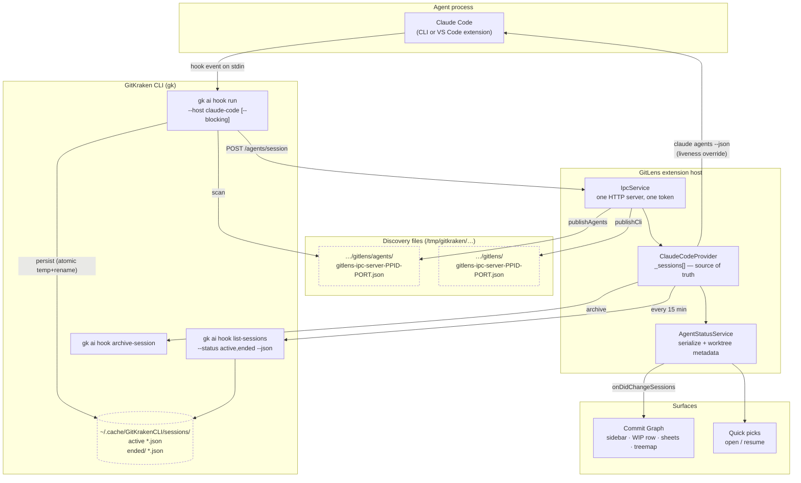
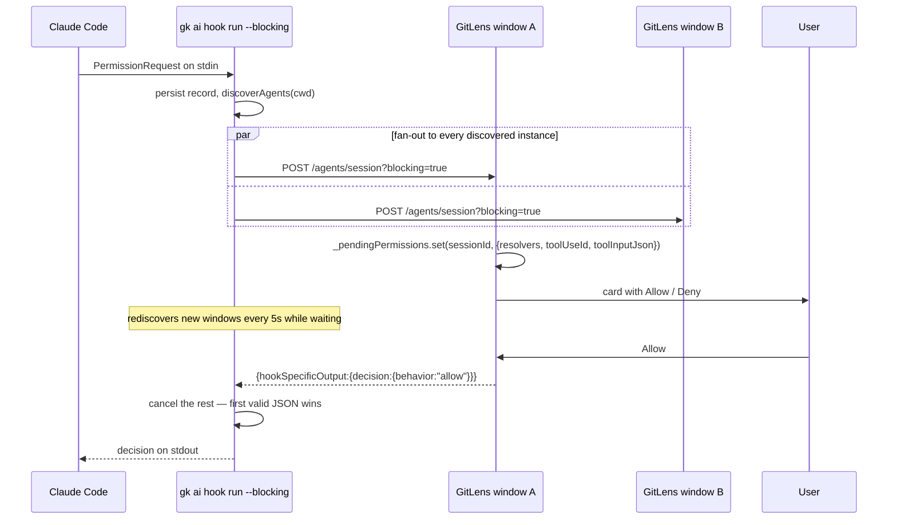
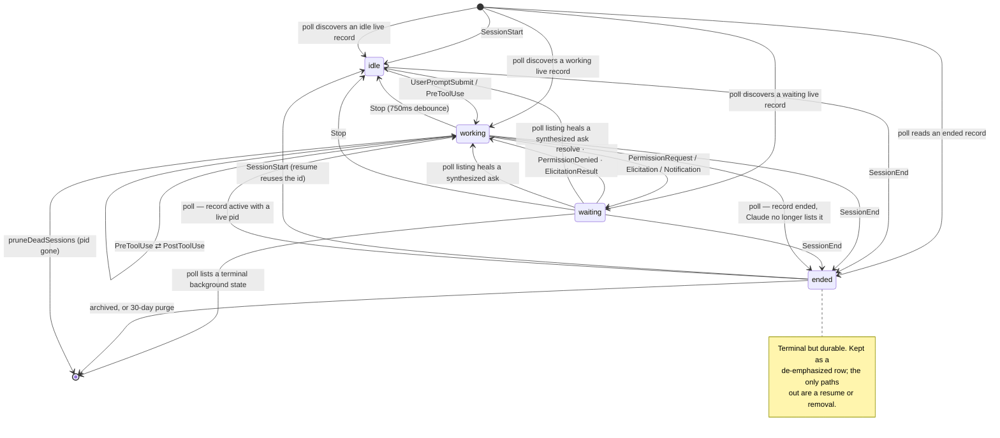

# Agent Sessions

How GitLens learns that an AI coding agent is running, keeps its picture of that agent current, and
lets the user act on it. Covers both halves of the system: the GitKraken CLI (`gk`), which owns hook
installation and the durable session store, and the GitLens extension host, which owns the live
in-memory session set and every UI surface.

For the Commit Graph's own pipeline see `docs/graph-update-pipeline.md`; for webview transport see
`docs/webview-architecture.md`.

## The problem

An agent is an ordinary OS process that GitLens never launched, running in a directory GitLens may
not have open, possibly hosted by a different VS Code window. There is no API to ask "what agents are
running". So GitLens learns about agents two independent ways, and both are lossy:

| Channel                           | Latency      | Sees                                                                                            | Misses                                                                  |
| --------------------------------- | ------------ | ----------------------------------------------------------------------------------------------- | ----------------------------------------------------------------------- |
| **Hook push** (realtime)          | milliseconds | every event of an agent whose hooks are installed and whose `cwd` this machine can broadcast to | agents started before the window opened; anything after a dropped event |
| **Reconciliation poll** (durable) | ≤ 15 min     | everything the CLI has ever persisted, live and terminal                                        | in-flight status between polls; anything the CLI never recorded         |

Neither is authoritative alone: the push path owns _freshness_, the poll owns _existence and
removal_. Most of the complexity in `ClaudeCodeProvider` is the reconciliation between them.

The CLI broadcasts every hook event to every GitKraken product instance it discovers on the
machine, and every window runs the same poll, so a session's data reaches every window this way —
no window has to ask another one for it. What differs window to window is only which one can
actually _show_ the session (its Claude Code tab or integrated terminal); that's a routing
question, handled separately by the CLI relay (see
[Opening a session in another window](#opening-a-session-in-another-window)).

## Topology



Two discovery files, one server. `IpcService` (`src/env/node/ipc/ipcService.ts`) stands up a single
HTTP server on a random loopback port with one bearer token, then publishes **two** files carrying
the same address/token:

- `/tmp/gitkraken/gitlens/gitlens-ipc-server-<ppid>-<port>.json` — the **CLI** file, scanned by `gk`
  for the command routes (`graph`, `compare`, `mcp/*`). Older `gk` binaries assume anything in this
  directory is a CLI server, which is why the agents file lives one level down.
- `/tmp/gitkraken/gitlens/agents/gitlens-ipc-server-<ppid>-<port>.json` — the **agents** file,
  scanned both by `gk ai hook run` (to broadcast events) and by `gk ai hook open-session` (to
  resolve which instance owns a session before relaying an open request to it — see
  [Opening a session in another window](#opening-a-session-in-another-window)). Its
  `workspacePaths` are owned by the agents package, so `ClaudeCodeProvider` re-publishes whenever
  the window's folders change.

Both are `0600` in a `0700` directory. `sweepStaleDiscoveryFiles` (`packages/ipc/src/discovery.ts`)
runs once, 30 s after activation, and deletes another instance's file only when its pid is provably
gone (`ESRCH`) or its `/ping` fails with something other than a timeout — a timeout is ambiguous,
so the file is kept.

## Hook installation

`gk ai hook install claude-code` does **not** edit `~/.claude/settings.json` hooks directly. It
registers a local Claude Code plugin marketplace and enables a plugin:

```
~/.claude/plugins/marketplaces/gitkraken/
  .claude-plugin/marketplace.json
  plugins/gitkraken-hooks/
    .claude-plugin/plugin.json      → name: gitkraken-hooks, version: <cli version>
    hooks/hooks.json                → one entry per event
```

with `~/.claude/settings.json` carrying `extraKnownMarketplaces.gitkraken` (a `directory` source
pointing at that path) and `enabledPlugins["gitkraken-hooks@gitkraken"] = true`, plus a
`known_marketplaces.json` registry entry and a mirrored copy under `plugins/cache/`. The config root
is `$CLAUDE_CONFIG_DIR` when set, else `~/.claude`. Each `hooks.json` entry is the same command line:

```json
{ "matcher": "", "hooks": [{ "type": "command", "command": "\"<path to gk>\" ai hook run --host claude-code" }] }
```

`<path to gk>` is the **stable channel-launcher symlink** (`<installDir>/gk`, `gk-insiders`,
`gk-alpha`), not the running binary's own path — so an installed hook survives version pruning.
Blocking events get ` --blocking` appended; on Windows, hosts whose manifest declares PowerShell
dispatch also get a leading `& ` call operator.

Two gotchas live here. The CLI shells `claude --version` and, **below Claude Code 2.1.101**, installs
only the 8 core events (`SessionStart`, `SessionEnd`, `UserPromptSubmit`, `PreToolUse`,
`PostToolUse`, `PostToolUseFailure`, `Notification`, `PermissionRequest`) — an older Claude Code
rejects the entire settings file over one unknown hook name. If the version can't be detected at all
it assumes 2.1.72 and falls back to that same core set. Separately, `install` is idempotent via a
sticky per-client flag, with drift-repair escape hatches that override the no-op (legacy
`gitkraken@local` / `gk@gitkraken` plugin ids, a dead baked binary, a missing session-end hook).

Non-Claude clients don't use plugins — they get loose JSON hook files that `gk` merges into, owning
only its own entries: `~/.cursor/hooks.json`, `~/.codex/hooks.json`,
`~/.copilot/hooks/gitkraken-hooks.json`, `~/.gemini/config/hooks.json` (antigravity), and a plugin
file for opencode.

GitLens drives Claude installs through
`installAgentHook` (`src/env/node/agents/agentHooks.ts`), which passes the curated Claude event set
explicitly rather than letting `gk` apply its defaults:

- every event in `claudeCodeNonBlockingHookEvents` as `--event`, **minus** `WorktreeCreate` /
  `WorktreeRemove` (`skippedInstallEvents`)
- `PermissionRequest` as `--blocking-event`

Every other client installs bare (`gk ai hook install <client> --force`) with no blocking events, so
no non-Claude agent can park on an unresolved ask. `onlyAllowClaudeHooks` in
`src/agents/utils/agentHooks.ts` currently gates install/uninstall to Claude Code entirely.

`gk agents list --json` reports per-agent `detected` / `hooksSupported` / `hooksInstalled`, cached
for 5 minutes by `AgentService` (`src/agents/agentService.ts`). Note the id mismatch: that command
calls the Claude Code CLI **`claude-cli`**, while `gk ai hook install` wants **`claude-code`** —
`getHookClientId()` translates.

## The CLI side

### `gk ai hook run`

One process per hook event. It reads the payload on stdin and, in order
(`internal/actions/aihook/runner.go`):

1. Resolves the client (`--host`, or auto-detected from the event name) and the event.
2. `discoverAgents(cwd)` — scans `$TMP/gitkraken/{gkd,gitlens,kepler}/agents` for `*.json`, skipping
   any file not owned by the current uid. Returns every instance found, plus the first
   `workspacePaths` entry that matches `cwd` by symmetric prefix containment (`cwd == p`, `cwd`
   under `p`, or `p` under `cwd`).
3. On a `SessionStart` from a rotation source, evicts predecessor sessions sharing the pid
   (`endReason: rotated`).
4. Persists the session record — **atomic temp+rename, before any broadcast**. This ordering is what
   lets GitLens treat a poll snapshot taken after a completion as authoritative.
5. Broadcasts.

Broadcast is **fan-out to every discovered instance, not just the matching one** — GitLens filters on
its own side. Non-blocking: parallel `POST <address>/agents/session` with a 1 s client timeout,
best-effort, a gone instance is expected. A failed POST triggers `reclaimOrphanDiscovery`.

Blocking (`--blocking`, i.e. `PermissionRequest`): parallel `POST /agents/session?blocking=true`,
**first valid JSON response wins**, everything else is cancelled. The transport disables idle
timeouts and sets a 60 s `ResponseHeaderTimeout`, so a client that starts streaming headers can hold
the request for as long as the user takes to decide. While waiting it re-runs `discoverAgents` every
5 s so a GitLens window launched mid-prompt still gets the ask.

6. `cleanupOldSessions(true)` — throttled to once per 30 s per store.

### The durable store

`~/.cache/GitKrakenCLI/sessions/` (`os.UserCacheDir()`, falling back to `os.TempDir()`):

```
sessions/
  <sessionId>.json        active
  ended/<sessionId>.json  ended + archived
  cleanup.stamp           throttle marker
```

Ended records live in a subdirectory specifically so hot-path active scans never read the backlog.
One record per session, last-event-wins, with these fields (observed on a live store):

| Field                                                         | Notes                                                                                                              |
| ------------------------------------------------------------- | ------------------------------------------------------------------------------------------------------------------ |
| `sessionId`, `providerId`, `pid`                              | `providerId` is the **hook client id** (`claude-code`), not GitLens's `AgentSession.providerId`                    |
| `event`, `toolName`, `notificationType`, `reason`, `source`   | last event seen                                                                                                    |
| `cwd`, `cwdTimeline[]`, `worktrees[]`, `matchedWorkspacePath` | `cwdTimeline` entries are `{cwd, worktree, at}` — the CLI ran `rev-parse` at hook time                             |
| `sessionName`, `model`, `prompt`, `firstPrompt`, `planFile`   | `sessionName` is an auto-generated repo slug (`vscode-gitlens-37`)                                                 |
| `agentId`, `agentType`, `subagents[]`                         | sub-agent bookkeeping                                                                                              |
| `fileActivity`, `fileOpCount`, `lastFileActivityAt`           | not read by GitLens — it maintains its own from `PreToolUse`/`PostToolUse`                                         |
| `hookInput`                                                   | raw stdin passthrough — **dropped when the session ends**, so terminal records stay small across the 30-day window |
| `origin`                                                      | `{client, kind, clientRunId, originId}` from `GITKRAKEN_AGENT_ORIGIN_*` env vars, all-or-nothing                   |
| `status`, `endReason`, `endedAt`, `updatedAt`                 | lifecycle                                                                                                          |

`fileActivity` is capped at 100 entries (oldest evicted) and `cwdTimeline` at 50 (FIFO).

`status` is one of `active` / `ended` / `archived`. `endReason` is one of:

| Reason          | Meaning                                                    |
| --------------- | ---------------------------------------------------------- |
| `session-end`   | the client's declared session-end event fired              |
| `rotated`       | a new `SessionStart` from a rotation source reused the pid |
| `dead-pid`      | the recorded pid no longer exists                          |
| `pid-zero-idle` | a pid-0 host idle past 24 h                                |
| `stale`         | record older than the 72 h backstop                        |
| `archived`      | user archived it                                           |

`session-end`, `rotated` and `archived` are _terminal_ — a late event never revives them (with one
exception: `rotated` stays revivable for pid-sharing clients like Codex). Reaping never touches a
session whose host is confirmed alive, no matter how idle.

`cleanupOldSessions` — and therefore both the reaping and the **30-day retention purge of `ended/`**
— runs only as a tail step of `gk ai hook run`, `list-sessions`, and friends. There is no daemon and
no timer. Archived records are exempt from the purge. This is why GitLens keeps polling even when it
holds nothing but terminal rows: the poll _is_ the CLI's garbage collector.

### Commands GitLens invokes

| Command                                              | Called from             | Purpose                                             |
| ---------------------------------------------------- | ----------------------- | --------------------------------------------------- |
| `ai hook list-sessions --status active,ended --json` | `syncSessions`          | the reconciliation poll                             |
| `ai hook list-sessions --status archived --json`     | `getArchivedSessionIds` | exclude archived transcripts from "Past" (10 s TTL) |
| `ai hook archive-session <id> --json`                | `archiveSession`        | dismiss an ended row                                |
| `ai hook install/uninstall <client>`                 | hooks commands          | plugin (un)registration                             |
| `agents list --json`                                 | `AgentService`          | detection + hooks state (5 min TTL)                 |

CLI version gates worth knowing: **v3.1.64** moved Claude hook installation off `settings.json` onto
the plugin marketplace; **v3.1.69** introduced the durable `ended/` store, the 30-day retention
model, `archive-session` / `remove-session`, and `--status <csv>`; **v3.1.70** added the cursor /
codex / copilot / antigravity clients.

Two more exist that GitLens doesn't call: `ai hook get-session <id> --json` (read one record of any
status) and `ai hook remove-session <id>` (hard-delete, broadcasting a synthetic `SessionEnd` first).
There is also a hidden `gk agents register` / `unregister` pair that GKD and Kepler use to publish
their agent discovery files — GitLens doesn't use it, writing its own file directly through
`IpcService`, but both produce the same `{token, address, workspacePaths}` shape in the same
per-app directory, which is why one hook event reaches all three products.

`list-sessions` defaults to active-only, so `--status` is **required** to see terminal records at
all. A pre-3.1.69 CLI rejects the flag; `isUnknownFlagError` detects that and retries flagless, which
on that CLI returns everything unfiltered. When that fallback fires, `_statusFilterSupported` goes
false and the whole `ended` row concept is disabled — no poll could ever confirm or archive one —
so `SessionEnd` reverts to removing the session outright.

## The realtime path

`ClaudeCodeProvider.ensureIpcServer` registers three routes on the shared server before any async
work, so a blocking permission request is never delayed by startup:

| Route                        | Caller                    | Behavior                                                                         |
| ---------------------------- | ------------------------- | -------------------------------------------------------------------------------- |
| `POST /agents/session`       | `gk ai hook run`          | one hook event; `?blocking=true` means hold the response                         |
| `POST /agents/sessions/open` | `gk ai hook open-session` | reveal `sessionId` in _this_ window (Claude tab or terminal); replies `{opened}` |

Then it publishes the agents discovery file, runs one **ungated** `syncSessions`, and arms the
15-minute gated poll.

`handleSessionEvent` drops anything whose `event.providerId` is present and not `claude-code` — the
CLI broadcasts every host's events to every listener. A dropped blocking request simply gets no
decision, and the CLI waits out its own timeout, which is correct: we must not answer for an agent we
don't track.

The event handlers, condensed:

| Event                                                                                                     | Effect                                                                                                                                                                      |
| --------------------------------------------------------------------------------------------------------- | --------------------------------------------------------------------------------------------------------------------------------------------------------------------------- |
| `SessionStart`                                                                                            | create, or **revive** a `ended` row (a resume reuses the id — this is the resume signal); takes the new pid, resets bookkeeping                                             |
| `UserPromptSubmit`                                                                                        | store prompt → `thinking`. A prompt that sanitizes to nothing is harness-synthetic (background-bash notifications, slash-command echo) and is treated as informational only |
| `PreToolUse`                                                                                              | `tool_use` + `describeToolInput` detail; refcount the touched file                                                                                                          |
| `PostToolUse` / `PostToolUseFailure`                                                                      | decrement refcount, schedule the decay eviction; `thinking` when no tool is still in flight                                                                                 |
| `PermissionRequest`                                                                                       | blocking → hold the HTTP response (below); non-blocking → same card, `resolvable: false`                                                                                    |
| `PermissionDenied`                                                                                        | drop the file immediately (no cooldown), settle the ask                                                                                                                     |
| `Elicitation` / `ElicitationResult`                                                                       | `permission_requested` with `kind: 'elicitation'`, always unresolvable                                                                                                      |
| `Notification`                                                                                            | `permission_prompt` / `elicitation_dialog` synthesize an unresolvable ask; `idle_prompt` is a no-op                                                                         |
| `PreCompact` / `PostCompact`                                                                              | `compacting` / `thinking`                                                                                                                                                   |
| `Stop` / `StopFailure`                                                                                    | settle bookkeeping, then **debounce 750 ms** before committing to `idle` — any non-idle event cancels it                                                                    |
| `CwdChanged`                                                                                              | routed through `ensureSession` so the location transition, workspace recompute, unresolvable-flag clear and probe gating all happen together                                |
| `SubagentStart` / `SubagentStop`                                                                          | add/remove an entry in the parent's `subagents[]`                                                                                                                           |
| `TeammateIdle`, `TaskCompleted`, `InstructionsLoaded`, `ConfigChange`, `WorktreeCreate`, `WorktreeRemove` | intentional no-ops                                                                                                                                                          |

### Blocking permissions



Every window holding the ask can answer it; whichever replies first wins. A duplicate delivery of the
same ask — the CLI retrying after its 60 s response-header timeout — is detected by `tool_use_id`, or
by tool name plus a **key-sorted** `tool_input` stringification when no id is present, and _attaches_
to the existing entry so both connections settle on one decision. A genuinely different ask arriving
while one is outstanding auto-denies the old one.

An ask is only `resolvable` when this window holds the blocking hook entry. Elicitations (delivered
non-blocking) and poll-discovered asks are both forced to `resolvable: false`, and surfaces must
render a button-less explanatory card for those. `AgentStatusService.resolvePermission` turns a
`false` return into "This request can only be answered in the agent's session. Open the session to
respond." — but says nothing if the ask has since cleared, since that's a raced click rather than an
unroutable ask.

### File activity

`PreToolUse` refcounts the target path per session, per kind (read-class: `Read`/`NotebookRead`;
edit-class: `Edit`/`Write`/`MultiEdit`/`NotebookEdit`). `PostToolUse` decrements and, at zero,
schedules eviction after the **activity decay window** (default 5 min, overridden by
`gitlens.graph.experimental.visualizations.activityDecay`). `Stop` clears the live `reading`/`editing`
flags but deliberately leaves the decay tail running, anchored at each tool's own completion — so the
treemap heatmap fades out over the window instead of snapping empty at turn end.

Sub-agent tool calls accumulate on the **parent's** `fileActivity`: the CLI keys them under the parent
session id with `agentId` set. Sub-agent `AgentSession` objects always carry `fileActivity:
undefined`; consumers never recurse.

## The reconciliation poll

`syncSessions` runs ungated at startup and every 15 min thereafter. Two gates back it off:

- Nothing tracked **and** hooks not installed → skip entirely. Sessions only ever arrive via the
  push path, so there is nothing reachable to find.
- Hooks not installed, nothing non-terminal tracked, and the last poll was under an hour ago → skip.
  There is no dying process to reap; only history reconciliation and the CLI's retention sweep,
  neither of which needs quarter-hourly resolution. Hooks **on** keeps the full cadence deliberately,
  because there the tick is also the backstop for events that never reached our IPC server.

It stamps `pollStartedAt` _before_ the CLI call, so it can distinguish "this snapshot postdates the
completion" from "an in-flight poll that predates it".

### The `ended`-record trap

The CLI's store **never revives a resumed session**. Once a record moves to `ended/`, nothing moves
it back — so an `ended` record is not proof the session is over. Before trusting one, the provider
consults `getLiveAgentSessions()`, which shells `claude agents --json`
(`src/env/node/agents/claudeSessionFile.ts`, 5 s TTL, 5 s spawn timeout, fails soft to an empty map)
and maps each entry through `statusFromLiveSession`:

| Claude reports                                       | Mapped status               |
| ---------------------------------------------------- | --------------------------- |
| `status: waiting`, `waitingFor: 'permission prompt'` | `permission_requested`      |
| `status: waiting` (anything else)                    | `waiting`                   |
| `status: busy`                                       | `thinking`                  |
| `state: blocked`                                     | `waiting`                   |
| `state: working`                                     | `thinking`                  |
| `state: done` / `failed` / `stopped`                 | **`undefined` — not alive** |
| anything else                                        | `idle`                      |

That `undefined` matters: `--json` lists background sessions "still working or blocked even when
their process has exited", so a listing is not by itself proof of life. Without the terminal-state
check a genuinely finished session would be resurrected as `idle`.

For a tracked row kept alive against an `ended` record, the listing establishes **liveness, not
ongoing status**. Its status sample is taken only when reviving the row; afterward hook events win, so
a later poll cannot stamp a row back to `idle` moments after a hook moved it to `tool_use`. The pid
always comes from the listing and never falls back to the row's own — the row's pid is the dead process
whose exit wrote the `ended` record, and carrying it forward would make `pruneDeadSessions` reap the
revived row later in the same poll.

The active-record path has two narrower status-authority cases because it has no fresher hook state:

- On first discovery, the listing corrects a potentially stale last-event status. A listed terminal
  background state skips the stale active record instead of seeding a false live row.
- For an already-tracked synthesized, unresolvable permission ask, a non-permission listing status
  clears the frozen ask. A listed terminal state removes the stale live row; the durable `ended`
  record restores it later with authoritative terminal metadata.

Absence from the listing — including the fail-soft empty map returned after a listing failure — never
means dead. In every active-record case, absence preserves the record-derived status.

### Removal

Four separate mechanisms, deliberately non-overlapping:

- **`pruneDeadSessions`** — drops non-terminal rows whose pid is gone. Never touches `ended` rows
  (their pid is dead by design) and never touches a row with an outstanding permission ask (a session
  blocking on us is alive even if `kill(pid, 0)` says otherwise).
- **Stale-ended filter** — a `ended` row absent from the poll was archived elsewhere or
  purged. Guarded by `polledAtLeastOnce`, or by the poll's snapshot postdating the completion by more
  than the 30 s grace, so a just-ended row isn't dropped by a poll that predates its record.
- **`SessionEnd`** — transitions to `ended` in place (legacy CLI: removes).
- **Terminal live-list entry** — removes an active row stuck on a synthesized, unresolvable ask when
  the durable active record has not advanced. The durable `ended` record restores the row once it
  carries authoritative terminal metadata.

`endSession` also rejects any in-flight permission promise and cancels a pending `Stop → idle`
timer, which would otherwise fire inside its window and revive the row as a live zombie.

Drift between the push path and the poll is reported as `agents/session/syncDiscrepancy` telemetry —
`discovered` (poll saw it, we didn't) and `missing` (we track it, poll no longer reports it alive) —
but only on the gated poll, since the bootstrap call runs before the push path could have received
anything.

## Session lifecycle



`AgentSessionStatus` (8 values) collapses to `AgentSessionPhase` (4) via `getPhaseForStatus`:
`thinking`/`tool_use`/`responding`/`compacting` → `working`; `waiting`/`permission_requested` →
`waiting`; `idle` → `idle`; `ended` → `ended`. `isActiveAgentPhase` is an explicit allowlist
(`working` or `waiting`), so a new phase defaults to _not_ live.

`phaseSince` survives short oscillations: a phase that transitions away and back within 2 s restores
the prior timestamp, so displayed elapsed time doesn't snap to zero on a same-turn blip.

## Opening a session in another window

Two GitLens windows on one machine both receive every broadcast and run their own poll, so both
already track a session's data (see [The problem](#the-problem)). But only one of them typically
hosts the Claude Code extension panel — or has the integrated terminal — the session actually lives
in, so "open" has to route to the right window rather than just paint the right row.

`dispatchSessionAction` (see [Actions](#actions)) does that routing locally, through one shared
helper: `relayAndRaise`. An extension-hosted session owned by another window's extension host is
the one case a window _knows_ it can't reveal in-place — `dispatchRemotelyHostedSession` calls
`relayAndRaise` directly. Every other path (a CLI-hosted or unknown-host Claude session, and every
non-Claude session) only _suspects_ it might be hosted elsewhere, once its own in-window reveal has
already come up empty, and reaches `relayAndRaise` as one more rung before OS-level window focus
(steps 2, 5, 6 below).

`AgentSessionProvider.relayOpenSession(sessionId, path)` shells out to
`gk ai hook open-session <id> --path <path> --exclude-address <own address> --json`. The CLI
resolves the owning instance from its own discovery-file view — the same one `gk ai hook run` scans
to broadcast events (see [The CLI side](#the-cli-side)), covering every GitKraken product instance,
matched against `path` the same way (`cwd == p`, `cwd` under `p`, or `p` under `cwd`) but tried in
ownership order — an exact workspace match first, then the closest ancestor, then descendants — and
`POST`s `{sessionId}` to the first instance that answers, stopping there. `--exclude-address` carries this window's
own IPC address (`IpcRegistrar.address`) so the CLI never routes the request back to the window
that's already asking. `relayOpenSession` resolves `true` only when the CLI reports delivery; it
never falls back to a direct HTTP call to another window, and never throws — a spawn/parse failure,
or a `gk` binary that predates `open-session`, just resolves `false`.

`relayAndRaise` treats that boolean as the gate for everything after it: it fires the relay with a
500 ms wait cap, and only once delivery is confirmed within that cap does it raise the window —
`vscode.openFolder` would otherwise risk opening a folder no window actually holds, replacing the
current workspace instead of finding a peer to focus. So:

- delivered, different workspace → `vscode.openFolder` on the target path (`workspacePath ??
worktreePath ?? commonPath ?? cwd`) with `forceNewWindow: false` — VS Code's own window-folder
  matching finds and focuses the window that already confirmed it holds the session;
- delivered, same workspace → an info message telling the user to switch windows manually, since
  there's nothing here to disambiguate or focus at the OS level;
- not delivered within the cap (unhealthy relay, no target path, or the provider can't relay at
  all) → `relayAndRaise` resolves `false` and does nothing further; the caller falls back to its
  own next rung (OS-level window focus, or — for `dispatchRemotelyHostedSession` — the same
  "switch to it" info message).

The receiving end is the `/agents/sessions/open` handler → `callbacks.revealSession(sessionId)` →
`AgentStatusService.revealSession`. Unknown or `ended` → `false`. A Claude session that's
extension-hosted but owned by a _different_ window's extension host (classified the same way
`dispatchSessionAction` does, via `~/.claude/sessions/<pid>.json` and
`isDescendantOfThisExtensionHost`) → `false` — opening it here would only create an inert view.
Otherwise `revealSessionInWindow`: a Claude session with a known/likely extension host tries the
extension's own open command (which reveals an existing tab for a known id); everything else finds
the integrated terminal (panel or editor tab) whose shell pid is the nearest ancestor of
`session.pid` — `findTerminalForProcess` (`src/agents/utils/-webview/terminalReveal.ts`), sharing
`walkAncestorChain` (`src/agents/utils/processAncestry.ts`) with the Graph's own follow-in-terminal
action — and calls `show()`. This works for non-Claude agents too. It never reaches for OS-level
window focus itself — that's `dispatchSessionAction`'s job when the in-window reveal comes up empty
(see [Actions](#actions)).

## Identity, attribution, naming

**Location fields, and which one to use:**

| Field                                                      | Meaning                              | Use for                                                  |
| ---------------------------------------------------------- | ------------------------------------ | -------------------------------------------------------- |
| `cwd`                                                      | live working directory, follows `cd` | resume (Claude migrates the transcript to follow it)     |
| `worktreePath`                                             | resolved worktree root               | **attribution** — branch cards, WIP rows, resume picker  |
| `commonPath`                                               | parent repo's common path            | "same repo" identity checks                              |
| `workspacePath`                                            | matched VS Code workspace folder     | `isInWorkspace`, "Open Folder" — **never** repo identity |
| `initialCwd` / `initialWorktreePath` / `initialCommonPath` | first observation, never overwritten | drift detection                                          |

`resolveGitInfo` (host callback, `src/env/node/providers.ts`) has a synchronous fast path when `cwd`
is in an already-loaded repo, and a cold path that runs one combined `git rev-parse` with no
repo-registration side effects. Its answer is superseded by a **CLI-seated** worktree
(`cliSeatedWorktree`) when the CLI resolved one for that exact cwd — the CLI's answer is right for a
nested worktree, where the probe would name the parent. `commonPath` always comes from the probe; the
CLI never resolves repo identity.

A cwd that isn't in any repo sets the `gitInfoUnresolvable` bookkeeping flag rather than writing a
tombstone onto the DTO, so `undefined` stays unambiguous on the wire — "not yet resolved" and
"resolved but not in a repo" are internally distinguished but consumers treat them identically. The
flag clears on `CwdChanged` and on `resetBookkeeping`.

**Attribution** (`src/webviews/apps/shared/agentUtils.ts`) matches strictly on `session.worktreePath`
against `target.worktreePath ?? target.repoPath`. It deliberately does _not_ fall back to
`workspacePath` (not a worktree identifier) or `cwd` (usually deeper than the worktree boundary). A
session whose worktree hasn't resolved yet simply doesn't match — a narrow window, since
`resolveGitInfo` runs on the first hook.

One deliberate exception: **cross-window routing does not use the attribution key.**
`relayAndRaise` picks `workspacePath ?? worktreePath ?? commonPath ?? cwd`, each step more general
than the last, because the question there is "which folder should `vscode.openFolder` focus" — not
"which WIP row does this belong to".

**Naming** — `getSessionDisplayName` (`src/agents/models/agentSessionState.ts`) resolves once
host-side so every surface agrees:

```
transcriptTitles.custom → transcriptTitles.ai → deriveNameFromPrompt(firstPrompt)
  → deriveNameFromPrompt(lastPrompt) → session.name → transcriptTitles.agent
  → "On <worktree|cwd basename>" → providerName
```

`session.name` ranks _below_ prompt-derived names because for Claude Code it's the CLI's auto-slug
(`vscode-gitlens-37`), which the newer CLI always stamps — ranking it first would mask every real
title. It stays _above_ the location anchor because for a sub-agent, `name` is the meaningful
`agentType` (`Explore`, `reviewer-agent`).

Titles come from tailing the Claude transcript at
`~/.claude/projects/<encoded-cwd>/<sessionId>.jsonl` (`ClaudeCodeTranscriptReader`), which caches per
session by mtime + byte offset and only reads the appended tail. Re-checked on `SessionStart`, on
every fresh transition into `idle` (Claude typically rewrites `ai-title` right after finishing a
response), and each poll for a poll-discovered session until a real title lands.

## Host → webview

`AgentStatusService` (`src/agents/agentStatusService.ts`) is the single fan-out point. It:

- flattens `_providers.flatMap(p => p.sessions)`
- serializes each via `serializeAgentSession` into `AgentSessionState` — a near-1:1 `Shape<>`
  projection with three divergences: `subagents` → `subagentCount`, a host-composed `worktree`
  object, and the cascade-resolved `displayName`
- backfills `commonPath` from the host's worktree lookup for ended sessions the provider never
  git-probed
- resolves worktree display metadata live per snapshot (`_worktreeNameByPath`), so `git checkout` and
  worktree renames reach the UI without the agent restarting
- fires `onDidChangeSessions(AgentSessionState[])` **only when something actually changed**

That change detection matters more than it looks. `onDidChangeSessions` fires per hook event — i.e.
per tool call — while `_sessions` holds every terminal session in the CLI's 30-day window.
Re-serializing all of it per event would scale the live path by total history. So serialization is
memoized in a `WeakMap` keyed by the session **object** (providers replace sessions immutably, so
identity is a sound proxy for content), and comparison is per-session pointer equality on the memoized
key. Only a session whose identity changed pays a real `JSON.stringify`. Session _order_ is
deliberately excluded — consumers sort for themselves.

The service also pushes hooks-installed state down to providers (`setClaudeHooksInstalled`) to gate
their poll, deferred 3 s past `onReady` so the `gk agents list` subprocess doesn't contend with
webview bootstrap. It fails **open** — providers assume installed until told otherwise — so a
detection hiccup never suppresses discovery.

Providers are started/stopped on window focus, but `ClaudeCodeProvider.stop()` is a deliberate no-op:
the IPC server stays up because hooks fire whether or not the window is focused.

| Surface           | Channel       | Wiring                                                                                                                                                      |
| ----------------- | ------------- | ----------------------------------------------------------------------------------------------------------------------------------------------------------- |
| Commit Graph      | legacy IPC    | `GetAgentSessionsRequest` (pull) + `DidChangeAgentSessionsNotification` (push), `graphWebview.ts`; also recomputes the `agents` branches-visibility ref set |
| Graph panels      | direct        | `graphPanelsService.ts` reads `getSerializedSessions()` on demand                                                                                           |
| Settings → Agents | Supertalk RPC | `AgentsService` (`src/webviews/rpc/services/agents.ts`) — **detection state only**, never live sessions                                                     |

**The two channels serialize dates differently, and `AgentSessionState` does not say so.** Legacy IPC
goes through VS Code's `postMessage`, which structured-clones — so `lastActivity` / `phaseSince`
arrive on the Graph as real `Date` objects (`pickWipRowAgentStatus` calls `.getTime()` on one
directly). The RPC channel `JSON.stringify`s its payload (`encodeRpcPayload`), so the same fields
reach RPC consumers as ISO **strings** wearing a `Date` type. Shared helpers hedge — `formatAgentElapsed`
accepts `Date | number` — but anything reaching for a `Date` method on a session that arrived over
RPC is a latent bug. `PastAgentSessionState.lastActivity` sidesteps it by being typed `number`
(epoch ms) outright, which is the convention to follow for anything new on the RPC channel.

### Surfaces

| Surface               | Entry point                                                   | Renders                                                                                                           |
| --------------------- | ------------------------------------------------------------- | ----------------------------------------------------------------------------------------------------------------- |
| Graph sidebar         | `sidebar/sidebar-panel.ts`, `sidebar/agent-tooltip.ts`        | session rows + hover detail                                                                                       |
| Graph WIP row         | `components/wipRowAgentStatus.ts`                             | one collapsed badge per worktree                                                                                  |
| Branch hover          | `components/gl-branch-hover.ts`                               | sessions on the hovered branch's worktree                                                                         |
| Details / agent sheet | `components/gl-details-agent-status.ts`                       | the dense per-session composite — permission actions, plan/question bodies, sticky tool detail                    |
| Branch sheet          | `components/gl-graph-branch-sheet-pane.ts`                    | agent pills + the "Past" section                                                                                  |
| Treemap               | `components/gl-graph-treemap.ts`                              | Activity mode reads `session.fileActivity` straight off the pushed array — there is no separate streaming channel |
| Kanban / overview     | `components/gl-graph-kanban.ts`, `overview/graph-overview.ts` | per-branch cards, batch-matched via the index                                                                     |
| Trees                 | `shared/components/tree/tree-view.ts`                         | `decoration.type === 'agent'`, sharing the graph's glyph vocabulary                                               |
| Quick pick            | `src/quickpicks/resumableSessionPicker.ts`                    | live + past sections                                                                                              |

There is no status-bar consumer.

`pickWipRowAgentStatus` is the one place that collapses many sessions into one indicator: it drops
`ended` outright and `idle` sessions older than 24 h (clock-skew-clamped), then picks the most
attention-worthy survivor by `needs-input > working > idle`. The 24 h bound is deliberately mirrored
from the host's `agentBranchesIdleThresholdMs`, which drives the `agents` branches-visibility scope —
keep the two in lock-step. Ended sessions are a deliberate divergence: dropped here, kept there,
because a branch whose agent just finished is exactly what that scope is for.

`AgentsService.getPastSessionsForWorktree` is deliberately the only session data on that RPC service:
live sessions already reach webviews on a push channel, and a snapshot taken there would disagree
with it within seconds.

## Past and resumable sessions

Two different stores answer "what can I resume here", and they must not double-count. `ended` is the
state word throughout the code; every surface labels it "Past" for the user.

- **CLI ended records** → tracked `ended` rows, rendered as cards on the surface that owns the
  worktree.
- **Claude transcripts** (`ClaudeCodeTranscriptReader.listSessions`) → the "Past" list.

`getPastSessions(worktreePath, options)` reconciles them. It excludes every live session, adds
machine-global archived ids (the tracked row is gone once archived, but the transcript on disk
survives and would otherwise resurface), and — when `excludeEnded` is set — also excludes tracked
ended rows _for this worktree only_. The scoping is load-bearing: an ended session whose
worktree never resolved has no card anywhere, so excluding it globally would make it invisible rather
than merely deduped.

The exclude set is passed **down** to the provider as `excludeSessionIds` so it applies before
`limit`. Without that, a worktree whose newest transcripts are all tracked could show no past rows and
no "N more" footer while older ones existed.

A second guard runs client-side. Past results are pulled once per worktree and never re-pushed, so
the live-id dedup that was masking a row stops the instant that session leaves the tracked set —
painting a just-archived session as a "Past" row, which reads as the archive having failed.
`createPastAgentSessionsResolver` (`agentUtils.ts`) tracks departures against the **full** tracked
set (so switching worktrees isn't mistaken for sessions disappearing) and suppresses them until a
fresh fetch arrives. Callers must resolve once per cycle and use the result for both the
visibility gate and the rendered rows — filtering only at render would let a parent size a section
from an unfiltered count that the child then renders empty.

Ended sessions defer their expensive resolution: a 30-day cold start would otherwise fan out
hundreds of git probes and transcript reads. `resolveEndedSessionDetails` runs only when the user
_opens_ a row. The one exception is sessions ended within the last 24 h — they still surface on WIP
rows and branch cards, which match strictly on resolved `worktreePath`, so their git info is resolved
eagerly at poll time.

## Actions

| Action                        | Route                                                                                      |
| ----------------------------- | ------------------------------------------------------------------------------------------ |
| Open Session                  | `gitlens.agents.openSession` → `dispatchSessionAction`                                     |
| Resume Session                | `gitlens.agents.resumeSession` → extension if `cwd` _is_ a workspace folder, else terminal |
| Archive                       | `gitlens.agents.archiveSession` → `gk ai hook archive-session`                             |
| Allow / Deny                  | `resolvePermission` → the held blocking HTTP response                                      |
| Open worktree / show in Graph | `gitlens.agents.openSessionWorktreeInNewWindow`, `showWorktreeInGraph`                     |

`dispatchSessionAction` picks a target in this order:

1. `ended` → straight to resume. Its retained pid is dead and possibly reused, so it must never
   reach the focus dispatch. (Safe by construction: the provider checks every `ended` record against
   `claude agents --json` before accepting `ended`.)
2. Not a Claude Code session (a different `providerId`) → `dispatchOtherAgentSessionAction`: reveal
   the integrated terminal owning `pid` in this window, then relay+raise a peer window that might
   actually host it (`relayAndRaise`, delivery-gated — see below), then an OS-level window focus,
   then warn/offer resume. None of the
   Claude-specific steps below apply to another agent's session id.
3. Classify the host by reading `~/.claude/sessions/<pid>.json` — `entrypoint === 'claude-vscode'`
   means the VS Code extension. For an extension-hosted session, the Claude binary's direct parent
   _is_ the owning extension host, so `parent === process.pid` decides local ownership.
4. Extension-hosted and owned by another window's extension host → `dispatchRemotelyHostedSession`:
   relay the open through the CLI, then `vscode.openFolder` or an info hint — see
   [Opening a session in another window](#opening-a-session-in-another-window).
5. In-workspace → `revealSessionInWindow` (the Claude tab, or the integrated terminal owning `pid`);
   then, only when we don't _know_ it's extension-hosted (the pid would be VS Code itself, so a
   relay or focus attempt would falsely signal success), `relayAndRaise` and then an OS-level window
   focus; then warn/offer resume.
6. Out-of-workspace CLI session → `revealSessionInWindow`, then (same "don't know it's ours" guard
   as step 5) `relayAndRaise`, then an OS-level window focus.
7. Dead end → offer `claude --resume <id>` in a fresh terminal, when `canResumeSession` allows it
   (`idle`, `waiting`, or `ended` — never `working`, which risks parallel writes).

Terminal resume prefers gkcli's detected `claude-cli` executable over bare `claude`, so a non-PATH
install (Homebrew, Volta shim, custom prefix) still works. `cwd` is load-bearing: `claude --resume`
only finds a session when invoked from the directory its transcript is homed under, and Claude
**migrates** that file when the session `cd`s — which is why the resume cascade prefers live `cwd`
over `initialCwd`.

`archiveSession` refuses any non-`ended` row as a last line of defense: the CLI's
`archive-session` ends an active session first, so a stale click on a row that resumed since render
must never reach it.

## Timing

| Constant                                    | Value                      | Where                                |
| ------------------------------------------- | -------------------------- | ------------------------------------ |
| Reconciliation poll                         | 15 min                     | `staleCheckIntervalMs`               |
| Idle-window poll floor                      | 1 h                        | `idleReconcileIntervalMs`            |
| `Stop` → `idle` debounce                    | 750 ms                     | `stopToIdleDebounceMs`               |
| `phaseSince` restore window                 | 2 s                        | `phaseSinceRestoreWindowMs`          |
| File-activity decay                         | 5 min (configurable)       | `defaultActivityDecayMs`             |
| Ended-removal grace                         | 30 s                       | `endedRemovalGraceMs`                |
| Archived-id cache                           | 10 s                       | `archivedSessionIdsCacheTtlMs`       |
| Eager git resolve for ended                 | 24 h                       | `recentEndedGitResolveThresholdMs`   |
| `claude agents --json` cache / timeout      | 5 s / 5 s                  | `claudeSessionFile.ts`               |
| Cross-window relay wait cap                 | 500 ms                     | `relayAndRaise`                      |
| Transcript listing cache                    | 10 s                       | `listingCacheTtlMs`                  |
| Deferred CLI probe / hooks push             | 3 s past `onReady`         | `GkCliService`, `AgentStatusService` |
| Discovery sweep                             | once, 30 s past activation | `IpcService`                         |
| CLI non-blocking broadcast timeout          | 1 s                        | `broadcastEvent`                     |
| CLI blocking rediscovery                    | 5 s                        | `blockingRediscoveryInterval`        |
| CLI blocking response-header timeout        | 60 s                       | `newBlockingTransport`               |
| CLI cleanup throttle                        | 30 s                       | `cleanupThrottle`                    |
| CLI stale backstop / pid-0 idle / retention | 72 h / 24 h / 30 d         | `runner.go`                          |

## Sharp edges

- **Cross-window open depends on the CLI relay, but degrades gracefully.** `relayOpenSession`
  resolves `false` on any relay failure, including a `gk` binary that predates
  `ai hook open-session` — `relayAndRaise` never fires `vscode.openFolder` without confirmed
  delivery, so a failed relay for a known extension-hosted peer session falls back to the "switch to
  it" info hint, and a failed relay for a CLI-hosted/non-Claude session that only _suspected_ a peer
  falls back further still, to OS-level window focus by pid (and, from there, the resume-in-terminal
  offer).
- **The poll is the CLI's garbage collector.** Gating it out to save a subprocess would strand rows
  on screen _and_ records on disk until a window reloads.
- **`ended` is not terminal.** Any code path that treats a `status: 'ended'` record as proof the
  session is over, without consulting `claude agents --json`, will report a live resumed agent as
  ended.
- **A revived row must take the listing's pid, never its own.** The old pid is dead — and, across a
  30-day window, possibly reused by an unrelated process.
- **`workspacePath` is not repo identity.** It is the matched workspace folder. Use `commonPath`.
- **Field availability varies by CLI version.** `initialCwd` and `model` are absent from older
  records; `cwdTimeline` / `worktrees` are absent from older ones still, which is why
  `worktreeRootFromData` falls back and the callers fall back again to a git probe.
- **Two webview transports, two date encodings.** Legacy IPC preserves `Date`; the RPC channel turns
  it into an ISO string behind the same type. Prefer epoch-ms on anything new crossing RPC.
- **Past sessions are pull-only.** Nothing re-pushes them when the live set changes, which is why
  `createPastAgentSessionsResolver` exists — skip it and an archived session reappears under "Past".
- **A stale Claude Code binary silently truncates the hook set.** Below 2.1.101 — or when
  `claude --version` can't be read at all — only 8 core events install, so `Stop`, `PreCompact`,
  `CwdChanged`, `SubagentStart`/`Stop`, `Elicitation`, and `PermissionDenied` never fire, and the
  session's status will look coarse and sticky for reasons invisible from the GitLens side.
- **The store is machine-global and shared across hosts.** Records carry a `providerId` for the hook
  client; anything not `claude-code` must be filtered _before_ it reaches the polled-id sets, or it
  skews ended-row reconciliation and the drift telemetry.
