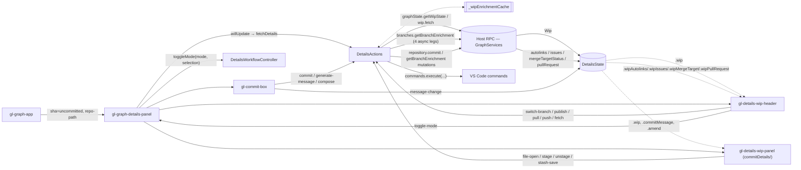
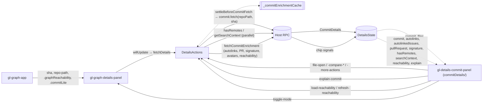

# Commit Graph Details Panel — Data Flow

Maps how data flows into and out of `gl-graph-details-panel` for each selection type, each
lens on that selection, and the sheet layer that floats above it. For the Graph's general
architecture see `docs/architecture.md`; for the row/layout pipeline see
`docs/graph-update-pipeline.md`.

## Conventions

- **In (parent → panel)**: `gl-graph-app` (`src/webviews/apps/plus/graph/graph-app.ts`) pushes
  the selection down as Lit `@property`/attribute bindings on `<gl-graph-details-panel>`: `sha`,
  `repo-path`, `.shas`, `.graphReachability`, `.commitLite`/`.commitLites` (eager per-row shells
  built from graph row data, so metadata can paint before the IPC round-trip resolves), plus
  layout/chrome flags (`show-maximize`, `maximized`, `sheet-maximized`, `graph-ready`,
  `.showSearchBox`, `.searchBoxFilter`) and `.navigation`/`.pushOverlay` controllers. The panel
  consumes several Lit contexts: `graphServicesContext` (the resolved `Remote<GraphServices>` RPC
  surface) and `graphStateContext` (`AppState` — the graph's own reactive state, e.g.
  `ingestWip`/`getWipState` for the WIP mirror shared with the row list) are the two that carry
  domain data; `graphCrossPaneContext` (the cross-pane running-operations registry, see below),
  `graphLaunchpadContext`, `ipcContext`, and `webviewContext` carry narrower concerns. The panel
  then **provides** its own contexts downward to sub-panels and sheets —
  `detailsStateContext`/`detailsActionsContext`/`detailsWorkflowContext` (`detailsContext.ts`) —
  so a sheet or mode panel several levels down can reach `DetailsState`/`DetailsActions`/the
  workflow controller without prop-drilling.
- **Host RPC**: `@eamodio/supertalk`, a typed RPC layer over the webview's single `postMessage`
  channel (`src/webviews/apps/shared/rpcClient.ts`, `webviewEndpoint.ts`). `resolveDetailsActions`
  (`detailsResolver.ts`) resolves the `GraphServices` sub-service proxies once
  (`graphInspect`, `autolinks`, `branches`, `pullRequests`, `repository`, `agents`, `ai`, …) and
  wraps the fetch-shaped ones as `Resource`s (`src/webviews/apps/shared/state/resource.ts`) —
  loading/value/error/cancel semantics with per-call generation guards, used for `commit`, `wip`,
  `compare`, `branchCompareSummary`, `branchCompareSide`, `review`, `compose`, `resolve`,
  `scopeFiles`. Other calls (enrichment legs, mutations) go through `DetailsActions` methods that
  call the service proxies directly.
- **State signals**: `DetailsState` (`detailsState.ts`, `@lit-labs/signals`) is the panel's single
  source of truth, created once per panel instance via `createDetailsState()` and provided to
  descendants via `detailsStateContext`. It is split into two independently-resettable layers:
  - **Durable** — fetch/capability results (`commit`, `wip`, `commitFrom`/`commitTo`,
    `branchCompare*`, enrichment chips, capabilities). Survives mode transitions; cleared only when
    a fetch supersedes it or `resetRepoScoped()`/`resetDurable()` runs.
  - **Transient** — interaction/workflow state (`activeMode`, `compareSheetOpen`, `scope`,
    commit-input form fields, forward-chip availability). `resetTransient()` returns the panel to
    its just-opened baseline without discarding fetched data.
    Every durable signal is declared as `repoScoped` or `capability` at its definition in
    `createDurableState()` — membership lives at the signal, not in a separate reset checklist.
    Ownership of writes is split, not uniform: `DetailsActions` owns the durable/fetch-result
    signals, while the mode-machine's transient signals (`activeMode`, `activeModeContext`,
    `activeModeRepoPath`, `activeModeSha`/`Shas`, `compareSheetOpen`, `compareAsPanel`, `scope`, …)
    are written by `DetailsWorkflowController` (see the cross-cutting section below) —
    `DetailsState` itself is a passive signal bag with no logic of its own.
- **Out (sub-panel → panel → action)**: events bubble (`composed: true`) from leaf components up
  through the mode panels to `gl-graph-details-panel`, which forwards them to `DetailsActions`
  (data mutation / RPC) or `DetailsWorkflowController` (mode/sheet lifecycle), or re-dispatches
  further up to `gl-graph-app` for cross-pane concerns (VS Code commands, PR actions, sheet-stack
  bookkeeping).

## Selection types and lenses

| Selection type    | Identified by                                                                   | `activeModeContext` | Content components                                                            |
| ----------------- | ------------------------------------------------------------------------------- | ------------------- | ----------------------------------------------------------------------------- |
| **WIP**           | `isWipSelectionSha(sha)` (the `uncommitted` revision or a synthetic WIP row id) | `'wip'`             | `gl-details-wip-header` + `gl-details-wip-panel` (shared with Commit Details) |
| **Single commit** | any other `sha`                                                                 | `'commit'`          | `gl-details-commit-panel` (shared with Commit Details)                        |
| **Multi-commit**  | `shas.length >= 2`                                                              | `'multicommit'`     | `gl-details-multicommit-panel`                                                |

`gl-details-commit-panel` and `gl-details-wip-panel` live in
`src/webviews/apps/commitDetails/components/` — they are the same components the standalone
Commit Details webview uses, both extending the shared `GlDetailsBase`
(`gl-details-base.ts`), imported into the Graph app via
`import '../../../commitDetails/components/gl-details-commit-panel.js'` /
`gl-details-wip-panel.js` in `gl-graph-details-panel.ts`. There is no graph-local
`gl-details-wip-panel`/`gl-details-commit-panel`.

On top of the base selection, the panel can be in one of three **modes** — `'review'`,
`'compose'`, `'resolve'` — tracked by `state.activeMode` and owned by
`DetailsWorkflowController.toggleMode`. Modes are mutually exclusive with each other and lock
the panel: `willUpdate` skips `fetchDetails`/`fetchCompareDetails` while `activeMode != null`, so
external graph navigation doesn't disrupt a mode in progress (`switchAnchorWithinMode` handles a
selection change while a mode is active by hiding the mode on the old anchor and, for WIP anchors
only, restoring a remembered mode on the new one). Compose and resolve are WIP-only — compose
because it composes from uncommitted changes, resolve because it operates on the paused
merge/rebase's conflicted files, which live on the WIP.

**Compare is not a mode.** It has an independent lifecycle (`DetailsWorkflowController.openCompare`
/ `closeCompare` / `openCompareAsPanel`) driven by `state.compareSheetOpen` and
`state.compareAsPanel`, and can coexist with an active review/compose/resolve mode — the compare
sheet sits over the panel, which stays inert but present beneath it. This is a structural change
from a signal-per-run "mode": Compare's own state is a large `branchCompare*` slice of
`DetailsState` (documented in its own section below).

A running compose/review/resolve operation is tracked outside `DetailsState`, in a
`RunningOperationBucket` keyed by `AnchorKey` (`anchorKey.ts`) on
`GraphCrossPaneState.runningOperations` (owned by `gl-graph-app`, not the panel) — so a run
started on one anchor keeps going (and other panes, like WIP-row adornments, can read it) even
after the user navigates away or the panel disconnects.

## 1. WIP — normal

### Loading sequence

`DetailsActions.fetchDetails(sha, repoPath, graphReachability, options)` is the single entry
point for both WIP and single-commit selections, invoked from the panel's `willUpdate` on every
selection change (a repeat `sha:repoPath` key is a no-op _except_ for WIP, whose sha is the fixed
`uncommitted` sentinel — a re-click on the same WIP row must still be able to revalidate the
working tree underneath it):

1. `resetEnrichment()` aborts any in-flight enrichment from the prior selection and returns a
   fresh `AbortSignal`.
2. Compare-core and compare-enrichment state clear (`clearCompareCore`, `clearCompareEnrichment`).
3. `resetRepoScopedStateOnSwitch(repoPath)` invalidates every repo-scoped signal if the render
   target's repo actually changed (a no-op within the same repo, and skipped while a mode or an
   open compare sheet owns the state).
4. `repository.hasRemotes(repoPath)` fires fire-and-forget in parallel.
5. For the WIP branch: check `graphState.getWipState(repoPath)` — the WIP mirror shared with the
   row list via `graphStateContext`. A live-enough cached entry hydrates `state.wip` synchronously
   (no await); a stale/missing one blocks on `resources.wip.fetch(repoPath)` (→
   `graphInspect.getWip`). Either way the result is accepted through `acceptWipRevision` (an
   out-of-order guard keyed on `Wip.revision`, since host pushes and fetch responses can race) and
   mirrored back with `graphState.ingestWip(repoPath, wip)`.
6. A cache hit that "can't fully vouch for itself" (not `isLive`, or older than
   `wipCacheRevalidateAfterMs` = 60s) triggers `revalidateWipIfStale` — a non-blocking background
   `resources.wip.fetch` that reconciles once it resolves, without holding up first paint.
7. `fetchWipBranchEnrichment(repoPath, branchName, signal)` runs once the branch name is known:
   a cache hit (`_wipEnrichmentCache`, LRU cap 8, keyed `branchName:repoPath`) hydrates
   `wipAutolinks`/`wipIssues`/`wipMergeTarget`/`wipPullRequest` synchronously (using
   `hasMergeTarget`/`hasPullRequest` sentinels to distinguish "not fetched" from "fetched, empty");
   in parallel, `branches.getBranchEnrichment(repoPath, branchName, signal)` returns one outer
   promise whose four legs (`autolinks`, `issues`, `mergeTargetStatus`, `pullRequest`) each settle
   independently and write through the cache into their own signal — so a slow merge-target lookup
   doesn't hold up the (typically faster) autolinks/issues/PR chips. A 10s belt-and-suspenders
   timer force-clears the merge-target loading flag if that leg never settles.

### Full data flow

### State read

`state.wip`, `state.wipAutolinks`, `state.wipIssues`, `state.wipMergeTarget` +
`wipMergeTargetLoading`, `state.wipPullRequest` + `wipPullRequestLoading`, `state.hasRemotes`,
`state.wipStale` (set when a fresher WIP payload lands while a mode has the panel locked, so the
locked mode's content can flag itself as stale instead of silently going out of date),
`state.preferences`, `state.orgSettings`, plus the commit-input form fields
(`commitMessage`, `commitMessageDirty`, `amend`, `amendBaseSha`, `generating`, `commitError`,
`committing`).

`gl-details-wip-panel` itself only renders when the WIP actually has content (uncommitted files or
a paused operation); an empty working tree renders `gl-details-wip-empty-pane` instead — a
Launchpad-integrated empty state (next-step suggestions, associated issue/PR) rather than a bare
"nothing here" message.

### IPC out

- `graphInspect.getWip` (gating on cache miss; background-revalidated otherwise)
- `repository.hasRemotes` (parallel, fire-and-forget)
- `branches.getBranchEnrichment` → 4 independently-settling legs (autolinks, issues,
  merge-target status, pull request)

### Cache

`_commitEnrichmentCache`/`_wipEnrichmentCache` are private `LruMap`s on `DetailsActions`
(caps 32 / 8), keyed `sha:repoPath` / `branchName:repoPath`. A hit hydrates state synchronously
before any await, eliminating the swap-flash on revisit; a miss clears the chip signals so a
stale prior selection's chips don't linger.

## 2. WIP — review mode

Entered via `toggleMode('review', selection)`. `DetailsWorkflowController` snapshots the
selection into `activeMode`/`activeModeContext`/`activeModeRepoPath`/`activeModeSha`/
`activeModeShas`, builds a default `ScopeSelection` from the current selection
(`buildDefaultScope`), fetches `resources.scopeFiles` for it, and calls
`runReview` → `dispatchOperation('review', instructions, () => actions.startReview(...))`.
`startReview` is a direct RPC (`graphInspect.reviewChanges`) whose `AbortController` is owned by
the registry entry (not the shared `Resource`), so the run survives an anchor switch —
`dispatchOperation`'s settle callback (`onRunSettled`) writes the result back into the
per-anchor `RunningOperation` entry regardless of whether the panel is still showing that anchor.

In parallel, `fetchBranchCommits(repoPath)` (→ `graphInspect.getBranchCommits`, gated by
`branchCommitsFetching`/`branchCommitsFetchedRepoPath`) populates `state.branchCommits` +
`branchMergeBase` + `branchCommitsHasMore`, the source for `gl-commits-scope-pane`'s scope picker.
A scope-picker change re-fetches `resources.scopeFiles` for the new `ScopeSelection`.

`state.review` itself is not a signal — `resources.review` (a `Resource`) plus the running-operation
registry entry are the source of truth; `RunningOperationExecState` (`'generating' | 'complete' |
'backed' | 'error' | 'orphaned'`) drives which of idle/loading/results/error the review panel
renders. `back()`/`forward()` snapshot/restore a successfully-resolved result without re-running
the AI (`_reviewBackSnapshot` on the controller); `'backed'` is the state that makes a subsequent
Close destructive (the back-then-close gate, `destroyEngagedOperation`).

### What's different from WIP normal

- `state.scope`, `state.aiExcludedFiles`, `state.branchCommits*`, `state.reviewForwardAvailable`,
  `state.reviewBackPreview`, `state.reviewPreErrorValue` are populated/relevant.
- Files render from `resources.scopeFiles.value`, re-fetched on every scope-picker change.
- Selection is locked to entry-time WIP: `willUpdate` skips `fetchDetails` while `activeMode !=
null`; a different-anchor click hides (not destroys) the mode's registry entry and re-attaches
  it if the user returns.

## 3. WIP — compose mode

Entered the same way as review, restricted to WIP anchors by `toggleMode`'s activation guard.
`runCompose` dispatches through `startCompose` → `graphInspect.composeChanges`, producing a
`ComposeResult { commits, baseCommit }` (a proposed set of commits carved out of the scope). Also
reachable via `enterComposeWithScope(selection, shas, includeWip)` — a WIP-scoped recompose seeded
with a specific commit range (e.g. "recompose these commits"), which either switches the scope of
an already-open idle compose in place or calls `toggleMode('compose', selection, scope)`.

Applying the plan (`compose.applyPlan` → `composeCommitAll`/`composeCommitTo`, ultimately
`graphInspect.composeCommit...`) writes real commits to the repo and exits compose mode
(`activeMode` cleared, `resources.compose.reset()`), then re-enters single-commit normal loading
via `refreshWip()` + `fetchDetails(sha, repoPath)` on the new HEAD.

### What's unique

- `resources.compose` (a `Resource<ComposeResult, …>`); refine continuation state
  (`composeCurrentCacheKey`, `composeRefineExcludedCommitIds`, `composeRegeneratingCommitId`);
  apply/progress state (`composeProgressMessage`, `composeApplying`); error-recovery snapshot
  (`composePreErrorValue`, `composeLastFailedAction`, `composeLastCommitAllIncludedIds`).
- `composeCommitAll`/`composeCommitTo` are the only operations in this doc that mutate the repo
  directly from a mode panel.

## 4. WIP — resolve mode

New since the skeleton; has no equivalent in the prior doc. The actual call site is
`GlGraphDetailsPanel.enterModeForWip('resolve', repoPath, sha, focusedFilePaths?)` — used by the
WIP header's "Resolve Conflicts" action, the empty-pane, and (with a specific `filePath`) the
conflict sheet's handoff (see below) — not `DetailsWorkflowController.toggleMode` directly.
`enterModeForWip` dismisses any stray `rebaseSummary` sheet (a mode panel and that sheet occupy
the same surface), seeds `state.resolveFocusedFilePaths` before the mode activates, and then
either calls `toggleMode('resolve', selection)` for a fresh entry or — on a same-anchor re-click,
which is how an automatic-rebase escalation hands off to an already-open panel — re-seeds via
`workflow.resolve.seedFromEscalation(repoPath)` instead of re-toggling. Inside `toggleMode` itself,
resolve has no commit/diff `scope` (it operates on `state.wip`'s conflicted-file set directly, so
scope-building is skipped) and is gated by the same WIP-only activation guard as compose.
`resolveDetailsActions` wires `resources.resolve` to `graphInspect.resolveConflicts`;
`DetailsActions.startResolve` is the direct-RPC entry point (same "controller-owned
`AbortController`" rationale as review/compose). The `readonly resolve = {…}` object on
`DetailsWorkflowController` (parallel to `review`/`compose`) exposes the mode's
back/error-recovery/escalation surface.

Two ways a resolve session starts populated instead of empty:

- Escalation handoff — a one-shot pickup of an **automatic rebase**'s escalation
  (`DetailsActions.fetchSeededResolveSession` → `graphInspect.getSeededResolveSession`): when
  GitLens's automatic-rebase feature hits a conflict it can't resolve unattended, it hands the
  already-computed resolutions to the panel so resolve mode opens directly in its ready state
  rather than idle.
- A live automatic-rebase run also streams progress into `state.autoRebaseRun` via
  `graphInspect.onAutoRebaseProgress` (subscribed in `DetailsActions.subscribeEvents`) — the
  resolve panel is that run's only progress surface, taking over the whole panel while running.
  A finished run opens its own `rebaseSummary` **sheet** (§8) over the resolve panel; dismissing
  that summary sheet exits resolve mode.

`applyResolutions(repoPath, includedFilePaths)` (→ `graphInspect.applyResolutions`) writes the
cached AI resolutions to the working tree, tears down the engagement (mirrors `hideMode`'s clear),
and refreshes the WIP + re-fetches details. Per-file operations: `reresolveFile` (retry with
feedback), `takeConflictSide` (manual take-ours/take-theirs fallback, queued until Apply — nothing
is written to the working tree until then), `discardResolutions` (drop the cached session
untouched).

`gl-wip-conflict-sheet.ts` is a **separate** feature from resolve mode: it's a sheet
(`SheetDescriptor { kind: 'conflict' }`) showing one conflicted file's per-side (current/incoming)
commit history for manual inspection — not an AI-resolution surface. It can be open independently
of, or alongside, resolve mode. The handoff between them is one-directional: the sheet's "Resolve
Conflicts" action (`GlGraphDetailsPanel.handleConflictResolveAi`) closes the conflict sheet
(`removeSheetKind('conflict')`) and calls `enterModeForWip('resolve', repoPath, uncommitted,
[filePath])`, scoping the run to that one file. There's no path back the other way.

### What's unique

- `resources.resolve`; `resolveProgressMessage`, `resolveApplying`, `resolveFocusedFilePaths`
  (scopes a run to a checked subset of conflicted files), `resolveRetryingFiles`,
  `resolveStagingFiles`, `autoRebaseRun`.
- The only mode whose "Back" has no Resume snapshot — applying resolutions is terminal, so
  `resolve.invalidateSnapshot()` on an anchor switch is a deliberate no-op kept for uniformity
  with review/compose.

## 5. Single commit — normal

Uses the same `DetailsActions.fetchDetails` entry point as WIP (see §1 steps 1–3), branching on
`isWip(sha)`:

1. A commit-cache hit (`_commitEnrichmentCache`, keyed `sha:repoPath`) hydrates `state.commit` +
   every chip signal synchronously — before any await — so displayed metadata and enrichment never
   mismatch mid-fetch.
2. On a cache miss, if the caller supplied an eager `commitLite` (built from the graph row) whose
   sha matches, that paints the commit shell immediately; chip signals clear to `undefined`.
3. `hasRemotes` fires in parallel, fire-and-forget.
4. If a search is active in the graph, `graphInspect.getSearchContext(sha)` fires in parallel
   (skipped otherwise — the host would just return `undefined`, so this saves a round trip in the
   common no-search case).
5. `settleBeforeCommitFetch(key)` gates the authoritative fetch on the selection holding still for
   `commitFetchSettleMs` (100ms): an isolated click goes straight through; a held arrow key/rapid
   navigation waits so only the settled selection spawns a host `git log`. A superseded wait
   returns `false` and the fetch never fires.
6. `resources.commit.fetch(repoPath, sha)` → `graphInspect.getCommit` (gating on a cache miss).
   The result merges in graph-derived reachability data (`withCachedEnrichment`,
   `isReachableFromSiblingWorktree` — the graph already knows which branches are checked out in
   sibling worktrees, so a positive answer costs no extra git call) before writing `state.commit`.
7. `fetchEnrichment(repoPath, sha, signal)` delegates to the shared
   `fetchCommitEnrichment` helper (`src/webviews/apps/shared/actions/commitEnrichment.js` —
   also used by the standalone Commit Details webview), which fires autolinks, enriched
   autolinks, pull request, signature, avatars, and cross-worktree reachability as independent
   legs, each writing through `_commitEnrichmentCache` into its own `state` signal via callback.

`state.reachability` is populated synchronously from the `graphReachability` prop (decoded by the
graph from its own compact per-row reachability bitmap — no extra fetch); `loadReachability()` /
`refreshReachability()` are a separate, on-demand path (`repository.getCommitReachability`) used
when the panel needs the _full_, non-partial reachable-ref set (e.g. the reachability popover).

### Full data flow

### IPC out

- `graphInspect.getCommit` (gated on cache miss + settle window)
- `repository.hasRemotes`, `graphInspect.getSearchContext` (parallel, conditional)
- `fetchCommitEnrichment`'s legs: autolinks, enriched autolinks, pull request, signature, avatars,
  cross-worktree reachability

### Single-commit modes

Review/compose/resolve embed the same panels described in §2–4 as `subPanelContent` inside
`gl-details-commit-panel`, with the scope-files fallback resolving to `state.commit.files` instead
of `state.wip.changes.files` where applicable. Compose is unreachable from a single-commit
selection (WIP-only guard in `toggleMode`).

## 6. Multi-commit — normal

`DetailsActions.fetchCompareDetails(shas, repoPath, commitLites)` is the multi-commit entry point
(the panel calls it from `willUpdate` instead of `fetchDetails` whenever `shas.length >= 2`).
`fromSha`/`toSha` are derived from `shas` and `state.swapped` (oldest/newest, swappable by the
user). Sequence:

1. `resetEnrichment()`; on a `fromSha`/`toSha`/`repoPath` triple unchanged from last time, no-op.
2. `resources.compare.fetch(repoPath, fromSha, toSha)` → `graphInspect.getCompareDiff` (stats +
   file list for the whole range).
3. `commitFrom`/`commitTo` reuse cached commit shells from `_commitEnrichmentCache` when the user
   has previously visited these shas as single commits (skips two `getCommit` round-trips); absent
   a cache hit, an eager `commitLite` from `commitLites` paints immediately, then
   `graphInspect.getCommit(repoPath, fromSha|toSha, signal)` fetches the authoritative payload.
4. Signature (`repository.getCommitSignature`, both ends) and, if `autolinksEnabled`, range-scoped
   autolinks (`autolinks.getAutolinksForCompareRange`) fetch as a follow-up enrichment pass.
5. Enriched autolinks (issues/PRs resolved from the raw autolinks) are lazy — fired only on an
   explicit `enrich-autolinks` event from the panel, not eagerly.

### State read / IPC out

`state.commitFrom`/`commitTo`, `compareFiles`, `compareStats`, `compareBetweenCount`,
`signatureFrom`/`signatureTo`, `compareAutolinks` (+ `compareAutolinksLoading`),
`compareEnrichedItems` (+ `compareEnrichmentLoading`), `swapped`. IPC: `getCompareDiff`,
`getCommit` ×2 (parallel, cache-skippable), `getCommitSignature` ×2, `getAutolinksForCompareRange`
(conditional), enriched-autolinks fetch (lazy, on demand).

### Multi-commit modes

Review reuses `state.compareFiles` as its scope-files fallback. Compose is unreachable (WIP-only).
Resolve is unreachable (WIP-only, requires a paused merge/rebase). The compare **sheet** can be
opened from a multi-commit selection as a "pivot": `openCompare` reads `commitFrom`/`commitTo` off
the existing multi-commit state and seeds the ref-to-ref comparison's `leftRef`/`rightRef` from
them directly.

## 7. Compare (sheet / panel)

Compare is opened by `DetailsWorkflowController.openCompare(selection, compareOverrides?)` from
any selection type (WIP, single commit, multi-commit pivot) or from an external entry point (e.g.
a sidebar tree "Compare" action) that supplies `compareOverrides` — explicit `leftRef`/`rightRef`
that skip selection-derived resolution entirely. Re-invoking `openCompare` on an already-open
comparison with no overrides is a no-op (doesn't reset the user's in-flight comparison).

`rightRef` (the "Compare" side) is derived from the _current selection shape_, checked before any
stale single-commit fallback: WIP → the checked-out branch name; multi-commit → `commitTo`
(pivoting the two sides of the existing multi-commit compare into ref-to-ref refs); single commit
→ that commit's short sha. `leftRef` (the "Base") is left unset unless overridden, and gets filled
by `initCompareDefaults` from the branch's merge target (`graphInspect.getMergeTargetComparisonRef`).

The comparison then loads in three phases, mirroring `resources.branchCompareSummary` and
`resources.branchCompareSide`:

1. **Phase 1 — summary** (`fetchCompareSummary`, cheap, runs on every identity change): ahead/behind
   counts, the "All Files" diff, the right ref's worktree path (drives Include-Working-Tree
   visibility), and the merge base (threaded into Phase 2 so both phases anchor on the same
   divergence point even under a concurrent force-push).
2. **Phase 2 — side** (`fetchCompareSide`, lazy — fires only once the user lands on the Ahead or
   Behind tab, or via `fetchCompareSideIfNeeded`'s defensive re-check): that side's commits with
   per-commit files inline. After this lands, tab-local interactions (commit selection, scoping to
   one commit) are pure client-side filtering — no further fetch. `loadMoreCompareCommits` bumps a
   per-side `limit` signal and re-runs Phase 2 (limit-replace, not offset paging), rolling the
   limit back on a cancelled/failed fetch so a retry doesn't skip a page.
3. **Phase 3 — enrichment** (`fetchBranchCompareAutolinks`/`fetchBranchCompareContributors`/
   `fetchBranchCompareEnrichment`, lazy, per-scope): autolinks fire automatically once Phase 1/2
   land; contributors and enriched (issue/PR-resolved) autolinks fire only when the user switches
   the compare view to `'contributors'` or explicitly requests enrichment. Both are cached per
   `BranchComparisonContributorsScope` (active tab) in `Map`-shaped signals
   (`branchCompareAutolinksByScope`, etc.) and only newly-visited scopes trigger a fetch.

`markBranchCompareStale()` sets `branchCompareStale` when a watched Include-Working-Tree-relevant
path changes underneath an open comparison, surfacing a "stale, refresh?" affordance rather than
silently re-fetching.

### Presentation forms

Compare renders in one of two forms, tracked by independent booleans that are mutually exclusive
at any instant but each togglable on their own:

- **Sheet** (`state.compareSheetOpen`) — the default; a `SheetDescriptor { kind: 'compare' }` on
  the panel's sheet stack (see §8). `gl-graph-compare-sheet` supplies only the chrome (title, the
  "Move Beside/Below" promote action); the panel's `renderCompareMode()` output is passed in as its
  slotted default-slot content, so the sheet wraps the same compare body the panel form uses.
- **Panel** (`state.compareAsPanel`) — `openCompareAsPanel(orientation?)` promotes the sheet into a
  nested split inside the details panel itself (side-by-side or top/bottom, `compareSplitPosition`
  - `compareSplitOrientation`). Getting back to sheet form requires closing and re-opening; there is
    no demote action.

`closeCompare()` resets the entire `branchCompare*` signal block back to idle regardless of which
form was active. Compare state is **independent of `activeMode`** — a compose/review/resolve run
keeps executing (and its chip stays live) while the compare sheet is open over it; only the
top-of-sheet-stack render target changes.

### Compare-mode-specific signals

`branchCompareLeftRef`/`RightRef` (+ `RefType`), `branchCompareIncludeWorkingTree`,
`branchCompareRightRefWorktreePath`, `branchCompareMergeBase`, `branchCompareStale`,
`branchCompareAheadCount`/`BehindCount`/`AllFilesCount`, `branchCompareAheadCommits`/
`BehindCommits`/`AllFiles`, `branchCompareAheadFiles`/`BehindFiles`, `branchCompareAheadLoaded`/
`BehindLoaded`, `branchCompareAheadHasMore`/`BehindHasMore`, `branchCompareAheadLimit`/
`BehindLimit`, `branchCompareAheadLoadingMore`/`BehindLoadingMore`, `branchCompareActiveTab`
(`'all' | 'ahead' | 'behind'`), `branchCompareSelectedCommitShaByTab` (a `Map`, one selection per
tab) + the derived `branchCompareSelectedCommitSha` computed signal, `branchCompareActiveView`
(`'files' | 'contributors'`), `branchCompareAutolinksByScope`/`EnrichedAutolinksByScope`/
`ContributorsByScope` (per-scope caches), `branchCompareEnrichmentRequested`,
`branchCompareCommitFilesLoading` (per-sha lazy file-fetch pending state).

## 8. The sheet layer

New since the skeleton. A **sheet** is a floating overlay above the details panel content —
branch/tag detail, an ad-hoc conflict inspector, an automatic-rebase run summary, a pull request,
or the compare comparison described in §7. `SheetDescriptor` (`sheetStack.ts`) is a discriminated
union over `kind: 'branch' | 'conflict' | 'rebaseSummary' | 'compare' | 'pullRequest'`, each
carrying the identity data that sheet needs (e.g. `{ kind: 'branch'; ref: BranchSheetRef; repoPath
}`). `gl-graph-details-panel` owns the stack as `@state private _sheetStack: SheetDescriptor[]`
and renders only `_sheetStack.at(-1)` — sheets below the top are held but not mounted.

**Stack operations** (`sheetStack.ts`, pure functions over `readonly SheetDescriptor[]`):
`pushSheet` (re-pushing the current top in place replaces it instead of growing the stack, via
`sheetKey` structural-identity comparison), `replaceStack` (discards everything, starts a fresh
single-sheet stack), `popSheet` (no-op-safe on empty), `removeKind`, and
`projectCompareSignal(stack, open, mode)` — reconciles `state.compareSheetOpen` onto the
descriptor stack every render (`mode: 'push'` stacks the compare sheet on top of whatever it was
opened from, e.g. a pull request sheet's "Compare Changes" action, so closing returns there;
`'replace'` is the default for any other opener).

**Chrome**: every sheet body component (`gl-graph-branch-sheet`, `gl-graph-compare-sheet`,
`gl-wip-conflict-sheet`, `gl-rebase-summary-sheet`, `gl-graph-pr-sheet`) applies the
`SheetWrapper` mixin (`sheetWrapper.ts`) over its own `LitElement` base — each owns an inner
`gl-detail-sheet` (title, kebab menu, close) in its own shadow root. The mixin exists purely to
mirror `skipFocusRestore` through the shadow boundary (the panel's `openSheet` router queries the
_host_ element for that flag, which shadow DOM would otherwise hide) and to stop the inner sheet's
`gl-detail-sheet-close` event from double-firing past the host's own re-emit. `sheetWrapperTags` +
`sheetWrapperSelector` enumerate the wrapped tags for that query, with a bare `gl-detail-sheet`
fallback for anything not (yet) converted.

**Content**: each sheet kind has its own body/pane component and, for branch/pull-request sheets, a
dedicated enrichment cycle independent of the main panel's — e.g. `gl-graph-branch-sheet-pane`
resolves its own `PastAgentSessionsResolver` and branch enrichment via `ResolvedServices` passed
down, and `refreshBranchSheet()` on the workflow host refreshes it without touching
`fetchWipBranchEnrichment`. `gl-graph-pr-sheet` can itself push another `pullRequest` sheet layer
(`push: true`) for a stacked-PR drill-down, or a `stackNumber` variant showing the stack root's
combined summary.

**Relationship to `activeMode`**: sheets and modes are layered, not exclusive. A sheet renders on
top of whatever the panel would otherwise show (base content, or a compose/review/resolve mode's
panel); `getActiveTaskAction` — which decides what a post-sign-in restore reopens — treats an
active mode as taking priority over an open compare when both are true, since the mode is the more
specific in-progress task; an open compare degrades to the default compare shape (current branch
vs. working tree) on restore, since a two-ref show target isn't representable in the protocol yet.

**Ownership**: the stack itself (`_sheetStack`) is host-element `@state` on
`gl-graph-details-panel`, not `DetailsState` — it's UI-routing state, not domain data. Each sheet
kind's own fetched data (branch enrichment, conflict detail, rebase summary) lives in that sheet
component's own properties/local state, resolved through the same `ResolvedServices` bag
`DetailsActions` uses, not through `DetailsState`. Compare is the one exception: because compare
can also render as a pinned split _inside_ the details panel (not just as a sheet), its data lives
in `DetailsState`'s `branchCompare*` slice so both presentation forms read the same source.

## Cross-cutting: `DetailsWorkflowController`

A Lit `ReactiveController` (`detailsWorkflowController.ts`) that owns mode transitions, separate
from `DetailsActions`' data-fetch responsibilities:

- `toggleMode(mode, selection, scopeOverride?)` — enter/exit/re-target a review/compose/resolve
  mode. Toggling the same mode off on the _same_ anchor hides it (registry entry survives, run
  keeps going) unless the entry is `'backed'`, in which case it destroys (back-then-close gate).
  Toggling the same mode on a _different_ anchor re-targets. Switching to a different mode while
  one is active hides the outgoing one first — both kinds may coexist per anchor.
- `hostUpdate()` (called every render) drives two triggers independent of the panel's own
  `willUpdate`: **Trigger 1**, a graph repo-selector switch (detected before `host.repoPath`
  itself updates, since that's selection-derived and lags) — cancels every running operation and
  tears down any active mode/open compare anchored to the outgoing repo. **Trigger 2**, the panel's
  render target changing repo (worktree-row jump, or the row click following Trigger 1) — re-wires
  the repo-change subscription and resets repo-scoped state.
- `switchAnchorWithinMode(newSelection)` — a selection change while a mode is active: hides the
  mode on the prior anchor (run persists in the registry) and, for a WIP anchor with a
  `rememberMode` entry, restores it on the new one in the same update cycle.
- `runReview`/`runCompose` (and `startResolve` on `DetailsActions`) go through
  `dispatchOperation`, which owns the operation's `AbortController` on the registry entry (not the
  shared `Resource`) so a run survives an anchor switch or panel disconnect; `onRunSettled` writes
  the resolved/rejected result back into whichever anchor's entry it belongs to, checking
  `_disconnected` before touching torn-down `actions`/resources.
- `openCompare`/`closeCompare`/`openCompareAsPanel` — compare's independent lifecycle (§7).

## Summary of unique state signals per selection type / mode

| Signal                                                             | WIP | Commit | Multi | Compare            | Review | Compose | Resolve |
| ------------------------------------------------------------------ | --- | ------ | ----- | ------------------ | ------ | ------- | ------- |
| `state.commit`                                                     | —   | ✓      | —     | —                  | —      | —       | —       |
| `state.wip`                                                        | ✓   | —      | —     | —                  | —      | —       | —       |
| `state.commitFrom`/`To`                                            | —   | —      | ✓     | —                  | —      | —       | —       |
| `state.compareFiles`/`Stats`/`Autolinks`                           | —   | —      | ✓     | —                  | —      | —       | —       |
| `state.signatureFrom`/`To`                                         | —   | —      | ✓     | —                  | —      | —       | —       |
| `state.signature`                                                  | —   | ✓      | —     | —                  | —      | —       | —       |
| `state.pullRequest`                                                | —   | ✓      | —     | —                  | —      | —       | —       |
| `state.autolinks`/`formattedMessage`/`autolinkedIssues`            | —   | ✓      | —     | —                  | —      | —       | —       |
| `state.wipAutolinks`/`wipIssues`/`wipMergeTarget`/`wipPullRequest` | ✓   | —      | —     | —                  | —      | —       | —       |
| `state.searchContext`                                              | —   | ✓      | —     | —                  | —      | —       | —       |
| `state.reachability`/`reachabilityState`                           | —   | ✓      | —     | —                  | —      | —       | —       |
| `state.branchCommits`/`MergeBase`/`HasMore`                        | —   | —      | —     | —                  | ✓      | ✓       | —       |
| `state.scope`                                                      | —   | —      | —     | —                  | ✓      | ✓       | —       |
| `state.branchCompare*` (~30 signals)                               | —   | —      | —     | ✓                  | —      | —       | —       |
| `resources.review` / `*BackSnapshot`/`*PreErrorValue`              | —   | —      | —     | —                  | ✓      | —       | —       |
| `resources.compose` / `compose*`                                   | —   | —      | —     | —                  | —      | ✓       | —       |
| `resources.resolve` / `resolve*`                                   | —   | —      | —     | —                  | —      | —       | ✓       |
| `resources.scopeFiles`                                             | —   | —      | —     | —                  | ✓      | ✓       | —       |
| `_sheetStack` descriptor                                           | —   | —      | —     | ✓ (as `'compare'`) | —      | —       | —       |
