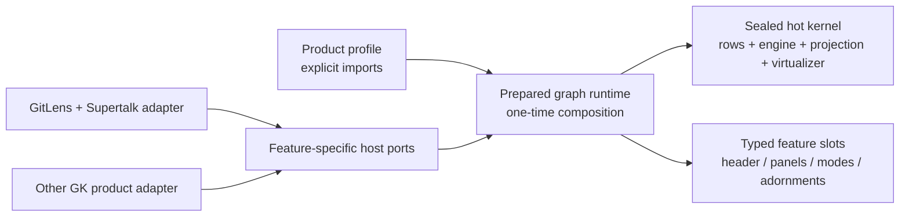

# Commit Graph modularization and external-consumption plan

## Recommendation

Do not turn the Commit Graph into a general runtime plugin system. Split it into a sealed, performance-critical
kernel and statically composed feature extensions:

1. Keep `@gitkraken/commit-graph` as the pure layout/projection engine.
2. Extract a host-agnostic web renderer and composition API into a new internal package (provisionally
   `@gitkraken/commit-graph-ui`).
3. Express optional behavior as small, typed feature ports and UI contributions selected by an explicit product
   profile at build time.
4. Keep GitLens-specific data acquisition, VS Code commands/contexts, licensing, onboarding, and telemetry in a
   GitLens adapter/profile.
5. Preserve the existing single RPC connection and `graph:rows` sequenced channel. A feature must not add a
   transport hop to the rows path.

Static composition is the important constraint. An external product can omit features and their code from its
bundle, while the GitLens profile resolves its feature list once before mount and retains direct calls in the
render/update paths.



## Implementation status — 2026-08-27

The reusable engine-and-renderer boundary described by this plan is now implemented on this branch:

- `@gitkraken/commit-graph` builds ESM, declarations, and source maps and is verified from a packed tarball.
- WIP identity is canonical in the engine; GitLens protocol code consumes it rather than owning renderer values.
- `@gitlens/components` is the canonical home for the renderer's reusable Lit UI dependencies. GitLens
  imports the package directly; no forwarding modules remain in the old shared tree.
- `@gitkraken/commit-graph-ui` owns the virtualized surface, its row/gutter helpers, renderer stylesheet,
  contracts, explicit registration, static runtime preparation, and optional refs, WIP-stat, lane-collapse,
  sticky-timeline, and scroll-marker extensions. Its implementation modules and base stylesheet contain no
  GitLens, VS Code, protocol, or product-tree dependencies; VS Code theming is an optional adapter stylesheet.
- GitLens keeps its row adapter, ref-finder callback, WIP context serialization, transport, and full product shell,
  and selects its existing behavior through one explicit profile prepared before mount.
- Packed-consumer verification type-checks real tarballs, bundles minimal and full browser profiles, verifies base,
  extension, and theme-adapter stylesheet isolation, and inspects metafiles to prove that opted-out hot-feature
  implementations are absent.
- Functional graph E2E, deterministic CPU/allocation benchmarks, browser frame/heap capture, and graph bundle gates
  are wired into the repository and CI. Final branch-wide results are recorded with the implementation handoff.

The extraction intentionally does not guess at a second product's shell requirements. `GraphApp`, details,
sidebar, minimap, search orchestration, and the large GitLens state/service aggregate remain product-owned. A real
target-product adapter and any shared shell features remain Phase 7 work because the target repository and the six
consumer decisions below are not attached to this task.

## What exists today

The graph now has three enforced package boundaries and one product boundary:

- `packages/plus/commit-graph` is dependency-free and renderer-agnostic. It owns incremental
  append/reconcile behavior, projections, geometry, and row identity.
- `packages/components` owns generic webview components/controllers previously coupled through the GitLens
  shared tree.
- `packages/plus/commit-graph-ui` owns the virtualized surface and opt-in row features. It resolves direct,
  immutable extension slots once and retains the existing visible-window provider and adornment-cache semantics.
- `src/webviews/apps/plus/graph/graph-wrapper` is the GitLens adapter. It supplies GitLens rows and callbacks to the
  host-neutral surface without adding a transport hop or per-render adaptation.

The existing `graph:rows` `SequencedChannel`, splice publisher, and engine session still keep host-to-webview and
layout work proportional to the changed region. The GitLens profile continues to use every current row feature, so
there is no default-product behavior reduction.

The remaining concentration is deliberately product-side: `graph-app.ts` is 4,341 lines, `stateProvider.ts` is
2,997 lines, and `graph-wrapper.ts` is 3,264 lines. They still coordinate the GitLens shell and mandatory service
aggregate. Those are candidates for feature-plane cleanup when a real second shell consumer establishes which
parts should be shared; they are no longer prerequisites for consuming the engine and renderer packages.

## Target boundaries

### 1. `@gitkraken/commit-graph`: sealed engine

Keep this package free of Lit, GitLens, VS Code, RPC, and product concepts. Layout and projection remain DOM-free.
The current adornment invalidation surface is the one exception: it uses `EventTarget` and `CustomEvent`, and the
package TypeScript configuration includes the DOM library. Before advertising support outside browser/Node 19+
runtimes, either document those two globals as an explicit runtime requirement or replace them with a small
renderer-neutral invalidation contract. It owns:

- canonical topology and commit shapes;
- layout, edges, delta classification, paging resume, and suffix reconciliation;
- scope/lane projections and geometry math;
- renderer-neutral adornment contracts, theming math, and accessibility helpers.

Do not add feature discovery or data-provider calls to the engine. In particular,
`CommitGraphEngineSession.update()` must continue receiving rows and direct options in one call.

The package now has a real `dist` build with `.d.ts` and source maps, explicit subpath exports, catalogued
development dependencies, and packed-consumer verification. It remains a `0.x` internal package until the owning
teams choose a release/version policy.

### 2. `@gitkraken/commit-graph-ui`: host-agnostic renderer and composition contracts

The implementation uses one package rather than a package per feature and exposes explicit subpaths, not a barrel:

- `surface.js`: the virtualized graph surface and its public properties/events;
- `runtime.js`: profile preparation and lifecycle;
- `contracts/*.js`: core and feature-specific host port types;
- `extensions/<feature>.js`: optional, host-independent feature implementations;
- `surface.css`: base rendering and generic theme defaults;
- `extensions/*.css`: separately imported extension styles;
- `themes/vscode.css`: optional VS Code variable adapter, never included in the neutral surface stylesheet.

The package owns the DOM/Lit renderer, core selection and keyboard behavior, and typed extension slots. It may
import the public `@gitlens/components` and `@gitlens/utils` leaf packages, but must not import `vscode`, the GitLens
container, GitLens protocol modules, Supertalk, or anything under the product `src/` tree.

That preparatory work is complete. WIP row-id creation/parsing is canonical in `@gitkraken/commit-graph`, and the
narrow `@gitlens/components` package contains the existing generic popover/tooltip, icon, modifier,
roving-tabindex, CSP directive, and shared Lit implementations. DOM, keymap, date, debounce, and cache helpers live
in the public `@gitlens/utils` package rather than being copied into the component package. Both package boundaries
are enforced in the source tree and verified after packing.

Registration is explicit and idempotent through `registerCommitGraphElements()`, so importing a type or helper does
not define custom elements. Only component registration modules and CSS are marked side-effectful, making profile
bundles and tree-shaking auditable.

### 3. GitLens adapter and product profile

Keep these in the GitLens repository/application layer:

- `GitGraphRow` to canonical renderer-model adaptation;
- Supertalk connection/session setup and the `graph:rows` channel;
- VS Code commands, quick picks, serialized menu contexts, URIs, and storage keys;
- GitLens configuration, subscription/access gates, onboarding, promos, and telemetry;
- GitLens-specific feature data providers (WIP, PRs/issues, agents, AI, Launchpad, health, and visualizations).

The other GK product provides its own adapter against the same narrow host ports. It should not need to implement
unused GitLens service methods.

## Composition model

### Product profiles, not discovery

A product profile explicitly imports and orders its features:

```ts
const gitLensGraphProfile = defineCommitGraphProfile({
	rowAdapter: gitLensRowAdapter,
	extensions: [
		refsExtension,
		wipStatsExtension,
		laneCollapseExtension,
		stickyTimelineExtension,
		scrollMarkersExtension,
	],
});

const gitLensGraphRuntime = prepareCommitGraphRuntime(gitLensGraphProfile);
```

The implemented API has now been exercised by five extracted features. Profile preparation must continue to:

- run once before the surface mounts;
- validate duplicate slots and missing feature dependencies once;
- produce immutable arrays and direct function references for the renderer;
- prefer a compile-time-derived service/state type for that profile, with explicit profile types as an escape
  hatch;
- avoid feature-id map lookups, dependency injection, or event-bus fan-out in per-row/per-scroll code;
- dispose contributions as one lifecycle unit.

Compile-time derivation is a goal, not a reason to build a large conditional-type framework over the current
88-field state. Explicit, hand-written state/service types for each supported profile are an acceptable fallback.
What is not acceptable is making every feature field optional and recreating the monolithic state with `?`.

Use three opt-in levels deliberately:

1. **Build-time omission**: the profile does not import the extension. Its code and dependencies must be absent
   from the bundle. This is the primary external-product mechanism.
2. **Startup capability**: an imported feature is disabled before mount. No listeners, RPC subscriptions, state,
   or providers are created for it.
3. **Activation loading**: a large, cold feature may use `import()` when first opened. Adopt this only when
   measurement shows that first activation does not regress. The GitLens profile may keep a feature eager or
   idle-prefetch it if immediate first-use latency would otherwise worsen.

### Extension slots

Start with a small closed set of slots. Before the target product is integrated, add a slot only for the next
migrated feature and a named, reviewed target-product use case; treat it as provisional. Once Phase 7 begins, a
slot becomes supported API only after two actual consumers exercise it.

| Slot                 | Contract                                        | Performance rule                                                                                                                   |
| -------------------- | ----------------------------------------------- | ---------------------------------------------------------------------------------------------------------------------------------- |
| Row adornment        | Existing `RowAdornmentProvider` model           | Visible rows only; every provider method currently runs per visible row/render; only resolved non-dynamic content is cached by SHA |
| Header action/status | Render contribution plus command callback       | No row subscription; update only its own signal                                                                                    |
| Side panel           | Panel descriptor and optional host port         | Construct/fetch only while enabled or visible                                                                                      |
| Details mode         | Mode descriptor and selection-scoped resource   | Load on activation; abort on supersession/teardown                                                                                 |
| Display mode         | Alternate body (timeline/treemap/health/kanban) | Never remap core rows merely because the alternate body updates                                                                    |
| Overlay/sheet        | Descriptor and focus/keymap scope               | Register with the existing overlay stack; no global listener leaks                                                                 |
| Key binding          | Static binding contribution                     | Compile into the dispatcher once; no per-key feature scan                                                                          |
| Column               | Zone definition and pure cell renderer          | Prepared once; any per-row function must pass hot-path benchmarks                                                                  |

Do not expose arbitrary hooks into layout, delta classification, projection reconciliation, virtualizer range
calculation, scroll handling, row identity, or rows-channel sequencing. Those are kernel implementation details.

### Feature ports instead of one provider

Preserve the useful shape of the current RPC groups, but move their contracts out of Supertalk and make them
independently composable. For example, a search extension should require a `GraphSearchPort`, while WIP should
require `GraphWipPort`; neither should receive a container-like object or an all-purpose `GraphServices` object.

The profile-specific host adapter binds those ports to Supertalk (GitLens) or the other product's transport. Port
calls remain direct after preparation. Optionality is resolved at profile construction, not checked on every call.

The implemented hot-view features use even narrower synchronous interfaces. Refs, WIP stats, and lane collapse
use the engine's existing `RowAdornmentProvider`; sticky timeline receives a one-time-bound `StickyTimelineHost`;
and the scroll rail receives a one-time-bound `ScrollMarkersHost`. Those host views expose stable maps, arrays,
geometry, and actions already owned by the surface. They do not fetch data, return promises, add subscriptions, or
create a second transport path during scrolling or rendering. Product data still arrives through the single
GitLens state/RPC flow and is adapted once into canonical rows or stable SHA-keyed sidecars.

Keep one ordered transport session. Feature ports are logical service planes, not permission to create one RPC
connection per feature. Rows remain on `graph:rows`; any causally related RPC action remains FIFO-ordered on that
same connection.

### State ownership

Replace the monolithic reactive `AppState` gradually with:

- `GraphCoreState`: identity, canonical rows, paging, selection, loading/error, core view/column configuration;
- one typed store per enabled feature (`SearchState`, `WipState`, `MinimapState`, and so on);
- immutable `GraphCapabilities`, computed once from the profile;
- a typed bootstrap envelope containing core state plus the selected feature state.

Continue sending one bootstrap and complete snapshots for `save-last` events. Splitting store ownership must not
split causality across transports. A live event should write directly to its owning store; do not broadcast every
patch to every extension or keep a `Record<string, unknown>` feature bag in the render path.

Rows, reachability, and row stats keep their current dedicated update ordering and single `updateState`/signal
commit. Do not clone canonical row arrays when crossing the core/feature boundary. Sidecar feature data should use
stable SHA-keyed maps or aligned arrays so payload-only changes retain topology identity.

## Proposed feature profile

The first externally useful profile should be intentionally smaller than GitLens:

| Area             | Core/minimal profile                                         | Standard optional extension                                | GitLens-only/product extension                                        | Current concentration                                                |
| ---------------- | ------------------------------------------------------------ | ---------------------------------------------------------- | --------------------------------------------------------------------- | -------------------------------------------------------------------- |
| Layout/rendering | Rows, lanes, paging, base columns, selection, a11y, keyboard | Lane folding and sticky timeline if desired                | VS Code menu contexts                                                 | `commit-graph`, `graph-wrapper/*`                                    |
| Refs             | None or plain ref labels                                     | Ref pills, pinning, visibility, scope, metadata adornments | PR/issue enrichment and GitLens commands                              | `refAdornmentProvider.ts`, `graph-header.ts`, `graphScopeService.ts` |
| Search           | No search                                                    | Search box, highlight/filter, history                      | Natural-language entitlement/telemetry                                | `search/*`, `graphSearchService.ts`                                  |
| Working changes  | No synthetic WIP rows                                        | WIP rows, stats, worktree watchers                         | Commit box, compose/review/resolve, agent status                      | `graphWipService.ts`, details components                             |
| Minimap          | Omitted                                                      | Canvas minimap and markers                                 | GitLens marker configuration                                          | `minimap/*`                                                          |
| Details          | Omitted                                                      | Basic commit details port/panel                            | Compare, PR, AI review/compose/resolve, rebase sheets                 | `components/gl-graph-details-panel.ts`                               |
| Sidebar/overview | Omitted                                                      | Sidebar shell and selected generic panels                  | Agents, Launchpad, PR stacks, GitLens actions                         | `sidebar/*`, `overview/*`                                            |
| Alternate modes  | Omitted                                                      | Timeline/treemap when a product supplies their ports       | Health and kanban/agent activity                                      | visualization components/services                                    |
| Product chrome   | Omitted                                                      | Theme and generic host status only                         | Access gate, account/org, onboarding, promo, coach marks, walkthrough | `graph.ts`, `access-account.ts`, `gate.ts`, account controllers      |

Feature dependencies should be explicit and acyclic. Examples: AI details modes require details + WIP + AI ports;
PR chips require refs + PR metadata; a minimap may consume search markers but must still work without search.

## Performance contract

Performance work is phase zero, not a final verification step. Capture baselines from the current `main` commit on
the same machines and fixtures before introducing an abstraction.

At planning time this infrastructure did not exist: the graph E2E specs were functional only, and the first Phase
0 run at `2273c7a68` found seven failures. This branch repaired that baseline and added deterministic engine
comparison tooling, browser frame/long-task/heap capture, and a production bundle-metafile gate. Future extraction
work must compare candidate and baseline timings on the same controlled runner rather than treating the current
artifacts as universal latency budgets.

### Preserve these invariants

1. One `graph:rows` sequenced channel; no extra serialization, proxy, or clone for extension dispatch.
2. The host ledger/splice, reachability-table, and snapshot recovery semantics stay unchanged.
3. `CommitGraphEngineSession` retains its payload/append/reconcile fast paths and row object identity.
4. Extension preparation happens once. Hot paths read immutable arrays/direct callbacks.
5. Row adornments remain proportional to the rendered window, not loaded history. The current dispatch baseline
   is one discovery call per provider per visible row/render (`providers × visible rows`); the cache only avoids
   recreating non-dynamic results after discovery. The default GitLens profile must not increase provider count,
   discovery calls, dynamic adornments, or per-call cost without an offsetting measured improvement.
6. Scroll listeners remain non-reactive except at existing edge transitions; no new synchronous layout reads.
7. Disabled features allocate no stores, subscriptions, observers, timers, RPC handlers, or DOM.
8. A hidden feature does not receive core row updates unless its declared behavior needs them.
9. Complete snapshots remain complete; deltas never use `save-last` buffering.
10. The default GitLens profile keeps current behavior and ordering while extraction is in progress.

### Required benchmark matrix

Add repeatable fixtures at roughly 200, 2,000, 10,000, and a lane-heavy 100,000 rows. Measure:

- engine `initial`, `payload`, `append`, and prefix-`replace` updates (time, throughput, allocations, retained heap);
- host row production, splice diffing, serialization bytes, apply-splice, and resync;
- cold script parse/evaluation, RPC ready, first rows applied, and first graph paint;
- sustained wheel scroll, fast scrollbar teleport, horizontal lane scroll, and minimap interaction;
- arrow navigation/selection, payload-only ref/WIP changes, paging, scope/filter changes, and theme changes;
- idle memory, repeated mount/unmount, and feature enable/disable lifecycle;
- production bundle/raw/gzip size and module graph for the GitLens and minimal profiles;
- first activation of any dynamically loaded feature.

Extend the existing functional E2E harness with new browser instrumentation for timings, traces, frames, long
tasks, and memory; there is no timing harness to reuse today. Add package-local `tinybench` suites for
deterministic engine and adapter operations. The direct esbuild path can emit `dist/meta/graph.json`, but the
standard webpack `bundle:e2e` path does not; first choose the authoritative producer, then build a new assertion
that reads its graph metafile. No current check consumes either build's module graph. Check machine-readable
results into CI artifacts so an extraction PR can compare matched baseline and candidate runs. Only production
bundle bytes have a checked-in pre-refactor baseline today; browser timing artifacts are not an automatic gate
until the runner noise is qualified and a baseline from that same controlled runner is available.

“No regression” means the candidate median is not slower/larger. A result inside normal test noise is acceptable
only when the upper confidence bound stays within 1% for deterministic engine/adapter microbenchmarks and 3% for
browser/E2E measurements. These percentages are measurement tolerances, not performance budgets: a repeatable
slowdown is rejected even when small, unless the same change contains a measured optimization that makes the full
user scenario neutral or faster. Also reject any new >50 ms long task, worse dropped-frame rate, increased rows
payload size, or increased retained heap in the default profile.

## Migration sequence

Each phase should be independently shippable, performance-compared, and easy to revert. Avoid a parallel “new
graph” implementation that drifts while the existing graph keeps changing.

### Landing and branch-coordination policy

Before Phase 2, Phase 3, and every later move-heavy step, inventory active graph branches and assign each one an
owner and disposition: land it first, rebase it onto the new boundary, or explicitly park it. During the short
file-move window, freeze parallel edits to the affected files and publish an old-to-new path map. After each such
landing, run the repository's commit/rebase-loss audit and have feature owners verify behavior before removing
compatibility facades. This applies in particular to the active results-bar, filter-paging, follow-primary,
mode-file-menu, and agent-session work called out during planning.

### Phase 0: repair the baseline and build the performance harness

Status: the functional, engine, bundle, and browser-capture work is complete for the GitLens/VS Code matrix
available in this repository. An automatic browser timing comparison remains intentionally unclaimed: the current
five-run open-to-visible result has roughly 20% relative margin of error, which cannot support the proposed 3%
tolerance without producing a misleading gate.

- **0A — functional baseline:** inventory the known graph E2E failures on `main`, fix them without skipping or
  weakening assertions, and pin a green functional baseline before collecting performance numbers.
- **0B — deterministic coverage:** add the engine/adapter microbenchmarks, golden contract tests, deterministic
  200/2,000/10,000/100,000-row fixtures, and bundle-metafile reader/assertion.
- **0C — browser capture and CI:** add browser performance marks/traces, frame and long-task capture, memory
  sampling, repeat/noise qualification, and machine-readable artifacts. Add an automatic baseline comparison only
  after the canonical runner produces repeatable results inside the intended tolerance.
- Add golden tests for row identities/transitions, event ordering, bootstrap/reconnect/resync, selection, visible
  range requests, and adornment invalidation.
- Assign a named DRI before starting each workstream: graph behavior/fixtures, engine microbenchmarks, browser/CI
  instrumentation, and bundle analysis. Phase 0 is not background work owned implicitly by extraction authors.
- Have a representative from the target product sign off its runtime, desired feature set, theming, data source,
  transport, licensing, and concrete first-profile scenarios.

Exit: all graph functional E2E specs are green; the full matrix produces machine-readable results; the production
bundle gate is pinned; and a controlled matched run can assess CPU, allocations, frames, payload size, memory, and
first use. Do not promote noisy workstation captures into universal latency budgets.

#### Phase 0 execution record — 2026-08-26

- Baseline commit: `2273c7a68`. A fresh run of the seven graph spec files on VS Code 1.135.0 collected 59 tests:
  18 passed, 7 failed, and 34 did not run after serial-suite failures. Three failures gated on custom-element hosts
  that had no layout box even though their named details regions were visible; four were in pin-to-edge flows.
- 0A is green for this matrix: a no-retry run at four workers passed all 59 tests in 41.2 seconds. The repairs keep
  the assertions behavioral: details gates target the context-named semantic region (`Commit details`, `Working
changes details`, or `Multiple commits selected`) and panel opening retries against that stable state; pin tests
  read the provider's live signal API rather than its immutable bootstrap `_state`; and the pinned-segment geometry
  test waits for the post-layout scroll calculation. Subscription simulation now exposes an async disposer and all
  resource-owning specs await it, eliminating the post-test helper socket-close caused by an abandoned cleanup fetch.
- The root benchmark runner now discovers package benchmarks as well as root `src` benchmarks. The first 0B slice
  adds a deterministic lane-heavy engine fixture at 200/2,000/10,000/100,000 rows; verifies and measures `initial`,
  `payload`, `append`, and prefix-`replace`; and can emit versioned JSON. Run the smoke matrix with
  `node scripts/runBenchmark.mjs commit-graph-engine -- --quick --json out/perf/commit-graph-engine.quick.json`.
- One local full-size engine run proves that all four 100,000-row scenarios complete and that the artifact schema is
  usable, but it is deliberately not a pinned baseline: the 100,000-row initial result had only three samples and
  44% relative margin of error. Longer calibrated runs, warm-up policy, repeatability qualification, and controlled
  runner metadata are required before any number can gate extraction work.
- Follow-on work completed allocation/heap coverage, an authoritative bundle-metafile assertion, browser
  timing/frame/long-task/heap capture with repeat aggregation, and CI artifact upload. The engine comparator now
  has an explicit `benchmark:graph:engine:compare` command and rejects reports from mismatched runtimes. Automatic
  browser comparison still requires a qualified canonical runner; a target-product owner and its own baseline
  remain part of Phase 7 because that product is not attached here.

#### Final implementation validation — 2026-08-27

- The clean branch-wide build and lint paths pass without warnings. The full unit run passes all workspace package
  suites and 2,570 VS Code-host tests, with two intentionally pending tests.
- A production rebuild passes all 59 graph E2E tests without retries. The final five browser-performance
  repetitions report 833.22 ms mean open-to-visible time, 10.62 ms mean first-rows-to-visible time, 1.68 ms mean
  engine time, a 16.8 ms p99 scroll-frame gap, zero estimated dropped frames, zero long tasks, and 34.09 MB mean
  post-run heap for the 121-row fixture. These measurements are an artifact and smoke gate, not a cross-machine
  latency budget.
- The same-machine production bundle gate is pinned to `b0123c1b01b19c18c642ed01bf88b7b46cb96893` and passes:
  the graph entrypoint is 2,922,956 bytes, 17,092 bytes smaller than the pinned `origin/main` build; `graph.css` is
  243 bytes smaller and `shared.js` is 1,067 bytes smaller.
- The full engine matrix completes the 200/2,000/10,000/100,000-row fixtures with allocation profiles. At 100,000
  rows, mean/p99 times are 243.60/247.67 ms for initial layout, 8.02/18.26 ms for payload-only reconciliation,
  81.31/86.70 ms for append, and 118.86/166.07 ms for prefix replacement. These are characterization results,
  not a calibrated comparison: the legacy schema-1 artifact is too noisy to serve as a baseline. More importantly
  for the extraction, every tracked production file in the engine directory remains byte-identical to
  `origin/main`, so the hot engine implementation did not change.
- Packed-tarball verification passes for all four reusable packages. The minimal/full UI fixtures bundle to
  793.2/878.0 KB and metafile inspection confirms that opted-out refs, WIP-stat, lane-collapse, sticky-timeline,
  and scroll-marker implementations are absent from the minimal build. Sticky-timeline and scroll-marker styles
  are separately imported, and raw VS Code variables exist only in the optional VS Code theme adapter.

### Phase 1: publish the existing engine

Status: complete on this branch; organizational release-channel ownership remains a rollout decision.

- Add `dist` JS/declaration/source-map output and package verification to `packages/plus/commit-graph`.
- Pin publish-time dependency versions and reproduce its boundary lint rules in the package/release workflow.
- Decide whether it ships directly or under the existing `@gitkraken/core-gitlens` internal distribution.
- Integrate only the engine in a tiny external-product fixture to verify ESM/types/theme consumption.
- Keep GitLens source-consumed in the monorepo. Select and test a workspace source alias/export condition so its
  webview build bundles package source into the graph asset; GitLens must never load an external package or stale
  `dist` file at runtime. `dist` is the external-consumer/release artifact and is verified from a packed tarball.

Exit: another GK product can consume the engine without source imports; GitLens runtime code is unchanged.

### Phase 2: decouple the renderer in place

Status: complete on this branch.

- Define canonical renderer DTOs around the existing `GraphCommit`/`GraphRow` shapes.
- Move `createWipRowId`, `getWipRowWorktreePath`, and `isWipRowId` out of the GitLens protocol module and into the
  canonical DTO/identity layer, with compatibility tests for existing persisted/message values.
- Move the GitLens-specific `GitGraphRow` adaptation behind one tested adapter. It must map once per engine update,
  not once per feature or render.
- Extract transport-neutral core ports for rows/paging, state, selection, and configuration. Keep the current
  Supertalk implementation as the GitLens binding.
- Provide an in-memory/browser binding for tests and the external fixture.
- Inventory every runtime import made by `gl-lit-graph.ts`, not just protocol types. In place, remove GitLens
  protocol values and product-local `@gitlens/*` utilities from the future package boundary.
- Extract the existing generic popover/tooltip/code-icon, modifier/keymap, roving-tabindex, DOM/context-menu, and
  CSP style-map implementations into a narrow source-consumed/publishable package. Only a signed target-product
  constraint recorded before Phase 2 may switch this to package-local equivalents with the same behavior and
  performance. Graph-specific adapters remain in `commit-graph-ui`.
- Enable the future renderer import-boundary rule against its current source location once decoupling lands.

Exit: the same data/behavior can drive the renderer without GitLens or Supertalk contracts, all runtime imports
have a valid future-package home, and the future boundary lint passes before any renderer file is moved.

### Phase 3: mechanically extract the already-decoupled renderer

Status: complete on this branch. The renderer, renderer SCSS, and generic primitives have one canonical package
location; GitLens imports package source directly and no compatibility re-export files remain.

- Move pure row/gutter/column/scroll-marker modules first, retaining their existing tests.
- Move the custom element and virtualizer behind the canonical inputs; preserve DOM structure, CSS, event names,
  object identities, and update order for the GitLens profile.
- Retain the Phase 2 boundary rules banning GitLens, VS Code, container, and host transport imports at the new
  package path.
- Add lint parity for the new package in both lint surfaces: Oxlint (including its regular/CI boundary configs)
  and Stylelint's Lit/CSS-in-TypeScript file patterns, which currently cover `src/webviews/apps/**/*.ts` but not a
  package path.
- Make custom-element registration and CSS loading explicit.
- Mount the package renderer in both GitLens and the small external fixture.

Do not redesign the 12k-line renderer or split it into provider calls during this phase. Protocol-value removal,
shared-primitives extraction, and host decoupling completed in Phase 2; Phase 3 is limited to mechanical moves and
package/build wiring so those risk events cannot collapse into one giant PR.

Exit: GitLens uses the packaged renderer with benchmark parity, and a non-VS Code page renders/navigates a graph.

### Phase 4: introduce static profiles and split state ownership

Status: static profile preparation and the GitLens parity profile are complete. Splitting the product-owned
`GraphStateProvider` aggregate is deferred until a second shell consumer identifies shared state planes; the
renderer package does not depend on that provider.

- Add the one-time profile preparation step and closed extension slots.
- Create the GitLens “all current features” profile first; compare its prepared callbacks/provider count with the
  current direct wiring.
- Split `GraphStateProvider` by ownership one plane at a time, retaining one bootstrap and the rows-plane atomic
  update.
- Type service/state requirements from the selected extensions; use explicit per-profile types if deriving them
  would require conditional-type machinery over the whole state. Eliminate container-like access from package
  code and do not fall back to an all-optional feature state.

Exit: a profile can omit a no-op proof feature with zero runtime artifacts, and the GitLens profile remains at
parity.

### Phase 5: extract cold product features first

Status: not required for the reusable surface delivered here. These remain GitLens shell features and should move
only when a second real consumer needs them.

Move one feature per PR, starting outside the row hot path:

1. access/account/onboarding/promo/coach-mark product chrome;
2. alternate modes (kanban, timeline, treemap, health);
3. sidebar panels and overview;
4. details shell, then compare/PR/AI modes as dependent extensions;
5. minimap;
6. search UI/service binding.

Build-time omission is required for every extracted feature. Use dynamic loading only when its separate first-use
benchmark passes; otherwise keep it eager in GitLens while allowing other product profiles to omit it.

Exit: an external profile can select a useful subset, and unused large feature trees are absent from its bundle.

### Phase 6: extract hot row features last

Status: refs, WIP stats, lane-collapse controls, sticky timeline, and scroll markers are statically selectable. The
minimal packed fixture proves all five omitted implementation modules and the two view-extension styles are absent
from its browser bundle. Column modes remain renderer configuration rather than independent extension modules.

- Convert refs, WIP rows/stats, metadata, lane-collapse controls, and optional columns to prepared contributions.
- Keep the current maximum/default provider count unless a benchmark proves a different composition faster.
- Prefer a precompiled combined callback over nested registries if provider dispatch becomes measurable.
- Retain the current non-dynamic per-SHA result cache, dynamic bypass semantics, targeted invalidation,
  visible-range enrichment, and request deduplication.

Exit: GitLens's scroll/navigation/update results meet or beat baseline, and the minimal profile pays for none of
these features.

### Phase 7: consume from the target product

Status: ready to start but external to this repository. It requires the target product repository, an owning team,
and answers to the consumer decisions below.

- Replace the fixture with the target product's real adapter and chosen profile.
- Run contract, visual, accessibility, and performance suites in both products before declaring an API stable.
- Release as `0.x` internal API initially; require changesets/release notes and cross-product compatibility tests.
- Remove temporary compatibility facades only after both consumers are on the package boundary.

## Approaches to avoid

- A global plugin registry or runtime discovery mechanism.
- A single provider with dozens of optional methods.
- An event bus for state, selection, and row updates.
- A separate RPC connection or message protocol per feature.
- Calling providers during engine layout/projection or once per loaded row.
- Converting the renderer framework or rewriting the graph while extracting it.
- Persisting resource/derived feature state to make extension startup look simpler.
- Subclassing `GraphApp`, `GraphStateProvider`, or `GlLitGraph`; it would expose their internal coupling as API.
- Shipping both old and new render paths long-term behind a flag. A short rollback flag may exist outside the hot
  path, but each phase should leave one production implementation.

## Decisions needed before target-product integration

1. Does the target product need only engine + renderer, or the full shell (details/sidebar/minimap/search)?
2. Is its runtime Chromium/Electron, a browser, or something else, and can it bundle ESM/Lit?
3. Will it produce canonical rows locally, use `@gitkraken/core-gitlens`, or receive rows over a backend transport?
4. Which GitLens features are explicitly out of scope for it?
5. Should packages publish independently or through the existing internal core distribution?
6. What compatibility/version window must the two products support?

These are blocking inputs, not deferred design questions. Assign an owner from the target product and record
signed-off answers during Phase 0; do not design supported slots or begin Phase 1 against an imagined consumer.
The answers change the first external profile, but not the proposed kernel/extension boundary.

## Definition of done

- The target product imports documented package subpaths and implements only the ports its profile selects.
- A minimal production bundle contains the engine, renderer, and selected extensions only.
- GitLens consumes workspace source and bundles it into its webview asset; published `dist` output is exercised
  only through packed external-consumer fixtures, so stale local `dist` cannot affect GitLens.
- GitLens still uses one rows channel and the existing delta/reconcile/object-identity fast paths.
- Disabled features create no runtime work.
- Default GitLens and target-product benchmark matrices are at or better than their pinned baselines.
- The graph functional E2E baseline is green, and the new browser timing and bundle-metafile gates run in CI.
- Package boundaries are enforced by Oxlint and Stylelint at package paths and verified from packed tarballs, not
  merely documented.
- Each move-heavy phase follows the landing/freeze policy and passes the commit/rebase-loss audit.
- Both products run shared contract/accessibility tests, plus their own E2E and performance gates.
