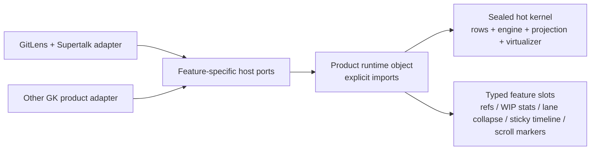

# Commit Graph componentization

## Recommendation

The Commit Graph is not a general runtime plugin system. It is a sealed, performance-critical kernel plus statically
composed feature extensions:

1. `@gitkraken/commit-graph` is the pure layout/projection engine.
2. `@gitkraken/commit-graph-ui` is the host-agnostic web renderer and composition surface.
3. Optional behavior is a small set of typed feature slots selected by an explicit product runtime at build time.
4. GitLens-specific data acquisition, VS Code commands/contexts, licensing, onboarding, and telemetry stay in the
   GitLens adapter.
5. There is one RPC connection and one sequenced `graph:rows` channel. A feature must not add a transport hop to
   the rows path.

Static composition is the point: a product that doesn't import an extension carries none of its code, and the
GitLens runtime resolves its feature list once, before mount, with direct calls in the render/update paths.



## Package boundaries

Package scope encodes publication: `@gitkraken/*` packages are published for other GitKraken products, while
`@gitlens/*` packages are workspace-internal and get compiled into a `@gitkraken/*` publisher's `dist/` when it
needs one, rather than installed.

- **`packages/plus/commit-graph`** — sealed engine. Free of Lit, GitLens, VS Code, RPC, and product concepts. Owns
  topology, layout/edges/delta classification, paging resume, suffix reconciliation, scope/lane projections, and
  renderer-neutral adornment contracts. No feature discovery or data-provider calls; `CommitGraphEngineSession`
  keeps receiving rows and options in one call.
- **`packages/plus/commit-graph-ui`** — kernel/surface + extensions. Owns the virtualized DOM/Lit renderer, core
  selection and keyboard behavior, and the closed set of extension slots (`extensions/<feature>.js`). It may import
  `@gitlens/components` and `@gitlens/utils`, never `vscode`, the GitLens container, GitLens protocol modules,
  Supertalk, or anything under `src/`. Registration is explicit via `registerCommitGraphElements()`; only
  registration modules and CSS are side-effectful, so profile bundles stay tree-shake auditable. Its published
  `exports` is narrow; GitLens's own `src/` code additionally reaches internal subpaths listed in the package's
  `workspaceExports` field, enforced by lint rather than by the manifest an external consumer installs.
- **`packages/components`** — generic, product-neutral Lit primitives (popover/tooltip, code-icon, modifier keys,
  roving tabindex, CSP style-map) shared by the graph and other webviews.
- **`packages/utils`** — host-neutral helpers (DOM, keymap, date, debounce, cache) usable from Node or the browser.
  Also holds dependency-free git vocabulary (`gitRefs.ts`, `pausedOperation.ts`, `hostingServiceType.ts`) that
  `packages/git`, the host, and the kernel all need but that can't live in `packages/git` without creating an edge
  the kernel isn't allowed to cross; provider icon rendering itself lives in `packages/components`.
- **`src/webviews/apps/plus/graph/graph-wrapper/`** — the GitLens adapter. Adapts `GitGraphRow` to the canonical
  renderer model, supplies the row adapter and callbacks, and owns everything product-specific: commands, quick
  picks, menu contexts, URIs, storage keys, subscription/access gates, onboarding, and telemetry.

## Composition model

A product builds one frozen `CommitGraphProfile` object literal and passes it to the surface — there is no builder,
discovery step, or validation pass. An unset slot is `undefined` at the import site, so bundlers drop the extension
module it would have pulled in. GitLens builds its runtime in
`src/webviews/apps/plus/graph/graph-wrapper/graph-profile.ts`:

```ts
export const gitLensGraphRuntime: CommitGraphProfile = Object.freeze({
	rowAdapter: gitLensRowAdapter,
	refs: refsExtension,
	wipStats: wipStatsExtension,
	laneCollapse: laneCollapseExtension,
	stickyTimeline: stickyTimelineExtension,
	scrollMarkers: scrollMarkersExtension,
	renderRefFinder: renderGitLensGraphRefFinder,
	resolveWipRowContext: serializeWipContext,
});
```

The working-changes row-action strip is not a runtime slot: it's host-supplied per WIP-state change through the
surface's `rowActionsByRowSha` property (`GraphRowAction` descriptors), built once and rendered verbatim by the
kernel. Compose, review, resolve, and agent status are therefore GitLens-only by construction — nothing in the
kernel or extension slots knows about them.

Native context menus ride the row adapter the same way: a row whose adapter supplies `contextData` carries it as a
`data-vscode-context` attribute (VS Code's context-menu protocol), and a host that supplies none emits no attribute.

## Approaches to avoid

- A global plugin registry or runtime discovery mechanism.
- A single provider with dozens of optional methods.
- An event bus for state, selection, and row updates.
- A separate RPC connection or message protocol per feature.
- Calling providers during engine layout/projection or once per loaded row.
- Persisting resource/derived feature state to make extension startup look simpler.
- Subclassing `GraphApp`, `GraphStateProvider`, or `GlCommitGraph`; it would expose their internal coupling as API.
- Shipping both an old and a new render path long-term behind a flag.

## Feature classification

| Area             | Core/minimal                                                 | Standard optional extension                                | GitLens-only/product extension                                        |
| ---------------- | ------------------------------------------------------------ | ---------------------------------------------------------- | --------------------------------------------------------------------- |
| Layout/rendering | Rows, lanes, paging, base columns, selection, a11y, keyboard | Lane folding and sticky timeline if desired                | VS Code menu contexts                                                 |
| Refs             | None or plain ref labels                                     | Ref pills, pinning, visibility, scope, metadata adornments | PR/issue enrichment and GitLens commands                              |
| Search           | No search                                                    | Search box, highlight/filter, history                      | Natural-language entitlement/telemetry                                |
| Working changes  | No synthetic WIP rows                                        | WIP rows, stats, worktree watchers                         | Commit box, compose/review/resolve, agent status                      |
| Minimap          | Omitted                                                      | Canvas minimap and markers                                 | GitLens marker configuration                                          |
| Details          | Omitted                                                      | Basic commit details port/panel                            | Compare, PR, AI review/compose/resolve, rebase sheets                 |
| Sidebar/overview | Omitted                                                      | Sidebar shell and selected generic panels                  | Agents, Launchpad, PR stacks, GitLens actions                         |
| Alternate modes  | Omitted                                                      | Timeline/treemap when a product supplies their ports       | Health and kanban/agent activity                                      |
| Product chrome   | Omitted                                                      | Theme and generic host status only                         | Access gate, account/org, onboarding, promo, coach marks, walkthrough |

Feature dependencies are explicit and acyclic: AI details modes require details + WIP + AI ports, PR chips require
refs + PR metadata, and a minimap may consume search markers but must still work without search.

For the phase-by-phase implementation status, benchmark results, and open target-product decisions, see
`.work/dev/graph-componentization/plan.md` in the primary worktree.
