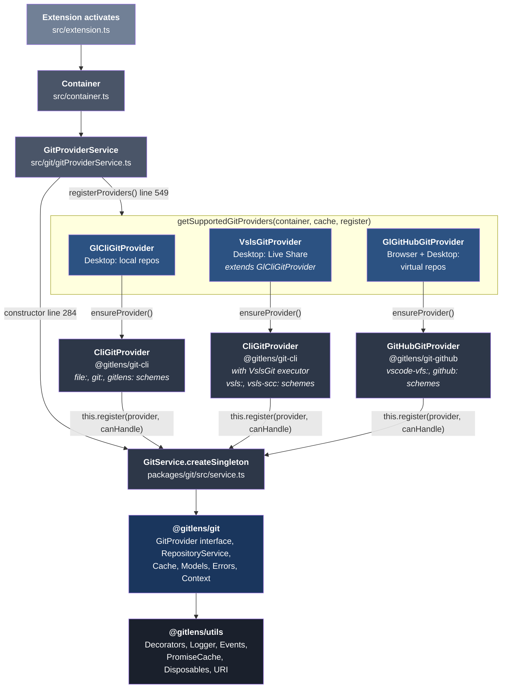
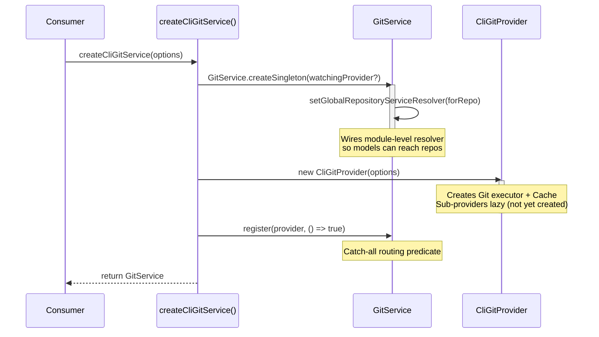
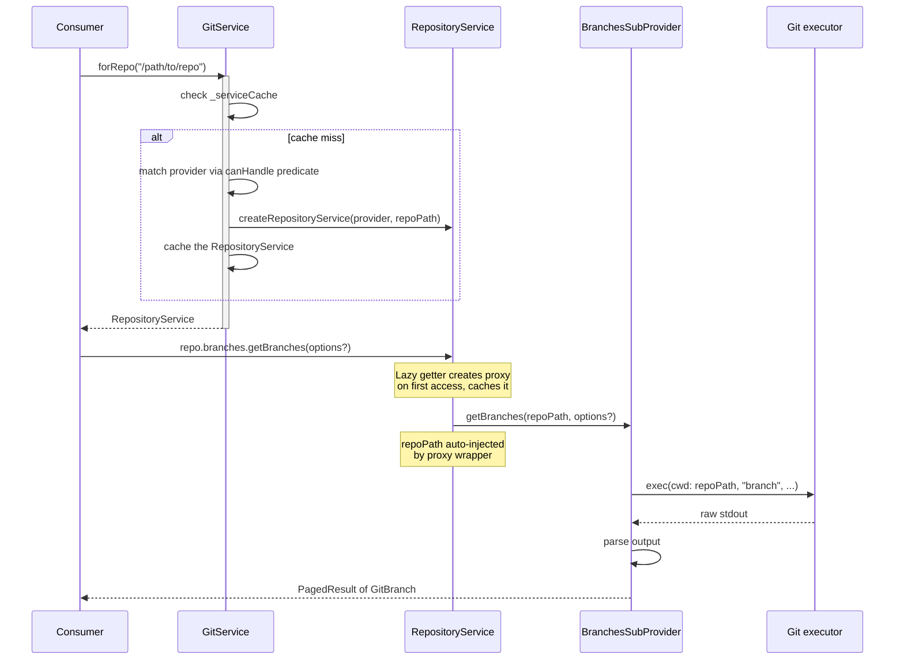
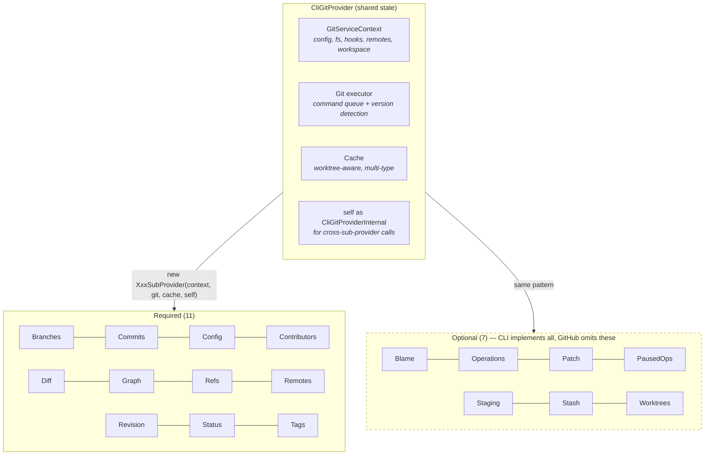
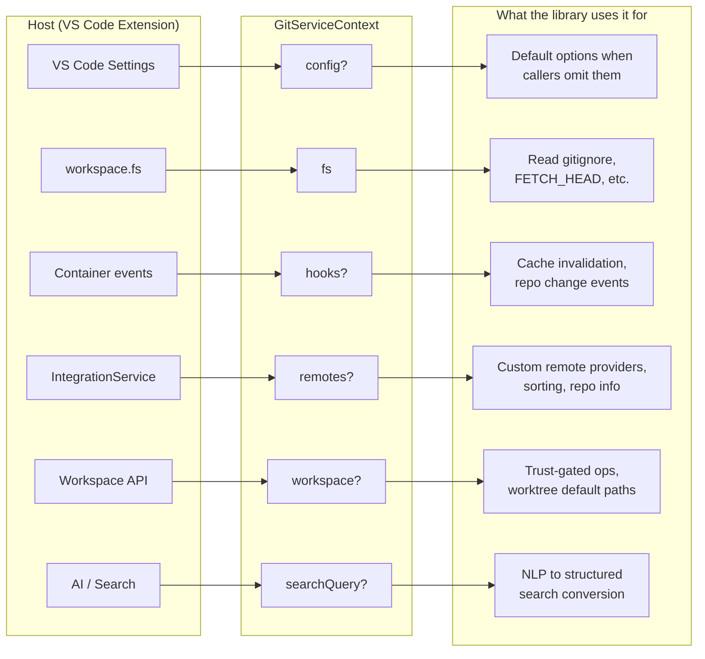
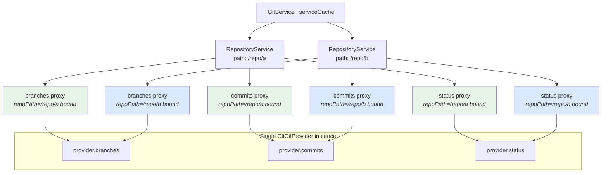
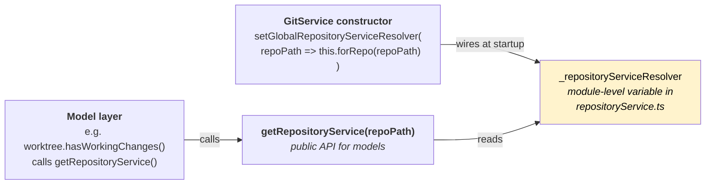

# Library Package Architecture — Creation, Data & Coupling Flow

## 1. Extension Entry Point and Provider Registration

How the extension boots up and connects to the library packages.

**Key details:**

- **Node.js (desktop):** All 3 Gl\* providers are created. **Browser (vscode.dev):** Only `GlGitHubGitProvider`.
- Each Gl\* provider lazily creates its library-level provider on first access via `ensureProvider()`, then registers it with `GitService` using a constructor-injected `register` callback.
- `VslsGitProvider` extends `GlCliGitProvider` but overrides `getProviderOptions()` to inject `VslsGit` — a custom `Git` subclass that delegates `exec()`/`stream()` to the Live Share guest. This creates a **separate** `CliGitProvider` instance from the local one, registered with `vsls:`/`vsls-scc:` scheme predicates.
- The `register` callback is `(provider, canHandle) => this._gitService.register(provider, canHandle)` — wired in `gitProviderService.ts` line 550.

## 2. Standalone Service Creation (CLI path)

For non-VS Code consumers using `@gitlens/git-cli` directly:

## 3. Consumer Data Flow (per-repository)

What happens when code calls `service.forRepo(path).branches.getBranches()`:

## 4. Sub-Provider Constructor Injection

Each sub-provider in `CliGitProvider` is a lazy getter that receives up to 4 shared dependencies:

> **Exception:** `BlameGitSubProvider` omits `context` — constructor is `(git, cache, self)`.

## 5. GitServiceContext — Host-to-Library Boundary

The context object is how the host (VS Code extension) provides configuration and hooks to the library without the library depending on VS Code:

## 6. RepositoryService Proxy Mechanism

Multiple repositories share a single provider — each `RepositoryService` is just a proxy that binds `repoPath` as the first argument to every sub-provider method:

> `createSubProviderProxyForRepo(target, repoPath)` walks the prototype chain and creates a bound wrapper for every method, prepending `repoPath` as the first argument. Proxies are cached per sub-provider per `RepositoryService`.

## 7. Global Module-Level Resolver

How models (plain data objects in `@gitlens/git`) reach back into the service layer:

> The resolver is set once during `GitService` construction and cleared on `dispose()`. If called before construction, `getRepositoryService()` returns `undefined` (safe — uses optional chaining internally).
