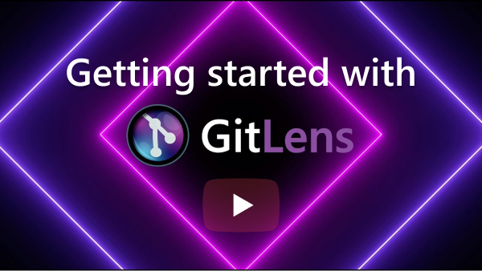

  

GitLens **supercharges** Git inside VS Code and unlocks the <b>untapped knowledge</b> within each repository. Whether you’re a seasoned Git user or just getting started, GitLens makes it easier, safer and faster to leverage the full power of Git. This tutorial will show you how to get the most out of GitLens in VS Code.
