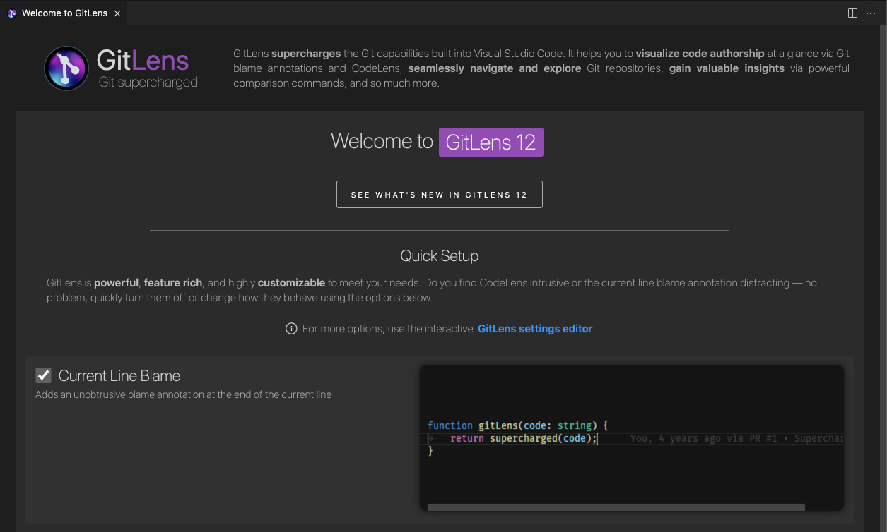

## Quick Setup

  

GitLens is powerful, feature rich, and highly customizable to meet your needs. Do you find code lens intrusive or the current line blame annotation distracting — no problem, quickly turn them off or change how they behave using the Quick Setup.

💡 Use the [GitLens: Welcome (Quick Setup)](command:gitlens.showWelcomePage?%22quick-setup%22) command from the [Command Palette](command:workbench.action.quickOpen?%22>GitLens%3A%20Welcome%22) to open it.
