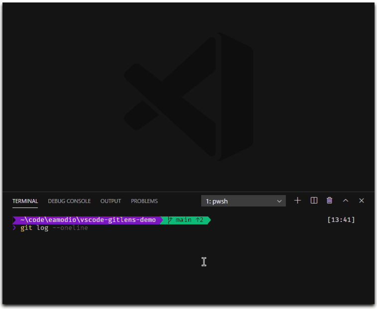

## Git Autolinks in Your Terminal

  

Autolinks are added for branches, tags, and commit ranges in the integrated terminal to quickly explore their commit history. While autolinks for commits will open a quick pick menu with commit details and actions.
