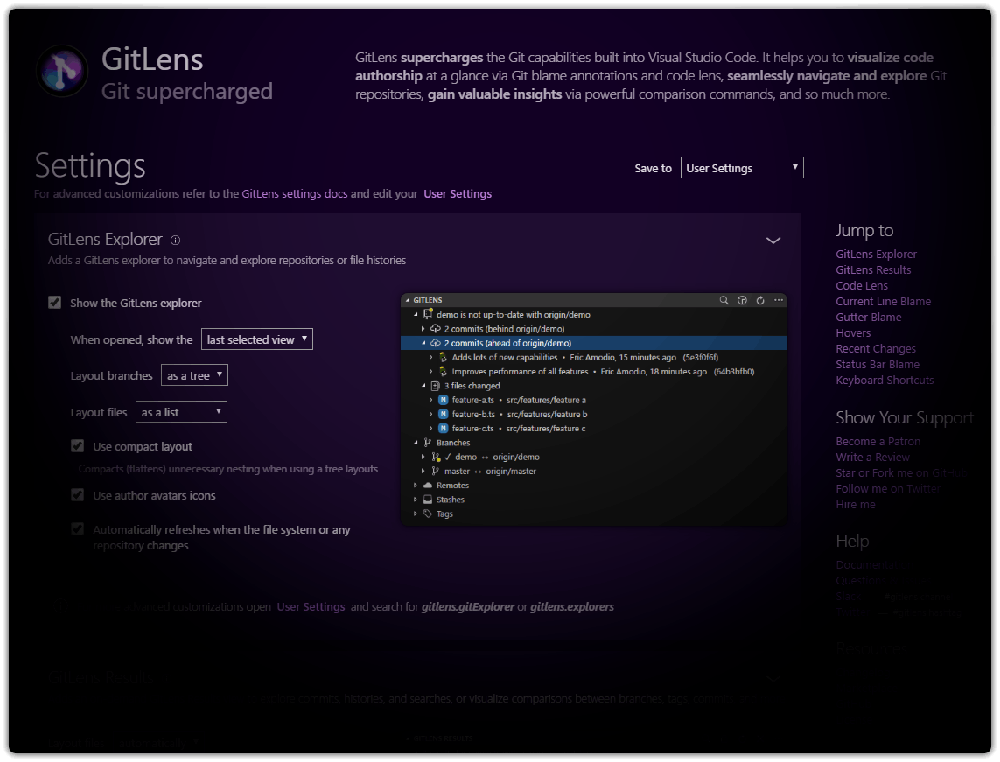

## Customize GitLens

  

GitLens provides a rich interactive settings editor, an easy-to-use interface, to configure many of GitLens' powerful features.

💡 Use the [GitLens: Open Settings](command:gitlens.showSettingsPage) command from the [Command Palette](command:workbench.action.quickOpen?%22>GitLens%3A%20Open%20Settings%22) to open it.
