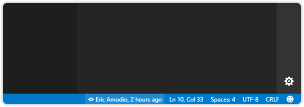

## Current Line Blame 

  

GitLens adds an unobtrusive Git blame annotation at the end of the current line, which shows the author, date, and message of the current line's most recent commit.

💡 Use the [Toggle Line Blame](command:workbench.action.quickOpen?%22>GitLens%3A%20Toggle%20Line%20Blame%22) command from the Command Palette to turn the annotation on and off.

⚙️ Use the settings editor to customize the [current line annotations](command:gitlens.showSettingsPage?%22current-line%22 'Jump to the Current Line Blame settings').

## Hovers

  

Hovering over these blame annotations will reveal more details and links to explore. The **details** hover (the top section) provides many commit details and actions, including autolinks in commit messages, while the **changes** hover (the bottom section) shows a diff of the current line with its previous version and related actions.

⚙️ Use the settings editor to customize the [hovers](command:gitlens.showSettingsPage?%22hovers%22 'Jump to the Hover settings').

## Status Bar Blame

  

GitLens also adds Git blame information about the current line to the status bar.

⚙️ Use the settings editor to customize the [status bar](command:gitlens.showSettingsPage?%22status-bar%22 'Jump to the Status Bar settings').
