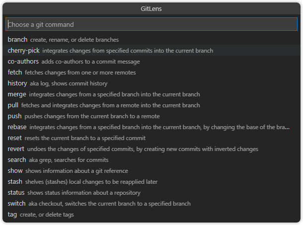

## Git Command Palette

  

The [Git Command Palette](command:gitlens.gitCommands) provides guided, step-by-step access to many common Git commands, as well as quick access to commits (history and search), stashes, and status (current branch and working tree).

You can quickly navigate and safely execute Git commands through easy-to-use menus where each command can require an explicit confirmation step before executing.
