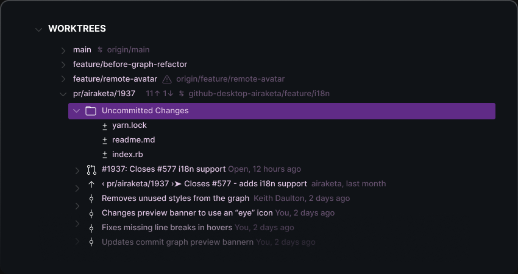

## Git Worktrees

  

Worktrees make developing on and testing multiple branches easier, by minimizing the context switching between branches. Worktrees allow you to easily work on different branches of a repository simultaneously. You can create multiple working trees, each of which can be opened in individual windows or all together in a single workspace.

_Note: Worktrees do not yet work with VS Code on the Web._
