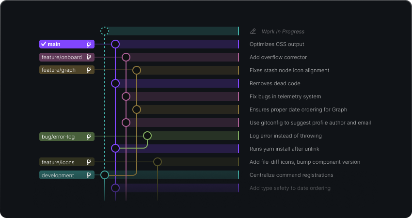

## Commit Graph

  

The Commit Graph helps you easily visualize and keep track of all work in progress. Not only does it help you verify your changes, but also easily see changes made by others and when.

Use the rich commit search to find exactly what you're looking for. It's powerful filters allow you to search by a specific commit, message, author, a changed file or files, or even a specific code change.
