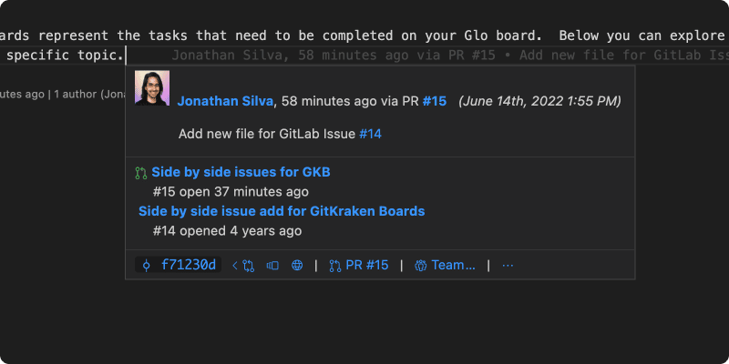

## Rich Self-Hosted Git Integrations

GitLens Pro users can access rich integrations for self-hosted providers.

### GitHub Enterprise

GitHub Enterprise users can see GitHub avatars for commit authors, richer details for auto-linked issues and pull requests, as well as pull requests associated with commits and branches.

  

### GitLab Self-Managed

GitLab Self-Managed users can see GitLab avatars for commit authors, richer details for auto-linked issues and merge requests, as well as merge requests associated with commits and branches.

  

