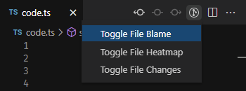
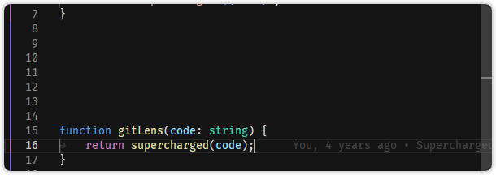

<figure align="center">
  
  <figcaption>File Annotations</figcaption>
</figure>

<figure align="center">
  
  <figcaption>File Blame</figcaption>
</figure>

<figure align="center">
  
  <figcaption>File Changes</figcaption>
</figure>

<figure align="center">
  
  <figcaption>Heatmap</figcaption>
</figure>
