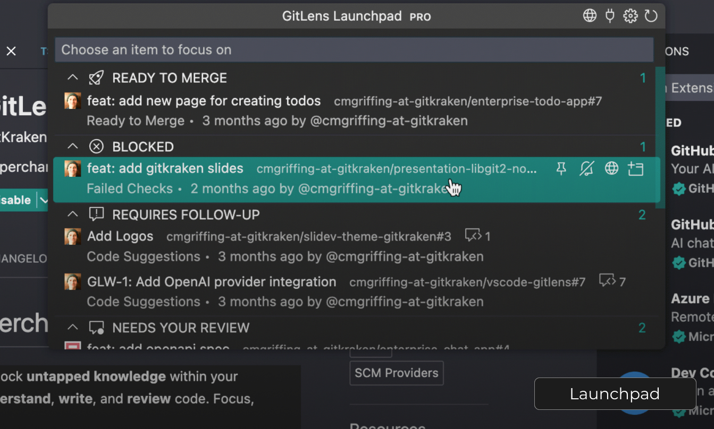

### Launchpad & Worktrees | PR Hub that accelerates PR Reviews

Streamline your workflow with Launchpad by managing pull requests directly in VS Code, keeping your tasks organized and your focus uninterrupted.

Work smarter with Worktrees and switch between branches seamlessly to work on multiple projects in parallel, all without disrupting your main workspace.

Watch a [video](command:gitlens.walkthrough.openAcceleratePrReviews) about how to accelerate code review in GitLens.
