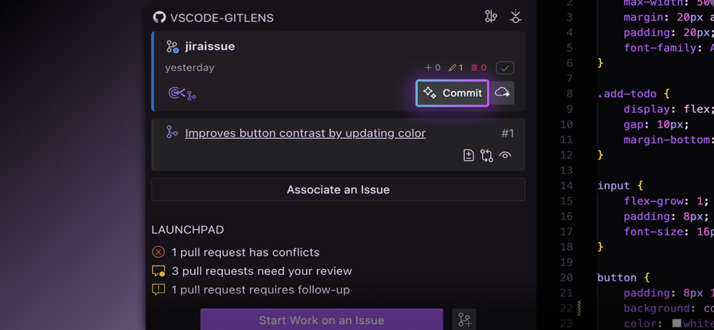

GitLens AI features use GitHub Copilot, if available, or GitKraken AI, which is included with your GitLens Pro subscription — no setup required.

GitLens also supports many "bring your own key" (BYOK) AI providers and models, including OpenAI, Anthropic, Gemini, etc, and local models via Ollama.

You can change the selected AI provider and model from the Integrations menu in the Home view or from the [Command Palette](command:gitlens.walkthrough.switchAIProvider).

Community users can generate commit messages for free using GitHub Copilot or a BYOK provider with a free GitKraken account.

If you want to [disable](command:gitlens.walkthrough.enableAiSetting) or modify AI features, including [custom prompt instructions](command:gitlens.walkthrough.openAiCustomInstructionsSettings), you can do so in [Settings](command:gitlens.walkthrough.openAiSettings).

[Learn more about GitKraken AI](command:gitlens.walkthrough.openLearnAboutAiFeatures)
