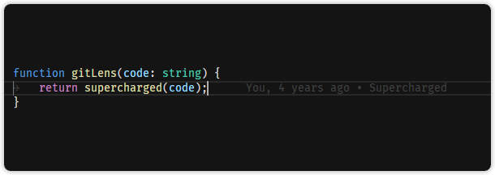
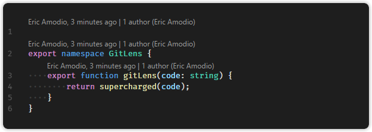
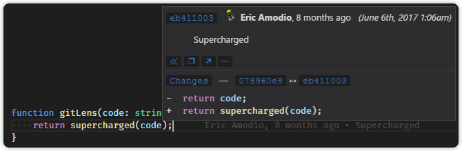

<figure align="center">
  
  <figcaption>Inline Blame</figcaption>
</figure>

<figure align="center">
  
  <figcaption>Git CodeLens</figcaption>
</figure>

<figure align="center">
  
  <figcaption>Hovers</figcaption>
</figure>
