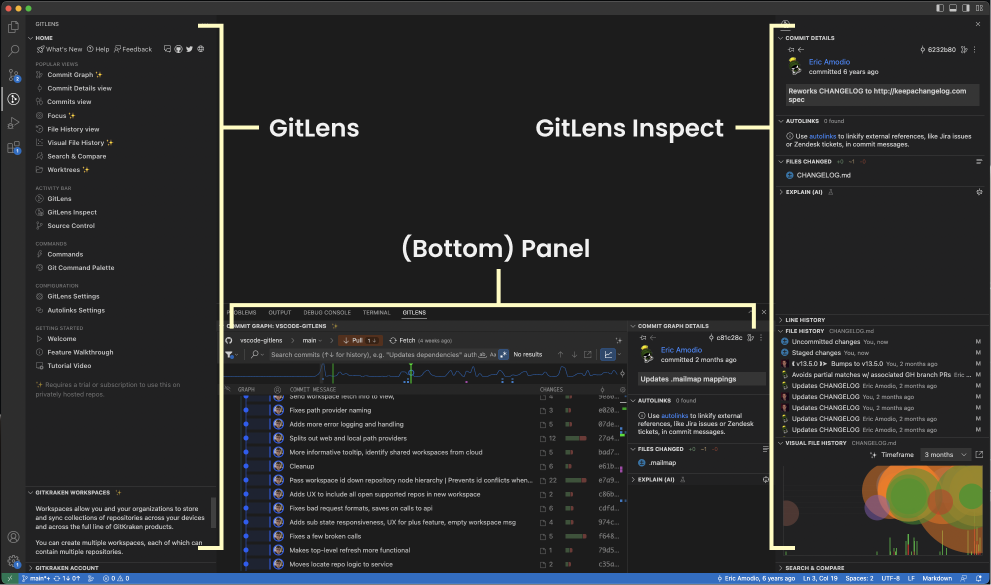

<figure align="center">
  
</figure>

<figure align="center">
  
<strong>GitLens Overview</strong>

  
  <figcaption>GitLens Inspect as shown above has been manually dragged into the Secondary Side Bar</figcaption>
</figure>
