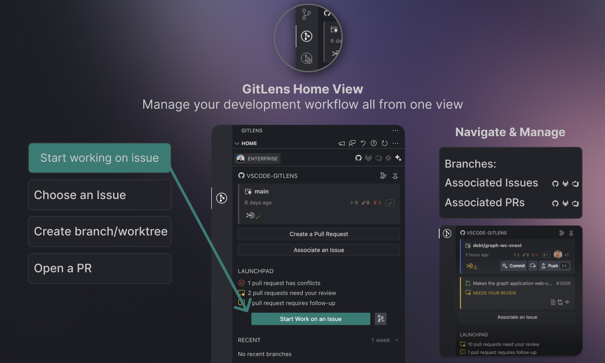

### Start and manage your work in the Home View

Located in the VS Code sidebar, the GitLens Home View highlights your current work with clear, actionable insights, guides you to Start Work on your next important tasks, and tracks recently modified branches for easy task-switching.

[Connect Integrations](command:gitlens.walkthrough.connectIntegrations) with hosting and issue services like GitHub, GitLab, Azure DevOps, Jira, Bitbucket, and more to help you monitor and take action on branches, issues, and pull requests.

Learn more on our detailed [Home View Help Center Page](command:gitlens.walkthrough.openHomeViewVideo).
