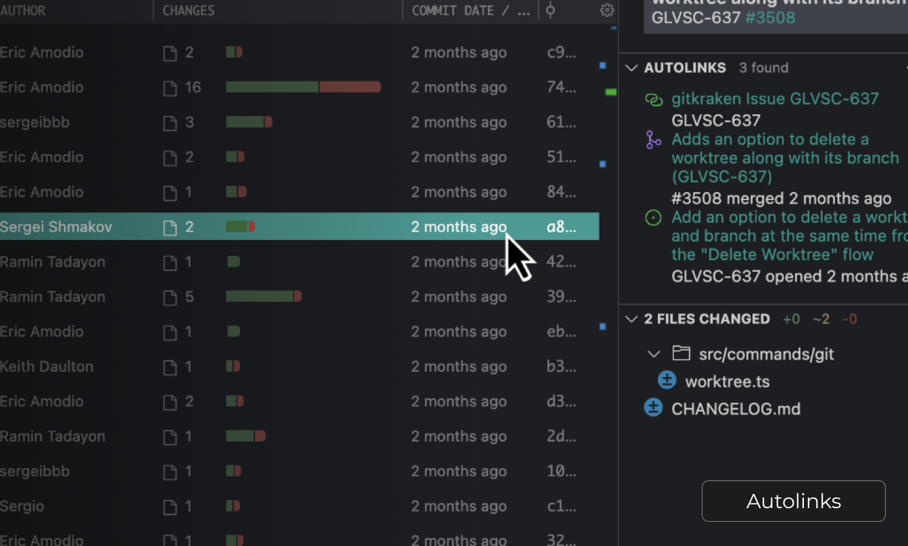

### Integrate with Git Hosting & Issue Services

Connect GitLens to GitHub, GitLab, and Jira to link PRs and issues to branches and commits, track and manage PRs in Launchpad, and start work on issues seamlessly.

With Autolinks, GitLens surfaces links to issues and PRs related to your commits automatically, from a variety of services and custom servers.

Watch a [video](https://help.gitkraken.com/gitlens/gitlens-start-here/#integrations) about improving GitLens with integrations.
