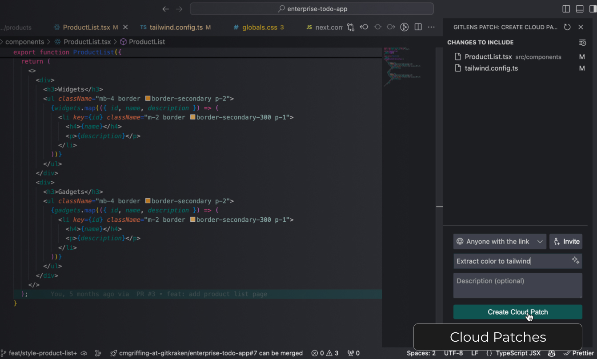

### Streamline Collaboration | Access Work Anywhere & Suggest Changes

Easily and securely share code changes with your teammates or other developers by creating a Cloud Patch from your WIP, commit or stash and sharing the generated link.

Liberate your code reviews and make and receive code suggestions from your team on anything in your project, not just on the lines of code changed in the PR.

Watch a [video](https://help.gitkraken.com/gitlens/gitlens-home/#streamline-collaboration) on Streamline Collaboration
