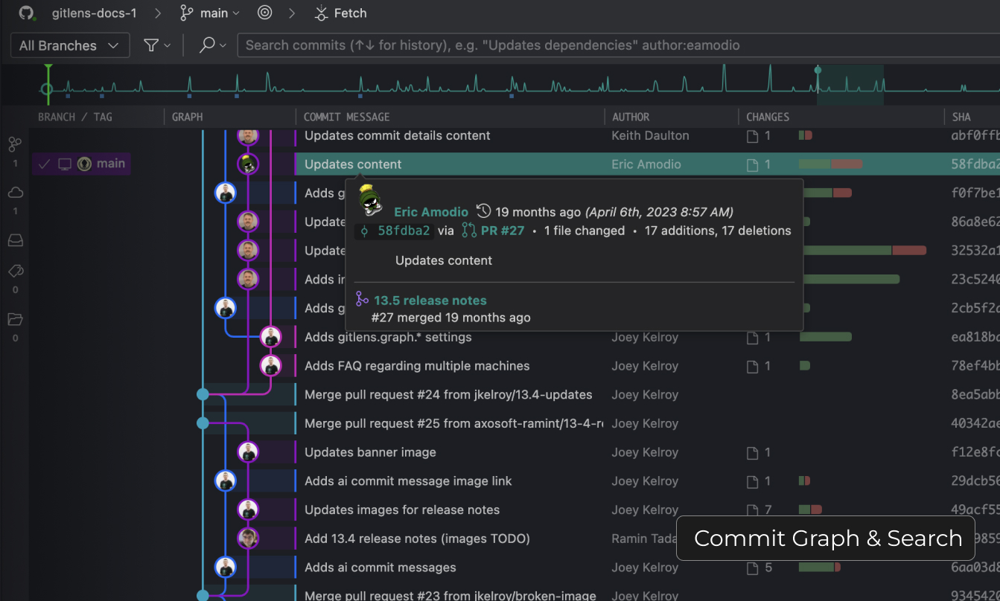

### Blame, Hovers, and Commit Graph

Go beyond visualization with the GitLens Commit Graph and take action to create branches, rebase, revert, and more. With rich search and filtering capabilities, easily find what you need by commit message, author, changed files, or even specific code changes.

Watch a [video](command:gitlens.walkthrough.openInteractiveCodeHistory) about Interactive Code History in GitLens.
